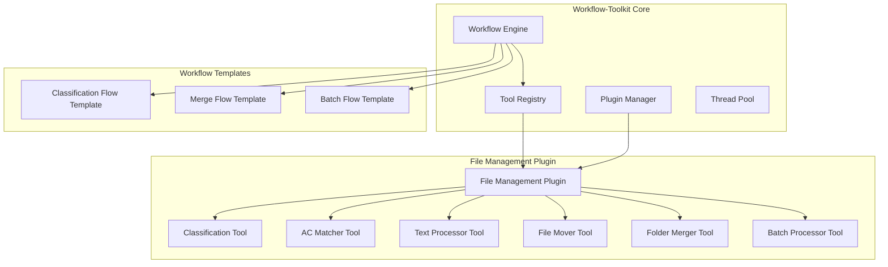
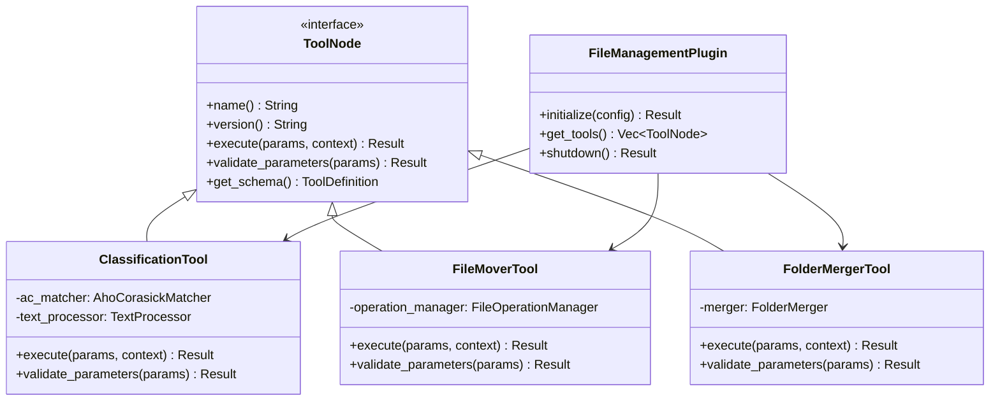

# Design Document

## Overview

The File Management Tools are a collection of workflow tools that integrate with the existing workflow-toolkit system to provide intelligent file and folder management capabilities. These tools leverage the workflow-toolkit's plugin system, tool registry, and execution engine to provide reusable components for file organization, text processing, and batch operations.

## Architecture

### Integration with Workflow-Toolkit



### Tool Architecture



## Components and Interfaces

### 1. File Management Plugin

**Responsibility**: Plugin entry point that registers all file management tools with the workflow-toolkit

**Implementation**:
```rust
use workflow_toolkit::plugins::{Plugin, PluginConfig};
use workflow_toolkit::tools::ToolNode;

pub struct FileManagementPlugin {
    tools: Vec<Box<dyn ToolNode>>,
    config: FileManagementConfig,
}

#[derive(Debug, Clone, Serialize, Deserialize)]
pub struct FileManagementConfig {
    pub max_threads: usize,
    pub temp_directory: PathBuf,
    pub default_encoding: String,
    pub enable_chinese_processing: bool,
}

impl Plugin for FileManagementPlugin {
    fn name(&self) -> &str { "file-management" }
    fn version(&self) -> &str { "1.0.0" }
    
    fn initialize(&mut self, config: PluginConfig) -> Result<()> {
        self.config = serde_json::from_value(config.plugin_config)?;
        
        // Initialize and register tools
        self.tools.push(Box::new(ClassificationTool::new(&self.config)?));
        self.tools.push(Box::new(AcMatcherTool::new(&self.config)?));
        self.tools.push(Box::new(TextProcessorTool::new(&self.config)?));
        self.tools.push(Box::new(FileMoverTool::new(&self.config)?));
        self.tools.push(Box::new(FolderMergerTool::new(&self.config)?));
        self.tools.push(Box::new(BatchProcessorTool::new(&self.config)?));
        
        Ok(())
    }
    
    fn get_tools(&self) -> Vec<Box<dyn ToolNode>> {
        self.tools.clone()
    }
    
    fn shutdown(&mut self) -> Result<()> {
        // Cleanup resources
        Ok(())
    }
}
```

### 2. Classification Tool

**Responsibility**: Intelligent folder classification using AC automaton and scoring algorithms

**Implementation**:
```rust
use workflow_toolkit::tools::{ToolNode, ToolDefinition, ExecutionContext};
use serde_json::Value;

pub struct ClassificationTool {
    ac_matcher: AhoCorasickMatcher,
    text_processor: TextProcessor,
    config: ClassificationConfig,
}

#[derive(Debug, Clone, Serialize, Deserialize)]
pub struct ClassificationParams {
    pub folder_path: String,
    pub classification_rules: Value, // JSON rules or file path
    pub enable_user_interaction: bool,
    pub experimental_mode: bool,
}

#[derive(Debug, Clone, Serialize, Deserialize)]
pub struct ClassificationResult {
    pub status: String, // "classified", "unclassified", "pending", "error"
    pub category: Option<String>,
    pub candidates: Vec<CategoryCandidate>,
    pub score: f64,
    pub folder_name: String,
    pub processing_time_ms: u64,
}

impl ToolNode for ClassificationTool {
    fn name(&self) -> &str { "folder-classifier" }
    fn version(&self) -> &str { "1.0.0" }
    
    async fn execute(&self, params: Value, context: ExecutionContext) -> Result<Value> {
        let params: ClassificationParams = serde_json::from_value(params)?;
        
        // Load classification rules
        let rules = self.load_classification_rules(&params.classification_rules)?;
        
        // Build AC automaton from rules
        let mut automaton = AhoCorasickMatcher::new();
        self.build_automaton_from_rules(&mut automaton, &rules)?;
        
        // Process folder
        let folder_path = Path::new(&params.folder_path);
        let folder_name = folder_path.file_name()
            .ok_or_else(|| anyhow!("Invalid folder path"))?
            .to_string_lossy();
        
        // Execute classification chain
        let result = self.classify_folder(&folder_name, &automaton, &rules)?;
        
        Ok(serde_json::to_value(result)?)
    }
    
    fn validate_parameters(&self, params: &Value) -> Result<()> {
        let _: ClassificationParams = serde_json::from_value(params.clone())?;
        Ok(())
    }
    
    fn get_schema(&self) -> ToolDefinition {
        ToolDefinition {
            name: self.name().to_string(),
            version: self.version().to_string(),
            description: "Intelligent folder classification using configurable rules".to_string(),
            parameters_schema: json!({
                "type": "object",
                "properties": {
                    "folder_path": {"type": "string", "description": "Path to folder to classify"},
                    "classification_rules": {"description": "Classification rules (JSON object or file path)"},
                    "enable_user_interaction": {"type": "boolean", "default": false},
                    "experimental_mode": {"type": "boolean", "default": false}
                },
                "required": ["folder_path", "classification_rules"]
            }),
            return_schema: json!({
                "type": "object",
                "properties": {
                    "status": {"type": "string", "enum": ["classified", "unclassified", "pending", "error"]},
                    "category": {"type": "string"},
                    "candidates": {"type": "array"},
                    "score": {"type": "number"},
                    "folder_name": {"type": "string"},
                    "processing_time_ms": {"type": "number"}
                }
            }),
            dependencies: vec![],
            metadata: HashMap::new(),
            plugin_info: None,
        }
    }
}
```

### 3. Aho-Corasick Matcher Tool

**Responsibility**: Efficient multi-pattern string matching as a standalone tool

**Implementation**:
```rust
pub struct AcMatcherTool {
    config: FileManagementConfig,
}

#[derive(Debug, Clone, Serialize, Deserialize)]
pub struct AcMatcherParams {
    pub text: String,
    pub patterns: Vec<PatternEntry>,
    pub case_sensitive: bool,
    pub find_overlapping: bool,
}

#[derive(Debug, Clone, Serialize, Deserialize)]
pub struct PatternEntry {
    pub pattern: String,
    pub category: String,
    pub score: f64,
}

#[derive(Debug, Clone, Serialize, Deserialize)]
pub struct MatchResult {
    pub matches: Vec<PatternMatch>,
    pub total_matches: usize,
    pub categories_found: Vec<String>,
}

#[derive(Debug, Clone, Serialize, Deserialize)]
pub struct PatternMatch {
    pub pattern: String,
    pub category: String,
    pub score: f64,
    pub start_pos: usize,
    pub end_pos: usize,
}

impl ToolNode for AcMatcherTool {
    fn name(&self) -> &str { "ac-matcher" }
    fn version(&self) -> &str { "1.0.0" }
    
    async fn execute(&self, params: Value, context: ExecutionContext) -> Result<Value> {
        let params: AcMatcherParams = serde_json::from_value(params)?;
        
        // Build automaton
        let mut automaton = AhoCorasickMatcher::new();
        for pattern_entry in &params.patterns {
            automaton.add_pattern(
                &pattern_entry.pattern,
                &pattern_entry.category,
                pattern_entry.score,
            )?;
        }
        automaton.build()?;
        
        // Find matches
        let matches = if params.find_overlapping {
            automaton.find_overlapping_matches(&params.text)
        } else {
            automaton.find_matches(&params.text)
        };
        
        let categories_found: Vec<String> = matches.iter()
            .map(|m| m.category.clone())
            .collect::<std::collections::HashSet<_>>()
            .into_iter()
            .collect();
        
        let result = MatchResult {
            total_matches: matches.len(),
            categories_found,
            matches,
        };
        
        Ok(serde_json::to_value(result)?)
    }
    
    fn get_schema(&self) -> ToolDefinition {
        ToolDefinition {
            name: self.name().to_string(),
            version: self.version().to_string(),
            description: "Aho-Corasick multi-pattern string matching".to_string(),
            parameters_schema: json!({
                "type": "object",
                "properties": {
                    "text": {"type": "string", "description": "Text to search in"},
                    "patterns": {
                        "type": "array",
                        "items": {
                            "type": "object",
                            "properties": {
                                "pattern": {"type": "string"},
                                "category": {"type": "string"},
                                "score": {"type": "number", "default": 1.0}
                            },
                            "required": ["pattern", "category"]
                        }
                    },
                    "case_sensitive": {"type": "boolean", "default": false},
                    "find_overlapping": {"type": "boolean", "default": false}
                },
                "required": ["text", "patterns"]
            }),
            return_schema: json!({
                "type": "object",
                "properties": {
                    "matches": {"type": "array"},
                    "total_matches": {"type": "number"},
                    "categories_found": {"type": "array", "items": {"type": "string"}}
                }
            }),
            dependencies: vec![],
            metadata: HashMap::new(),
            plugin_info: None,
        }
    }
}
```

### 4. Text Processor Tool

**Responsibility**: Text normalization, Chinese processing, and pinyin conversion

**Implementation**:
```rust
pub struct TextProcessorTool {
    processor: TextProcessor,
    config: FileManagementConfig,
}

#[derive(Debug, Clone, Serialize, Deserialize)]
pub struct TextProcessorParams {
    pub text: String,
    pub operations: Vec<TextOperation>,
    pub chinese_processing: Option<ChineseProcessingConfig>,
}

#[derive(Debug, Clone, Serialize, Deserialize)]
pub enum TextOperation {
    NormalizeCase,
    RemoveSpaces,
    ConvertTraditional,
    GeneratePinyin,
    CreateCombinations,
}

#[derive(Debug, Clone, Serialize, Deserialize)]
pub struct ChineseProcessingConfig {
    pub pinyin_style: PinyinStyle,
    pub generate_combinations: bool,
    pub include_tones: bool,
}

#[derive(Debug, Clone, Serialize, Deserialize)]
pub struct TextProcessorResult {
    pub original: String,
    pub processed: String,
    pub pinyin_variants: Vec<String>,
    pub combinations: Vec<Vec<String>>,
    pub metadata: HashMap<String, Value>,
}

impl ToolNode for TextProcessorTool {
    fn name(&self) -> &str { "text-processor" }
    fn version(&self) -> &str { "1.0.0" }
    
    async fn execute(&self, params: Value, context: ExecutionContext) -> Result<Value> {
        let params: TextProcessorParams = serde_json::from_value(params)?;
        
        let mut result = TextProcessorResult {
            original: params.text.clone(),
            processed: params.text.clone(),
            pinyin_variants: Vec::new(),
            combinations: Vec::new(),
            metadata: HashMap::new(),
        };
        
        // Apply text operations in sequence
        for operation in &params.operations {
            match operation {
                TextOperation::NormalizeCase => {
                    result.processed = self.processor.normalize_case(&result.processed);
                }
                TextOperation::RemoveSpaces => {
                    result.processed = self.processor.remove_spaces(&result.processed);
                }
                TextOperation::ConvertTraditional => {
                    result.processed = self.processor.convert_traditional(&result.processed);
                }
                TextOperation::GeneratePinyin => {
                    if let Some(ref chinese_config) = params.chinese_processing {
                        result.pinyin_variants = self.processor.generate_pinyin_variants(
                            &result.processed,
                            &chinese_config.pinyin_style,
                        )?;
                    }
                }
                TextOperation::CreateCombinations => {
                    if let Some(ref chinese_config) = params.chinese_processing {
                        if chinese_config.generate_combinations {
                            result.combinations = self.processor.create_combinations(
                                &result.processed,
                                &result.pinyin_variants,
                            )?;
                        }
                    }
                }
            }
        }
        
        Ok(serde_json::to_value(result)?)
    }
    
    fn get_schema(&self) -> ToolDefinition {
        ToolDefinition {
            name: self.name().to_string(),
            version: self.version().to_string(),
            description: "Text processing including Chinese and pinyin conversion".to_string(),
            parameters_schema: json!({
                "type": "object",
                "properties": {
                    "text": {"type": "string", "description": "Text to process"},
                    "operations": {
                        "type": "array",
                        "items": {
                            "type": "string",
                            "enum": ["NormalizeCase", "RemoveSpaces", "ConvertTraditional", "GeneratePinyin", "CreateCombinations"]
                        }
                    },
                    "chinese_processing": {
                        "type": "object",
                        "properties": {
                            "pinyin_style": {"type": "string", "enum": ["Normal", "WithTone", "WithoutTone", "FirstLetter"]},
                            "generate_combinations": {"type": "boolean", "default": false},
                            "include_tones": {"type": "boolean", "default": false}
                        }
                    }
                },
                "required": ["text", "operations"]
            }),
            return_schema: json!({
                "type": "object",
                "properties": {
                    "original": {"type": "string"},
                    "processed": {"type": "string"},
                    "pinyin_variants": {"type": "array", "items": {"type": "string"}},
                    "combinations": {"type": "array"},
                    "metadata": {"type": "object"}
                }
            }),
            dependencies: vec![],
            metadata: HashMap::new(),
            plugin_info: None,
        }
    }
}
```

### 5. File Mover Tool

**Responsibility**: Safe file and folder operations with conflict resolution

**Implementation**:
```rust
pub struct FileMoverTool {
    operation_manager: FileOperationManager,
    config: FileManagementConfig,
}

#[derive(Debug, Clone, Serialize, Deserialize)]
pub struct FileMoverParams {
    pub operations: Vec<MoveOperation>,
    pub conflict_resolution: ConflictResolution,
    pub check_disk_space: bool,
    pub create_directories: bool,
}

#[derive(Debug, Clone, Serialize, Deserialize)]
pub struct MoveOperation {
    pub source: String,
    pub destination: String,
    pub operation_type: OperationType,
}

#[derive(Debug, Clone, Serialize, Deserialize)]
pub enum OperationType {
    Move,
    Copy,
    Link,
}

#[derive(Debug, Clone, Serialize, Deserialize)]
pub enum ConflictResolution {
    Skip,
    Overwrite,
    Rename,
    Fail,
}

#[derive(Debug, Clone, Serialize, Deserialize)]
pub struct FileMoverResult {
    pub operations_completed: usize,
    pub operations_failed: usize,
    pub operations_skipped: usize,
    pub total_bytes_moved: u64,
    pub duration_ms: u64,
    pub errors: Vec<OperationError>,
}

impl ToolNode for FileMoverTool {
    fn name(&self) -> &str { "file-mover" }
    fn version(&self) -> &str { "1.0.0" }
    
    async fn execute(&self, params: Value, context: ExecutionContext) -> Result<Value> {
        let params: FileMoverParams = serde_json::from_value(params)?;
        
        let start_time = std::time::Instant::now();
        let mut result = FileMoverResult {
            operations_completed: 0,
            operations_failed: 0,
            operations_skipped: 0,
            total_bytes_moved: 0,
            duration_ms: 0,
            errors: Vec::new(),
        };
        
        for operation in params.operations {
            match self.execute_single_operation(&operation, &params).await {
                Ok(op_result) => {
                    result.operations_completed += 1;
                    result.total_bytes_moved += op_result.bytes_moved;
                }
                Err(e) => {
                    result.operations_failed += 1;
                    result.errors.push(OperationError {
                        operation: operation.clone(),
                        error: e.to_string(),
                    });
                }
            }
        }
        
        result.duration_ms = start_time.elapsed().as_millis() as u64;
        
        Ok(serde_json::to_value(result)?)
    }
    
    fn get_schema(&self) -> ToolDefinition {
        ToolDefinition {
            name: self.name().to_string(),
            version: self.version().to_string(),
            description: "Safe file and folder operations with conflict resolution".to_string(),
            parameters_schema: json!({
                "type": "object",
                "properties": {
                    "operations": {
                        "type": "array",
                        "items": {
                            "type": "object",
                            "properties": {
                                "source": {"type": "string"},
                                "destination": {"type": "string"},
                                "operation_type": {"type": "string", "enum": ["Move", "Copy", "Link"], "default": "Move"}
                            },
                            "required": ["source", "destination"]
                        }
                    },
                    "conflict_resolution": {"type": "string", "enum": ["Skip", "Overwrite", "Rename", "Fail"], "default": "Rename"},
                    "check_disk_space": {"type": "boolean", "default": true},
                    "create_directories": {"type": "boolean", "default": true}
                },
                "required": ["operations"]
            }),
            return_schema: json!({
                "type": "object",
                "properties": {
                    "operations_completed": {"type": "number"},
                    "operations_failed": {"type": "number"},
                    "operations_skipped": {"type": "number"},
                    "total_bytes_moved": {"type": "number"},
                    "duration_ms": {"type": "number"},
                    "errors": {"type": "array"}
                }
            }),
            dependencies: vec![],
            metadata: HashMap::new(),
            plugin_info: None,
        }
    }
}
```

### 7. Human Decision Tool and Experimental Mode

**Responsibility**: Handle human decision-making and experimental mode execution

**Implementation**:
```rust
pub struct HumanDecisionTool {
    config: FileManagementConfig,
}

#[derive(Debug, Clone, Serialize, Deserialize)]
pub struct HumanDecisionParams {
    pub decision_type: DecisionType,
    pub context: DecisionContext,
    pub options: Vec<DecisionOption>,
    pub timeout_seconds: Option<u64>,
    pub default_choice: Option<usize>,
}

#[derive(Debug, Clone, Serialize, Deserialize)]
pub enum DecisionType {
    Classification,
    FileConflict,
    MergeStrategy,
    Custom,
}

#[derive(Debug, Clone, Serialize, Deserialize)]
pub struct DecisionContext {
    pub title: String,
    pub description: String,
    pub folder_name: Option<String>,
    pub metadata: HashMap<String, Value>,
}

#[derive(Debug, Clone, Serialize, Deserialize)]
pub struct DecisionOption {
    pub id: String,
    pub label: String,
    pub description: Option<String>,
    pub score: Option<f64>,
    pub recommended: bool,
}

#[derive(Debug, Clone, Serialize, Deserialize)]
pub struct HumanDecisionResult {
    pub selected_option: String,
    pub decision_time_ms: u64,
    pub was_timeout: bool,
    pub user_input: Option<String>,
}

impl ToolNode for HumanDecisionTool {
    fn name(&self) -> &str { "human-decision" }
    fn version(&self) -> &str { "1.0.0" }
    
    async fn execute(&self, params: Value, context: ExecutionContext) -> Result<Value> {
        let params: HumanDecisionParams = serde_json::from_value(params)?;
        
        // Check if we're in experimental mode
        if context.is_experimental_mode() {
            // In experimental mode, simulate decision without user interaction
            let result = self.simulate_decision(&params)?;
            return Ok(serde_json::to_value(result)?);
        }
        
        // Present decision to user
        let result = self.present_decision_to_user(&params, &context).await?;
        
        Ok(serde_json::to_value(result)?)
    }
    
    fn get_schema(&self) -> ToolDefinition {
        ToolDefinition {
            name: self.name().to_string(),
            version: self.version().to_string(),
            description: "Human decision-making for ambiguous scenarios".to_string(),
            parameters_schema: json!({
                "type": "object",
                "properties": {
                    "decision_type": {"type": "string", "enum": ["Classification", "FileConflict", "MergeStrategy", "Custom"]},
                    "context": {
                        "type": "object",
                        "properties": {
                            "title": {"type": "string"},
                            "description": {"type": "string"},
                            "folder_name": {"type": "string"},
                            "metadata": {"type": "object"}
                        },
                        "required": ["title", "description"]
                    },
                    "options": {
                        "type": "array",
                        "items": {
                            "type": "object",
                            "properties": {
                                "id": {"type": "string"},
                                "label": {"type": "string"},
                                "description": {"type": "string"},
                                "score": {"type": "number"},
                                "recommended": {"type": "boolean", "default": false}
                            },
                            "required": ["id", "label"]
                        }
                    },
                    "timeout_seconds": {"type": "number"},
                    "default_choice": {"type": "number"}
                },
                "required": ["decision_type", "context", "options"]
            }),
            return_schema: json!({
                "type": "object",
                "properties": {
                    "selected_option": {"type": "string"},
                    "decision_time_ms": {"type": "number"},
                    "was_timeout": {"type": "boolean"},
                    "user_input": {"type": "string"}
                }
            }),
            dependencies: vec![],
            metadata: HashMap::new(),
            plugin_info: None,
        }
    }
}

impl HumanDecisionTool {
    async fn present_decision_to_user(&self, params: &HumanDecisionParams, context: &ExecutionContext) -> Result<HumanDecisionResult> {
        let start_time = std::time::Instant::now();
        
        // Display decision context
        println!("\n=== {} ===", params.context.title);
        println!("{}", params.context.description);
        
        if let Some(folder_name) = &params.context.folder_name {
            println!("Folder: '{}'", folder_name);
        }
        
        // Display options
        println!("\nAvailable options:");
        for (index, option) in params.options.iter().enumerate() {
            let recommended = if option.recommended { " (recommended)" } else { "" };
            let score = if let Some(s) = option.score { 
                format!(" (score: {:.2})", s) 
            } else { 
                String::new() 
            };
            
            println!("  {}. {}{}{}", index + 1, option.label, score, recommended);
            
            if let Some(desc) = &option.description {
                println!("     {}", desc);
            }
        }
        
        // Get user input with timeout
        let selected_option = if let Some(timeout) = params.timeout_seconds {
            self.get_user_input_with_timeout(timeout, &params.options, params.default_choice).await?
        } else {
            self.get_user_input(&params.options).await?
        };
        
        let decision_time = start_time.elapsed().as_millis() as u64;
        
        Ok(HumanDecisionResult {
            selected_option: selected_option.id,
            decision_time_ms: decision_time,
            was_timeout: false,
            user_input: None,
        })
    }
    
    fn simulate_decision(&self, params: &HumanDecisionParams) -> Result<HumanDecisionResult> {
        // In experimental mode, automatically select the recommended option or first option
        let selected_option = params.options.iter()
            .find(|opt| opt.recommended)
            .or_else(|| params.options.first())
            .ok_or_else(|| anyhow!("No options available for decision"))?;
        
        println!("[Experimental Mode] Auto-selected: {}", selected_option.label);
        
        Ok(HumanDecisionResult {
            selected_option: selected_option.id.clone(),
            decision_time_ms: 0,
            was_timeout: false,
            user_input: Some("auto-selected in experimental mode".to_string()),
        })
    }
}
```

**Enhanced Classification Tool with Human Decision Integration**:
```rust
impl ClassificationTool {
    async fn execute(&self, params: Value, context: ExecutionContext) -> Result<Value> {
        let params: ClassificationParams = serde_json::from_value(params)?;
        
        // ... existing classification logic ...
        
        // Check if human decision is needed
        if self.needs_human_decision(&classification_result, &params) {
            let decision_params = HumanDecisionParams {
                decision_type: DecisionType::Classification,
                context: DecisionContext {
                    title: "Folder Classification Decision".to_string(),
                    description: format!("Multiple categories found for folder '{}'", folder_name),
                    folder_name: Some(folder_name.to_string()),
                    metadata: HashMap::new(),
                },
                options: classification_result.candidates.iter().map(|candidate| {
                    DecisionOption {
                        id: candidate.category.clone(),
                        label: candidate.category.clone(),
                        description: Some(format!("Score: {:.2}", candidate.score)),
                        score: Some(candidate.score),
                        recommended: candidate.score == classification_result.candidates[0].score,
                    }
                }).collect(),
                timeout_seconds: params.decision_timeout,
                default_choice: Some(0),
            };
            
            // Call human decision tool
            let decision_tool = HumanDecisionTool::new(&self.config)?;
            let decision_result = decision_tool.execute(
                serde_json::to_value(decision_params)?,
                context.clone()
            ).await?;
            
            let decision: HumanDecisionResult = serde_json::from_value(decision_result)?;
            
            // Update classification result with human decision
            classification_result.status = "classified".to_string();
            classification_result.category = Some(decision.selected_option);
            classification_result.metadata.insert("human_decision".to_string(), json!(true));
        }
        
        Ok(serde_json::to_value(classification_result)?)
    }
    
    fn needs_human_decision(&self, result: &ClassificationResult, params: &ClassificationParams) -> bool {
        if !params.enable_user_interaction {
            return false;
        }
        
        // Need human decision if multiple candidates with similar scores
        if result.candidates.len() > 1 {
            let top_score = result.candidates[0].score;
            let second_score = result.candidates[1].score;
            let score_difference = top_score - second_score;
            
            // If scores are very close, ask for human decision
            score_difference < 0.5
        } else {
            false
        }
    }
}
```

**Experimental Mode Support**:
```rust
#[derive(Debug, Clone, Serialize, Deserialize)]
pub struct ExperimentalModeConfig {
    pub enabled: bool,
    pub simulate_file_operations: bool,
    pub show_detailed_plans: bool,
    pub auto_approve_decisions: bool,
}

// Add to ExecutionContext
impl ExecutionContext {
    pub fn is_experimental_mode(&self) -> bool {
        self.metadata.get("experimental_mode")
            .and_then(|v| v.as_bool())
            .unwrap_or(false)
    }
    
    pub fn get_experimental_config(&self) -> ExperimentalModeConfig {
        self.metadata.get("experimental_config")
            .and_then(|v| serde_json::from_value(v.clone()).ok())
            .unwrap_or_default()
    }
}

// Enhanced File Mover Tool with experimental mode
impl FileMoverTool {
    async fn execute(&self, params: Value, context: ExecutionContext) -> Result<Value> {
        let params: FileMoverParams = serde_json::from_value(params)?;
        
        if context.is_experimental_mode() {
            return self.simulate_operations(&params, &context).await;
        }
        
        // ... normal execution ...
    }
    
    async fn simulate_operations(&self, params: &FileMoverParams, context: &ExecutionContext) -> Result<Value> {
        let mut result = FileMoverResult {
            operations_completed: 0,
            operations_failed: 0,
            operations_skipped: 0,
            total_bytes_moved: 0,
            duration_ms: 0,
            errors: Vec::new(),
        };
        
        println!("\n=== Experimental Mode - File Operations Simulation ===");
        
        for operation in &params.operations {
            // Simulate the operation
            let source_path = Path::new(&operation.source);
            let dest_path = Path::new(&operation.destination);
            
            if source_path.exists() {
                let size = self.calculate_size(source_path)?;
                println!("Would move: {} -> {} ({} bytes)", 
                    operation.source, operation.destination, size);
                
                result.operations_completed += 1;
                result.total_bytes_moved += size;
            } else {
                println!("Would fail: {} (source not found)", operation.source);
                result.operations_failed += 1;
            }
        }
        
        println!("=== Simulation Complete ===");
        println!("Operations that would succeed: {}", result.operations_completed);
        println!("Operations that would fail: {}", result.operations_failed);
        println!("Total bytes that would be moved: {}", result.total_bytes_moved);
        
        Ok(serde_json::to_value(result)?)
    }
}
```

**Responsibility**: Pre-configured workflow definitions for common file management tasks

### 6. Workflow Templates

**Responsibility**: Pre-configured workflow definitions for common file management tasks

**Enhanced Classification Workflow Template with Human Decision**:
```yaml
name: "intelligent-folder-classification"
version: "1.0.0"
description: "Intelligent folder classification with human decision support"

parameters:
  source_directory: 
    type: "string"
    description: "Directory containing folders to classify"
  output_directory:
    type: "string" 
    description: "Root directory for organized folders"
  classification_rules:
    type: "object"
    description: "Classification rules configuration"
  experimental_mode:
    type: "boolean"
    default: false
  enable_user_interaction:
    type: "boolean"
    default: true
  decision_timeout:
    type: "number"
    default: 300
    description: "Timeout for human decisions in seconds"

nodes:
  - id: "scan_folders"
    type: "Tool"
    tool_name: "directory-scanner"
    parameters:
      directory: "${source_directory}"
      recursive: false
      filter_type: "directories"

  - id: "classify_batch"
    type: "Tool" 
    tool_name: "batch-processor"
    parameters:
      items: "${scan_folders.folders}"
      batch_size: 10
      tool_name: "folder-classifier"
      tool_params:
        classification_rules: "${classification_rules}"
        experimental_mode: "${experimental_mode}"
        enable_user_interaction: "${enable_user_interaction}"
        decision_timeout: "${decision_timeout}"

  - id: "review_results"
    type: "Condition"
    condition: "experimental_mode"
    then:
      - id: "show_experimental_results"
        type: "Tool"
        tool_name: "result-reviewer"
        parameters:
          results: "${classify_batch.results}"
          mode: "experimental"
      
      - id: "confirm_execution"
        type: "Tool"
        tool_name: "human-decision"
        parameters:
          decision_type: "Custom"
          context:
            title: "Confirm File Operations"
            description: "Review experimental results and confirm execution"
          options:
            - id: "execute"
              label: "Execute file operations"
              recommended: true
            - id: "cancel"
              label: "Cancel operations"

  - id: "execute_moves"
    type: "Condition"
    condition: "!experimental_mode || confirm_execution.selected_option == 'execute'"
    then:
      - id: "move_files"
        type: "Tool"
        tool_name: "file-mover"
        parameters:
          operations: "${classify_batch.move_operations}"
          conflict_resolution: "Rename"
          experimental_mode: "${experimental_mode}"

edges:
  - from: "scan_folders"
    to: "classify_batch"
  - from: "classify_batch" 
    to: "review_results"
  - from: "review_results"
    to: "execute_moves"
```

**Interactive Merge Workflow Template**:
```yaml
name: "interactive-folder-merge"
version: "1.0.0"
description: "Interactive folder merging with human decision support"

parameters:
  folder1:
    type: "string"
    description: "First folder to compare"
  folder2: 
    type: "string"
    description: "Second folder to compare"
  merge_strategy:
    type: "string"
    enum: ["SmallerToLarger", "LargerToSmaller", "UserDecision"]
    default: "UserDecision"
  experimental_mode:
    type: "boolean"
    default: true

nodes:
  - id: "find_common_folders"
    type: "Tool"
    tool_name: "folder-merger"
    parameters:
      folder1: "${folder1}"
      folder2: "${folder2}"
      operation: "find_common"

  - id: "decide_merge_strategy"
    type: "Condition"
    condition: "merge_strategy == 'UserDecision'"
    then:
      - id: "human_merge_decision"
        type: "Tool"
        tool_name: "human-decision"
        parameters:
          decision_type: "MergeStrategy"
          context:
            title: "Choose Merge Strategy"
            description: "Select how to merge common folders"
          options:
            - id: "smaller_to_larger"
              label: "Merge smaller folders into larger ones"
              description: "Safer option, preserves larger folder structure"
              recommended: true
            - id: "larger_to_smaller"
              label: "Merge larger folders into smaller ones"
              description: "May require more disk space"
            - id: "manual_each"
              label: "Decide manually for each folder pair"
              description: "Maximum control, more time consuming"

  - id: "merge_folders"
    type: "Tool"
    tool_name: "folder-merger" 
    parameters:
      common_folders: "${find_common_folders.common_folders}"
      merge_strategy: "${decide_merge_strategy.human_merge_decision.selected_option || merge_strategy}"
      operation: "merge"
      experimental_mode: "${experimental_mode}"

  - id: "confirm_merge"
    type: "Condition"
    condition: "experimental_mode"
    then:
      - id: "review_merge_plan"
        type: "Tool"
        tool_name: "result-reviewer"
        parameters:
          results: "${merge_folders.merge_plan}"
          mode: "experimental"
      
      - id: "confirm_merge_execution"
        type: "Tool"
        tool_name: "human-decision"
        parameters:
          decision_type: "Custom"
          context:
            title: "Confirm Merge Operations"
            description: "Review merge plan and confirm execution"
          options:
            - id: "execute"
              label: "Execute merge operations"
              recommended: true
            - id: "cancel"
              label: "Cancel merge operations"

edges:
  - from: "find_common_folders"
    to: "decide_merge_strategy"
  - from: "decide_merge_strategy"
    to: "merge_folders"
  - from: "merge_folders"
    to: "confirm_merge"
```

## Correctness Properties

*A property is a characteristic or behavior that should hold true across all valid executions of a system—essentially, a formal statement about what the system should do. Properties serve as the bridge between human-readable specifications and machine-verifiable correctness guarantees.*

### Property 1: Tool Registration Completeness
*For any* file management plugin initialization, all tools should be successfully registered with the tool registry
**Validates: Requirements 7.1**

### Property 2: Parameter Validation Consistency
*For any* tool execution, invalid parameters should be rejected before execution begins
**Validates: Requirements 9.3**

### Property 3: Classification Result Determinism
*For any* identical folder name and rules, classification should produce consistent results
**Validates: Requirements 1.3**

### Property 4: File Operation Safety
*For any* file operation, the system should either complete successfully or leave files in their original state
**Validates: Requirements 4.1**

### Property 5: Workflow Integration Compatibility
*For any* file management tool, execution should integrate properly with workflow-toolkit's execution context
**Validates: Requirements 7.3, 7.4**

### Property 6: Batch Processing Completeness
*For any* batch of items, all items should be processed and results should be aggregated correctly
**Validates: Requirements 6.4**

### Property 7: Error Propagation Correctness
*For any* tool error, error information should be properly formatted and propagated through the workflow system
**Validates: Requirements 11.2**

### Property 9: Human Decision Integration Correctness
*For any* ambiguous classification scenario, the system should properly invoke human decision-making when configured
**Validates: Requirements 11.1, 11.3**

### Property 10: Experimental Mode Consistency
*For any* tool execution in experimental mode, no actual file system changes should occur
**Validates: Requirements 12.1, 12.2**

## Testing Strategy

### Dual Testing Approach

**Unit Tests**:
- Test individual tool functionality in isolation
- Mock workflow-toolkit dependencies for focused testing
- Verify parameter validation and error handling
- Test file operations with temporary directories

**Property-Based Tests**:
- Verify correctness properties across random inputs
- Test tool integration with generated workflow contexts
- Validate text processing with Unicode and Chinese inputs
- Test concurrent tool execution scenarios

### Integration Testing

**Workflow Integration Tests**:
- Test complete workflow templates end-to-end
- Verify tool chaining and data flow
- Test error handling and recovery scenarios
- Performance testing with large datasets

### Testing Configuration

```toml
[dev-dependencies]
proptest = "1.6"
tempfile = "3.14"
mockall = "0.13"
workflow-toolkit-test = { path = "../workflow-toolkit", features = ["testing"] }

[[test]]
name = "integration_tests"
required-features = ["integration-testing"]
```

Each property test runs a minimum of 100 iterations and is tagged with:
**Feature: file-management-tools, Property {number}: {property_text}**