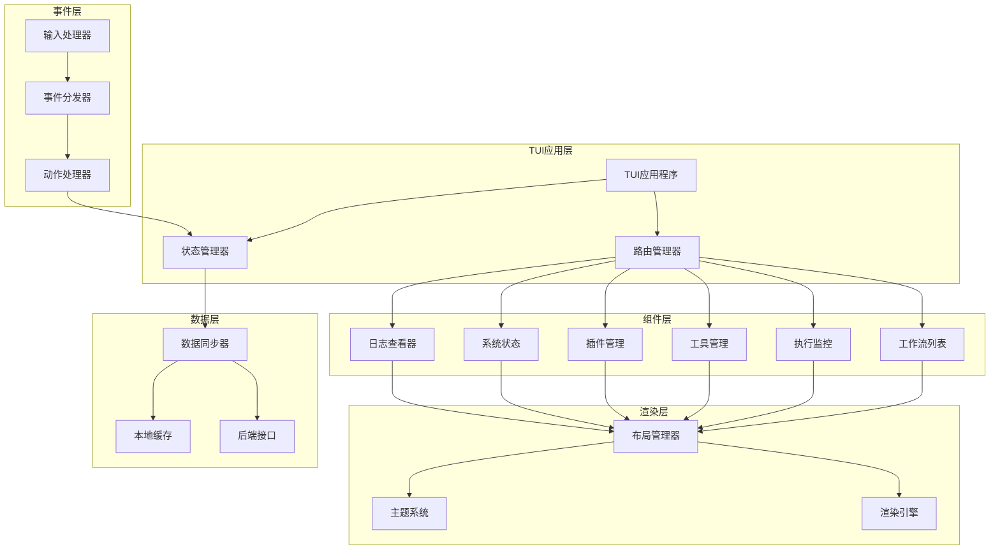
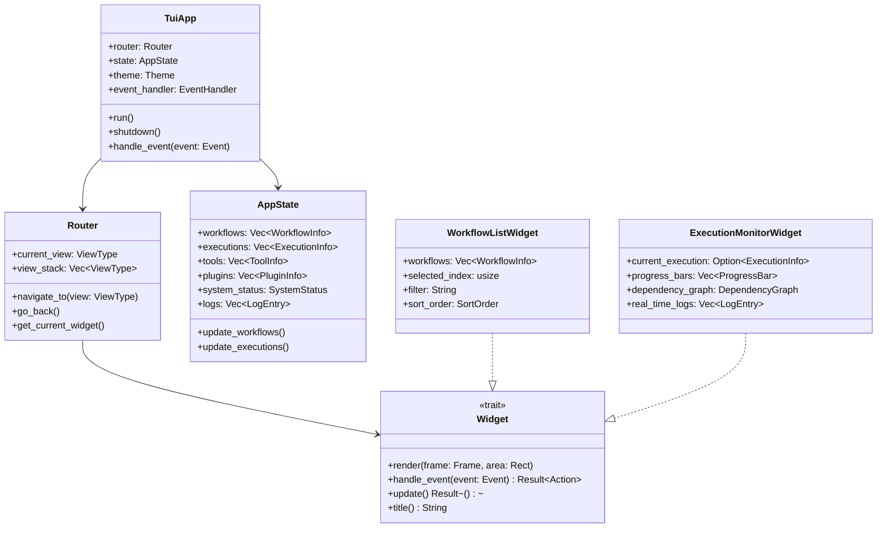

# TUI实现设计文档

## 概述

TUI实现基于ratatui库构建，采用组件化架构设计，提供响应式终端用户界面。系统采用事件驱动模式，支持实时数据更新、键盘交互和多主题显示。核心设计原则包括高性能渲染、模块化组件和可扩展架构。

## 架构

### 整体架构



### 组件架构



## 技术栈选型

### 核心依赖

```toml
[dependencies]
# TUI框架
ratatui = "0.29"
crossterm = { version = "0.28", features = ["event-stream"] }

# 异步运行时
tokio = { version = "1.42", features = ["full"] }
tokio-util = "0.7"
futures = "0.3"

# 数据处理
serde = { version = "1.0", features = ["derive"] }
serde_json = "1.0"
chrono = { version = "0.4", features = ["serde"] }

# 配置和主题
config = "0.14"
toml = "0.8"

# 日志和错误处理
tracing = "0.1"
tracing-subscriber = "0.3"
anyhow = "1.0"
thiserror = "2.0"

# 性能监控
sysinfo = "0.32"

# 字符串处理和搜索
regex = "1.11"
fuzzy-matcher = "0.3"

# 图表和可视化
tui-big-text = "0.6"
```

## 组件和接口

### 1. TUI应用程序核心 (TuiApp)

**职责**: 应用程序生命周期管理、事件循环和组件协调

**技术实现**:
- 使用 `crossterm` 进行跨平台终端操作
- 基于 `tokio` 的异步事件循环
- 使用 `ratatui` 进行界面渲染

**核心接口**:
```rust
use ratatui::{
    backend::CrosstermBackend,
    crossterm::{
        event::{self, DisableMouseCapture, EnableMouseCapture, Event, KeyCode, KeyEventKind},
        execute,
        terminal::{disable_raw_mode, enable_raw_mode, EnterAlternateScreen, LeaveAlternateScreen},
    },
    layout::{Constraint, Direction, Layout, Rect},
    style::{Color, Modifier, Style},
    symbols,
    text::{Line, Span, Text},
    widgets::{
        Block, Borders, Clear, Gauge, List, ListItem, ListState, Paragraph, Scrollbar,
        ScrollbarOrientation, ScrollbarState, Table, TableState, Tabs, Wrap,
    },
    Frame, Terminal,
};
use std::io::{self, Stdout};
use tokio::sync::mpsc;
use chrono::{DateTime, Utc};

pub struct TuiApp {
    terminal: Terminal<CrosstermBackend<Stdout>>,
    router: Router,
    state: AppState,
    theme: Theme,
    event_handler: EventHandler,
    should_quit: bool,
    tick_rate: Duration,
}

impl TuiApp {
    pub async fn new() -> Result<Self> {
        enable_raw_mode()?;
        let mut stdout = io::stdout();
        execute!(stdout, EnterAlternateScreen, EnableMouseCapture)?;
        let backend = CrosstermBackend::new(stdout);
        let terminal = Terminal::new(backend)?;
        
        Ok(Self {
            terminal,
            router: Router::new(),
            state: AppState::new(),
            theme: Theme::default(),
            event_handler: EventHandler::new(),
            should_quit: false,
            tick_rate: Duration::from_millis(16), // 60 FPS
        })
    }
    
    pub async fn run(&mut self) -> Result<()> {
        let mut last_tick = Instant::now();
        
        loop {
            // 处理事件
            if event::poll(Duration::from_millis(0))? {
                if let Event::Key(key) = event::read()? {
                    if key.kind == KeyEventKind::Press {
                        let action = self.handle_key_event(key).await?;
                        self.process_action(action).await?;
                    }
                }
            }
            
            // 定期更新
            if last_tick.elapsed() >= self.tick_rate {
                self.update().await?;
                last_tick = Instant::now();
            }
            
            // 渲染界面
            self.render()?;
            
            if self.should_quit {
                break;
            }
        }
        
        Ok(())
    }
    
    async fn handle_key_event(&mut self, key: KeyEvent) -> Result<Action> {
        // 全局快捷键处理
        match key.code {
            KeyCode::Char('q') if key.modifiers.contains(KeyModifiers::CTRL) => {
                return Ok(Action::Quit);
            }
            KeyCode::F(1) => return Ok(Action::Navigate(ViewType::WorkflowList)),
            KeyCode::F(2) => return Ok(Action::Navigate(ViewType::ExecutionMonitor)),
            KeyCode::F(3) => return Ok(Action::Navigate(ViewType::ToolManager)),
            KeyCode::F(4) => return Ok(Action::Navigate(ViewType::PluginManager)),
            KeyCode::F(5) => return Ok(Action::Navigate(ViewType::SystemStatus)),
            KeyCode::F(6) => return Ok(Action::Navigate(ViewType::LogViewer)),
            KeyCode::F(12) => return Ok(Action::Refresh),
            _ => {}
        }
        
        // 委托给当前Widget处理
        if let Some(widget) = self.router.get_current_widget_mut() {
            widget.handle_event(Event::Key(key)).await
        } else {
            Ok(Action::None)
        }
    }
    
    async fn process_action(&mut self, action: Action) -> Result<()> {
        match action {
            Action::Quit => self.should_quit = true,
            Action::Navigate(view) => self.router.navigate_to(view),
            Action::Refresh => self.state.refresh_all().await?,
            Action::ExecuteWorkflow(name) => {
                // 调用后端API执行工作流
                self.execute_workflow(&name).await?;
            }
            Action::PauseWorkflow(id) => {
                self.pause_workflow(id).await?;
            }
            // ... 其他动作处理
            _ => {}
        }
        Ok(())
    }
    
    fn render(&mut self) -> Result<()> {
        self.terminal.draw(|frame| {
            let size = frame.area();
            
            // 主布局
            let chunks = Layout::default()
                .direction(Direction::Vertical)
                .constraints([
                    Constraint::Length(3), // 标题栏
                    Constraint::Min(0),    // 主内容区
                    Constraint::Length(3), // 状态栏
                ])
                .split(size);
            
            // 渲染标题栏
            self.render_header(frame, chunks[0]);
            
            // 渲染主内容
            self.render_main_content(frame, chunks[1]);
            
            // 渲染状态栏
            self.render_status_bar(frame, chunks[2]);
        })?;
        
        Ok(())
    }
    
    fn render_header(&self, frame: &mut Frame, area: Rect) {
        let title = Paragraph::new("工作流工具包 TUI v1.0.0")
            .style(self.theme.header_style())
            .block(Block::default().borders(Borders::ALL));
        frame.render_widget(title, area);
    }
    
    fn render_main_content(&mut self, frame: &mut Frame, area: Rect) {
        if let Some(widget) = self.router.get_current_widget_mut() {
            widget.render(frame, area);
        }
    }
    
    fn render_status_bar(&self, frame: &mut Frame, area: Rect) {
        let status_text = format!(
            "视图: {} | 快捷键: F1-F6切换视图, Ctrl+Q退出 | 状态: {}",
            self.router.current_view_name(),
            self.state.connection_status()
        );
        
        let status = Paragraph::new(status_text)
            .style(self.theme.status_bar_style())
            .block(Block::default().borders(Borders::ALL));
        frame.render_widget(status, area);
    }
}

impl Drop for TuiApp {
    fn drop(&mut self) {
        let _ = disable_raw_mode();
        let _ = execute!(
            self.terminal.backend_mut(),
            LeaveAlternateScreen,
            DisableMouseCapture
        );
    }
}
```

### 2. 路由管理器 (Router)

**职责**: 视图导航和Widget生命周期管理

```rust
#[derive(Debug, Clone, PartialEq, Eq)]
pub enum ViewType {
    WorkflowList,
    ExecutionMonitor,
    ToolManager,
    PluginManager,
    SystemStatus,
    LogViewer,
}

pub struct Router {
    current_view: ViewType,
    view_stack: Vec<ViewType>,
    widgets: HashMap<ViewType, Box<dyn Widget>>,
}

impl Router {
    pub fn new() -> Self {
        let mut widgets: HashMap<ViewType, Box<dyn Widget>> = HashMap::new();
        widgets.insert(ViewType::WorkflowList, Box::new(WorkflowListWidget::new()));
        widgets.insert(ViewType::ExecutionMonitor, Box::new(ExecutionMonitorWidget::new()));
        widgets.insert(ViewType::ToolManager, Box::new(ToolManagerWidget::new()));
        widgets.insert(ViewType::PluginManager, Box::new(PluginManagerWidget::new()));
        widgets.insert(ViewType::SystemStatus, Box::new(SystemStatusWidget::new()));
        widgets.insert(ViewType::LogViewer, Box::new(LogViewerWidget::new()));
        
        Self {
            current_view: ViewType::WorkflowList,
            view_stack: Vec::new(),
            widgets,
        }
    }
    
    pub fn navigate_to(&mut self, view: ViewType) {
        if view != self.current_view {
            self.view_stack.push(self.current_view.clone());
            self.current_view = view;
        }
    }
    
    pub fn go_back(&mut self) {
        if let Some(previous_view) = self.view_stack.pop() {
            self.current_view = previous_view;
        }
    }
    
    pub fn get_current_widget_mut(&mut self) -> Option<&mut Box<dyn Widget>> {
        self.widgets.get_mut(&self.current_view)
    }
    
    pub fn current_view_name(&self) -> &str {
        match self.current_view {
            ViewType::WorkflowList => "工作流列表",
            ViewType::ExecutionMonitor => "执行监控",
            ViewType::ToolManager => "工具管理",
            ViewType::PluginManager => "插件管理",
            ViewType::SystemStatus => "系统状态",
            ViewType::LogViewer => "日志查看器",
        }
    }
}
```

### 3. 状态管理器 (AppState)

**职责**: 应用程序状态管理和数据同步

```rust
use tokio::sync::RwLock;
use std::sync::Arc;

pub struct AppState {
    workflows: Arc<RwLock<Vec<WorkflowInfo>>>,
    executions: Arc<RwLock<Vec<ExecutionInfo>>>,
    tools: Arc<RwLock<Vec<ToolInfo>>>,
    plugins: Arc<RwLock<Vec<PluginInfo>>>,
    system_status: Arc<RwLock<SystemStatus>>,
    logs: Arc<RwLock<Vec<LogEntry>>>,
    connection_status: Arc<RwLock<ConnectionStatus>>,
    last_update: Arc<RwLock<DateTime<Utc>>>,
}

#[derive(Debug, Clone)]
pub struct WorkflowInfo {
    pub name: String,
    pub version: String,
    pub description: Option<String>,
    pub status: WorkflowStatus,
    pub last_execution: Option<DateTime<Utc>>,
    pub execution_count: u32,
    pub tags: Vec<String>,
}

#[derive(Debug, Clone)]
pub struct ExecutionInfo {
    pub id: String,
    pub workflow_name: String,
    pub status: ExecutionStatus,
    pub started_at: DateTime<Utc>,
    pub completed_at: Option<DateTime<Utc>>,
    pub progress: f64,
    pub current_task: Option<String>,
    pub tasks: Vec<TaskInfo>,
}

#[derive(Debug, Clone)]
pub struct TaskInfo {
    pub name: String,
    pub status: TaskStatus,
    pub progress: f64,
    pub started_at: Option<DateTime<Utc>>,
    pub completed_at: Option<DateTime<Utc>>,
    pub error: Option<String>,
}

#[derive(Debug, Clone, PartialEq, Eq)]
pub enum WorkflowStatus {
    Available,
    Running,
    Paused,
    Completed,
    Failed,
}

#[derive(Debug, Clone, PartialEq, Eq)]
pub enum ExecutionStatus {
    Pending,
    Running,
    Paused,
    Completed,
    Failed,
    Cancelled,
}

#[derive(Debug, Clone, PartialEq, Eq)]
pub enum TaskStatus {
    Pending,
    Running,
    Completed,
    Failed,
    Skipped,
}

#[derive(Debug, Clone)]
pub struct SystemStatus {
    pub cpu_usage: f64,
    pub memory_usage: f64,
    pub memory_total: u64,
    pub memory_used: u64,
    pub active_workflows: u32,
    pub system_health: SystemHealth,
    pub uptime: Duration,
    pub network_status: NetworkStatus,
}

#[derive(Debug, Clone, PartialEq, Eq)]
pub enum SystemHealth {
    Healthy,
    Warning,
    Critical,
}

#[derive(Debug, Clone, PartialEq, Eq)]
pub enum NetworkStatus {
    Connected,
    Disconnected,
    Limited,
}

#[derive(Debug, Clone, PartialEq, Eq)]
pub enum ConnectionStatus {
    Connected,
    Connecting,
    Disconnected,
    Error(String),
}

impl AppState {
    pub fn new() -> Self {
        Self {
            workflows: Arc::new(RwLock::new(Vec::new())),
            executions: Arc::new(RwLock::new(Vec::new())),
            tools: Arc::new(RwLock::new(Vec::new())),
            plugins: Arc::new(RwLock::new(Vec::new())),
            system_status: Arc::new(RwLock::new(SystemStatus::default())),
            logs: Arc::new(RwLock::new(Vec::new())),
            connection_status: Arc::new(RwLock::new(ConnectionStatus::Disconnected)),
            last_update: Arc::new(RwLock::new(Utc::now())),
        }
    }
    
    pub async fn refresh_all(&self) -> Result<()> {
        // 并发刷新所有数据
        let (workflows_result, executions_result, tools_result, plugins_result, system_result) = tokio::join!(
            self.refresh_workflows(),
            self.refresh_executions(),
            self.refresh_tools(),
            self.refresh_plugins(),
            self.refresh_system_status()
        );
        
        workflows_result?;
        executions_result?;
        tools_result?;
        plugins_result?;
        system_result?;
        
        *self.last_update.write().await = Utc::now();
        Ok(())
    }
    
    pub async fn get_workflows(&self) -> Vec<WorkflowInfo> {
        self.workflows.read().await.clone()
    }
    
    pub async fn get_executions(&self) -> Vec<ExecutionInfo> {
        self.executions.read().await.clone()
    }
    
    pub async fn get_system_status(&self) -> SystemStatus {
        self.system_status.read().await.clone()
    }
    
    pub async fn connection_status(&self) -> String {
        match &*self.connection_status.read().await {
            ConnectionStatus::Connected => "已连接".to_string(),
            ConnectionStatus::Connecting => "连接中...".to_string(),
            ConnectionStatus::Disconnected => "未连接".to_string(),
            ConnectionStatus::Error(err) => format!("错误: {}", err),
        }
    }
    
    async fn refresh_workflows(&self) -> Result<()> {
        // 从后端API获取工作流列表
        // 这里是示例实现
        let workflows = vec![
            WorkflowInfo {
                name: "数据处理流水线".to_string(),
                version: "1.0.0".to_string(),
                description: Some("处理和转换数据的工作流".to_string()),
                status: WorkflowStatus::Available,
                last_execution: Some(Utc::now() - chrono::Duration::hours(2)),
                execution_count: 15,
                tags: vec!["数据".to_string(), "ETL".to_string()],
            },
            WorkflowInfo {
                name: "系统监控".to_string(),
                version: "2.1.0".to_string(),
                description: Some("监控系统健康状态".to_string()),
                status: WorkflowStatus::Running,
                last_execution: Some(Utc::now() - chrono::Duration::minutes(5)),
                execution_count: 142,
                tags: vec!["监控".to_string(), "系统".to_string()],
            },
        ];
        
        *self.workflows.write().await = workflows;
        Ok(())
    }
    
    async fn refresh_executions(&self) -> Result<()> {
        // 从后端API获取执行状态
        let executions = vec![
            ExecutionInfo {
                id: "exec-001".to_string(),
                workflow_name: "系统监控".to_string(),
                status: ExecutionStatus::Running,
                started_at: Utc::now() - chrono::Duration::minutes(5),
                completed_at: None,
                progress: 0.65,
                current_task: Some("检查磁盘空间".to_string()),
                tasks: vec![
                    TaskInfo {
                        name: "检查CPU使用率".to_string(),
                        status: TaskStatus::Completed,
                        progress: 1.0,
                        started_at: Some(Utc::now() - chrono::Duration::minutes(5)),
                        completed_at: Some(Utc::now() - chrono::Duration::minutes(4)),
                        error: None,
                    },
                    TaskInfo {
                        name: "检查内存使用率".to_string(),
                        status: TaskStatus::Completed,
                        progress: 1.0,
                        started_at: Some(Utc::now() - chrono::Duration::minutes(4)),
                        completed_at: Some(Utc::now() - chrono::Duration::minutes(3)),
                        error: None,
                    },
                    TaskInfo {
                        name: "检查磁盘空间".to_string(),
                        status: TaskStatus::Running,
                        progress: 0.3,
                        started_at: Some(Utc::now() - chrono::Duration::minutes(3)),
                        completed_at: None,
                        error: None,
                    },
                ],
            },
        ];
        
        *self.executions.write().await = executions;
        Ok(())
    }
    
    async fn refresh_system_status(&self) -> Result<()> {
        use sysinfo::{System, SystemExt, CpuExt};
        
        let mut sys = System::new_all();
        sys.refresh_all();
        
        let cpu_usage = sys.global_cpu_info().cpu_usage() as f64;
        let memory_total = sys.total_memory();
        let memory_used = sys.used_memory();
        let memory_usage = (memory_used as f64 / memory_total as f64) * 100.0;
        
        let health = if cpu_usage > 90.0 || memory_usage > 90.0 {
            SystemHealth::Critical
        } else if cpu_usage > 70.0 || memory_usage > 70.0 {
            SystemHealth::Warning
        } else {
            SystemHealth::Healthy
        };
        
        let status = SystemStatus {
            cpu_usage,
            memory_usage,
            memory_total,
            memory_used,
            active_workflows: self.executions.read().await.len() as u32,
            system_health: health,
            uptime: Duration::from_secs(sys.uptime()),
            network_status: NetworkStatus::Connected, // 简化实现
        };
        
        *self.system_status.write().await = status;
        Ok(())
    }
}

impl Default for SystemStatus {
    fn default() -> Self {
        Self {
            cpu_usage: 0.0,
            memory_usage: 0.0,
            memory_total: 0,
            memory_used: 0,
            active_workflows: 0,
            system_health: SystemHealth::Healthy,
            uptime: Duration::from_secs(0),
            network_status: NetworkStatus::Disconnected,
        }
    }
}
```

### 4. Widget组件系统

**职责**: 可复用的UI组件，处理特定功能区域的显示和交互

```rust
use async_trait::async_trait;

#[async_trait]
pub trait Widget: Send + Sync {
    async fn render(&mut self, frame: &mut Frame, area: Rect);
    async fn handle_event(&mut self, event: Event) -> Result<Action>;
    async fn update(&mut self) -> Result<()>;
    fn title(&self) -> &str;
    fn help_text(&self) -> Vec<(&str, &str)>; // (key, description)
}

#[derive(Debug, Clone, PartialEq, Eq)]
pub enum Action {
    None,
    Quit,
    Navigate(ViewType),
    ExecuteWorkflow(String),
    PauseWorkflow(String),
    ResumeWorkflow(String),
    StopWorkflow(String),
    ExecuteTool(String),
    InstallPlugin(String),
    UninstallPlugin(String),
    ReloadPlugin(String),
    ShowDetails(String),
    Refresh,
    Search(String),
    Filter(String),
    Sort(SortOrder),
}

#[derive(Debug, Clone, PartialEq, Eq)]
pub enum SortOrder {
    NameAsc,
    NameDesc,
    DateAsc,
    DateDesc,
    StatusAsc,
    StatusDesc,
}
```

### 5. 工作流列表Widget

```rust
pub struct WorkflowListWidget {
    workflows: Vec<WorkflowInfo>,
    filtered_workflows: Vec<usize>, // 过滤后的索引
    selected_index: usize,
    scroll_state: ScrollbarState,
    list_state: ListState,
    filter: String,
    sort_order: SortOrder,
    show_details: bool,
    search_mode: bool,
}

impl WorkflowListWidget {
    pub fn new() -> Self {
        let mut list_state = ListState::default();
        list_state.select(Some(0));
        
        Self {
            workflows: Vec::new(),
            filtered_workflows: Vec::new(),
            selected_index: 0,
            scroll_state: ScrollbarState::default(),
            list_state,
            filter: String::new(),
            sort_order: SortOrder::NameAsc,
            show_details: false,
            search_mode: false,
        }
    }
    
    pub fn set_workflows(&mut self, workflows: Vec<WorkflowInfo>) {
        self.workflows = workflows;
        self.apply_filter_and_sort();
        self.update_selection();
    }
    
    fn apply_filter_and_sort(&mut self) {
        // 应用过滤器
        self.filtered_workflows = self.workflows
            .iter()
            .enumerate()
            .filter(|(_, workflow)| {
                if self.filter.is_empty() {
                    true
                } else {
                    workflow.name.to_lowercase().contains(&self.filter.to_lowercase()) ||
                    workflow.description.as_ref().map_or(false, |desc| 
                        desc.to_lowercase().contains(&self.filter.to_lowercase())
                    ) ||
                    workflow.tags.iter().any(|tag| 
                        tag.to_lowercase().contains(&self.filter.to_lowercase())
                    )
                }
            })
            .map(|(i, _)| i)
            .collect();
        
        // 应用排序
        self.filtered_workflows.sort_by(|&a, &b| {
            let workflow_a = &self.workflows[a];
            let workflow_b = &self.workflows[b];
            
            match self.sort_order {
                SortOrder::NameAsc => workflow_a.name.cmp(&workflow_b.name),
                SortOrder::NameDesc => workflow_b.name.cmp(&workflow_a.name),
                SortOrder::DateAsc => workflow_a.last_execution.cmp(&workflow_b.last_execution),
                SortOrder::DateDesc => workflow_b.last_execution.cmp(&workflow_a.last_execution),
                SortOrder::StatusAsc => workflow_a.status.cmp(&workflow_b.status),
                SortOrder::StatusDesc => workflow_b.status.cmp(&workflow_a.status),
            }
        });
    }
    
    fn update_selection(&mut self) {
        if self.selected_index >= self.filtered_workflows.len() && !self.filtered_workflows.is_empty() {
            self.selected_index = self.filtered_workflows.len() - 1;
        }
        self.list_state.select(Some(self.selected_index));
        
        // 更新滚动条状态
        self.scroll_state = self.scroll_state.content_length(self.filtered_workflows.len());
        self.scroll_state = self.scroll_state.position(self.selected_index);
    }
    
    fn selected_workflow(&self) -> Option<&WorkflowInfo> {
        self.filtered_workflows
            .get(self.selected_index)
            .and_then(|&index| self.workflows.get(index))
    }
}

#[async_trait]
impl Widget for WorkflowListWidget {
    async fn render(&mut self, frame: &mut Frame, area: Rect) {
        let chunks = if self.show_details {
            Layout::default()
                .direction(Direction::Horizontal)
                .constraints([Constraint::Percentage(60), Constraint::Percentage(40)])
                .split(area)
        } else {
            vec![area]
        };
        
        // 渲染工作流列表
        self.render_workflow_list(frame, chunks[0]);
        
        // 如果显示详情，渲染详情面板
        if self.show_details && chunks.len() > 1 {
            self.render_workflow_details(frame, chunks[1]);
        }
    }
    
    fn render_workflow_list(&mut self, frame: &mut Frame, area: Rect) {
        let items: Vec<ListItem> = self.filtered_workflows
            .iter()
            .map(|&index| {
                let workflow = &self.workflows[index];
                let status_symbol = match workflow.status {
                    WorkflowStatus::Available => "○",
                    WorkflowStatus::Running => "●",
                    WorkflowStatus::Paused => "⏸",
                    WorkflowStatus::Completed => "✓",
                    WorkflowStatus::Failed => "✗",
                };
                
                let status_style = match workflow.status {
                    WorkflowStatus::Available => Style::default().fg(Color::White),
                    WorkflowStatus::Running => Style::default().fg(Color::Green),
                    WorkflowStatus::Paused => Style::default().fg(Color::Yellow),
                    WorkflowStatus::Completed => Style::default().fg(Color::Blue),
                    WorkflowStatus::Failed => Style::default().fg(Color::Red),
                };
                
                let last_exec = workflow.last_execution
                    .map(|dt| dt.format("%Y-%m-%d %H:%M").to_string())
                    .unwrap_or_else(|| "从未执行".to_string());
                
                let content = vec![
                    Line::from(vec![
                        Span::styled(status_symbol, status_style),
                        Span::raw(" "),
                        Span::styled(&workflow.name, Style::default().add_modifier(Modifier::BOLD)),
                        Span::raw(" v"),
                        Span::styled(&workflow.version, Style::default().fg(Color::Gray)),
                    ]),
                    Line::from(vec![
                        Span::raw("  最后执行: "),
                        Span::styled(last_exec, Style::default().fg(Color::Gray)),
                        Span::raw(" | 执行次数: "),
                        Span::styled(workflow.execution_count.to_string(), Style::default().fg(Color::Cyan)),
                    ]),
                ];
                
                ListItem::new(content)
            })
            .collect();
        
        let title = if self.search_mode {
            format!("工作流列表 - 搜索: {}", self.filter)
        } else if !self.filter.is_empty() {
            format!("工作流列表 - 过滤: {}", self.filter)
        } else {
            format!("工作流列表 ({}/{})", self.filtered_workflows.len(), self.workflows.len())
        };
        
        let list = List::new(items)
            .block(Block::default().borders(Borders::ALL).title(title))
            .highlight_style(Style::default().bg(Color::DarkGray).add_modifier(Modifier::BOLD))
            .highlight_symbol("► ");
        
        frame.render_stateful_widget(list, area, &mut self.list_state);
        
        // 渲染滚动条
        if self.filtered_workflows.len() > area.height as usize - 2 {
            let scrollbar = Scrollbar::default()
                .orientation(ScrollbarOrientation::VerticalRight)
                .begin_symbol(Some("↑"))
                .end_symbol(Some("↓"));
            
            let scrollbar_area = Rect {
                x: area.right() - 1,
                y: area.y + 1,
                width: 1,
                height: area.height - 2,
            };
            
            frame.render_stateful_widget(scrollbar, scrollbar_area, &mut self.scroll_state);
        }
    }
    
    fn render_workflow_details(&self, frame: &mut Frame, area: Rect) {
        if let Some(workflow) = self.selected_workflow() {
            let chunks = Layout::default()
                .direction(Direction::Vertical)
                .constraints([
                    Constraint::Length(8),  // 基本信息
                    Constraint::Min(0),     // 描述和标签
                ])
                .split(area);
            
            // 基本信息
            let info_text = vec![
                Line::from(vec![
                    Span::raw("名称: "),
                    Span::styled(&workflow.name, Style::default().add_modifier(Modifier::BOLD)),
                ]),
                Line::from(vec![
                    Span::raw("版本: "),
                    Span::styled(&workflow.version, Style::default().fg(Color::Cyan)),
                ]),
                Line::from(vec![
                    Span::raw("状态: "),
                    Span::styled(
                        format!("{:?}", workflow.status),
                        match workflow.status {
                            WorkflowStatus::Running => Style::default().fg(Color::Green),
                            WorkflowStatus::Failed => Style::default().fg(Color::Red),
                            WorkflowStatus::Paused => Style::default().fg(Color::Yellow),
                            _ => Style::default().fg(Color::White),
                        }
                    ),
                ]),
                Line::from(vec![
                    Span::raw("执行次数: "),
                    Span::styled(workflow.execution_count.to_string(), Style::default().fg(Color::Cyan)),
                ]),
            ];
            
            let info_paragraph = Paragraph::new(info_text)
                .block(Block::default().borders(Borders::ALL).title("详细信息"))
                .wrap(Wrap { trim: true });
            
            frame.render_widget(info_paragraph, chunks[0]);
            
            // 描述和标签
            let mut desc_lines = Vec::new();
            
            if let Some(description) = &workflow.description {
                desc_lines.push(Line::from("描述:"));
                desc_lines.push(Line::from(description.clone()));
                desc_lines.push(Line::from(""));
            }
            
            if !workflow.tags.is_empty() {
                desc_lines.push(Line::from("标签:"));
                let tags_line = Line::from(
                    workflow.tags.iter()
                        .map(|tag| Span::styled(
                            format!("#{} ", tag),
                            Style::default().fg(Color::Blue)
                        ))
                        .collect::<Vec<_>>()
                );
                desc_lines.push(tags_line);
            }
            
            let desc_paragraph = Paragraph::new(desc_lines)
                .block(Block::default().borders(Borders::ALL).title("描述"))
                .wrap(Wrap { trim: true });
            
            frame.render_widget(desc_paragraph, chunks[1]);
        }
    }
    
    async fn handle_event(&mut self, event: Event) -> Result<Action> {
        match event {
            Event::Key(key) => {
                if self.search_mode {
                    match key.code {
                        KeyCode::Esc => {
                            self.search_mode = false;
                            Ok(Action::None)
                        }
                        KeyCode::Enter => {
                            self.search_mode = false;
                            self.apply_filter_and_sort();
                            self.update_selection();
                            Ok(Action::None)
                        }
                        KeyCode::Backspace => {
                            self.filter.pop();
                            Ok(Action::None)
                        }
                        KeyCode::Char(c) => {
                            self.filter.push(c);
                            Ok(Action::None)
                        }
                        _ => Ok(Action::None),
                    }
                } else {
                    match key.code {
                        KeyCode::Up | KeyCode::Char('k') => {
                            if self.selected_index > 0 {
                                self.selected_index -= 1;
                                self.update_selection();
                            }
                            Ok(Action::None)
                        }
                        KeyCode::Down | KeyCode::Char('j') => {
                            if self.selected_index < self.filtered_workflows.len().saturating_sub(1) {
                                self.selected_index += 1;
                                self.update_selection();
                            }
                            Ok(Action::None)
                        }
                        KeyCode::Enter => {
                            if let Some(workflow) = self.selected_workflow() {
                                Ok(Action::ExecuteWorkflow(workflow.name.clone()))
                            } else {
                                Ok(Action::None)
                            }
                        }
                        KeyCode::Char('d') => {
                            self.show_details = !self.show_details;
                            Ok(Action::None)
                        }
                        KeyCode::Char('/') => {
                            self.search_mode = true;
                            self.filter.clear();
                            Ok(Action::None)
                        }
                        KeyCode::Char('c') => {
                            self.filter.clear();
                            self.apply_filter_and_sort();
                            self.update_selection();
                            Ok(Action::None)
                        }
                        KeyCode::Char('s') => {
                            // 循环切换排序方式
                            self.sort_order = match self.sort_order {
                                SortOrder::NameAsc => SortOrder::NameDesc,
                                SortOrder::NameDesc => SortOrder::DateAsc,
                                SortOrder::DateAsc => SortOrder::DateDesc,
                                SortOrder::DateDesc => SortOrder::StatusAsc,
                                SortOrder::StatusAsc => SortOrder::StatusDesc,
                                SortOrder::StatusDesc => SortOrder::NameAsc,
                            };
                            self.apply_filter_and_sort();
                            self.update_selection();
                            Ok(Action::None)
                        }
                        _ => Ok(Action::None),
                    }
                }
            }
            _ => Ok(Action::None),
        }
    }
    
    async fn update(&mut self) -> Result<()> {
        // 定期更新工作流状态
        Ok(())
    }
    
    fn title(&self) -> &str {
        "工作流列表"
    }
    
    fn help_text(&self) -> Vec<(&str, &str)> {
        if self.search_mode {
            vec![
                ("Esc", "退出搜索"),
                ("Enter", "确认搜索"),
                ("Backspace", "删除字符"),
            ]
        } else {
            vec![
                ("↑/k", "上移"),
                ("↓/j", "下移"),
                ("Enter", "执行工作流"),
                ("d", "切换详情"),
                ("/", "搜索"),
                ("c", "清除过滤"),
                ("s", "切换排序"),
            ]
        }
    }
}

impl PartialOrd for WorkflowStatus {
    fn partial_cmp(&self, other: &Self) -> Option<std::cmp::Ordering> {
        Some(self.cmp(other))
    }
}

impl Ord for WorkflowStatus {
    fn cmp(&self, other: &Self) -> std::cmp::Ordering {
        use WorkflowStatus::*;
        match (self, other) {
            (Running, Running) => std::cmp::Ordering::Equal,
            (Running, _) => std::cmp::Ordering::Less,
            (_, Running) => std::cmp::Ordering::Greater,
            (Failed, Failed) => std::cmp::Ordering::Equal,
            (Failed, _) => std::cmp::Ordering::Less,
            (_, Failed) => std::cmp::Ordering::Greater,
            (Paused, Paused) => std::cmp::Ordering::Equal,
            (Paused, _) => std::cmp::Ordering::Less,
            (_, Paused) => std::cmp::Ordering::Greater,
            (Available, Available) => std::cmp::Ordering::Equal,
            (Available, _) => std::cmp::Ordering::Less,
            (_, Available) => std::cmp::Ordering::Greater,
            (Completed, Completed) => std::cmp::Ordering::Equal,
        }
    }
}
```

### 6. 主题系统 (Theme)

**职责**: 界面样式和颜色管理

```rust
use ratatui::style::{Color, Modifier, Style};
use serde::{Deserialize, Serialize};

#[derive(Debug, Clone, Serialize, Deserialize)]
pub struct Theme {
    pub name: String,
    pub colors: ColorScheme,
    pub styles: StyleScheme,
}

#[derive(Debug, Clone, Serialize, Deserialize)]
pub struct ColorScheme {
    pub primary: Color,
    pub secondary: Color,
    pub background: Color,
    pub surface: Color,
    pub error: Color,
    pub warning: Color,
    pub success: Color,
    pub info: Color,
    pub text_primary: Color,
    pub text_secondary: Color,
    pub border: Color,
    pub highlight: Color,
}

#[derive(Debug, Clone, Serialize, Deserialize)]
pub struct StyleScheme {
    pub header: Style,
    pub status_bar: Style,
    pub border: Style,
    pub highlight: Style,
    pub error: Style,
    pub warning: Style,
    pub success: Style,
    pub info: Style,
}

impl Theme {
    pub fn dark() -> Self {
        let colors = ColorScheme {
            primary: Color::Blue,
            secondary: Color::Cyan,
            background: Color::Black,
            surface: Color::DarkGray,
            error: Color::Red,
            warning: Color::Yellow,
            success: Color::Green,
            info: Color::Blue,
            text_primary: Color::White,
            text_secondary: Color::Gray,
            border: Color::Gray,
            highlight: Color::Blue,
        };
        
        let styles = StyleScheme {
            header: Style::default()
                .fg(colors.text_primary)
                .bg(colors.primary)
                .add_modifier(Modifier::BOLD),
            status_bar: Style::default()
                .fg(colors.text_secondary)
                .bg(colors.surface),
            border: Style::default().fg(colors.border),
            highlight: Style::default()
                .fg(colors.text_primary)
                .bg(colors.highlight)
                .add_modifier(Modifier::BOLD),
            error: Style::default()
                .fg(colors.error)
                .add_modifier(Modifier::BOLD),
            warning: Style::default()
                .fg(colors.warning)
                .add_modifier(Modifier::BOLD),
            success: Style::default()
                .fg(colors.success)
                .add_modifier(Modifier::BOLD),
            info: Style::default()
                .fg(colors.info)
                .add_modifier(Modifier::BOLD),
        };
        
        Self {
            name: "Dark".to_string(),
            colors,
            styles,
        }
    }
    
    pub fn light() -> Self {
        let colors = ColorScheme {
            primary: Color::Blue,
            secondary: Color::Cyan,
            background: Color::White,
            surface: Color::LightBlue,
            error: Color::Red,
            warning: Color::Yellow,
            success: Color::Green,
            info: Color::Blue,
            text_primary: Color::Black,
            text_secondary: Color::DarkGray,
            border: Color::DarkGray,
            highlight: Color::Blue,
        };
        
        let styles = StyleScheme {
            header: Style::default()
                .fg(Color::White)
                .bg(colors.primary)
                .add_modifier(Modifier::BOLD),
            status_bar: Style::default()
                .fg(colors.text_secondary)
                .bg(colors.surface),
            border: Style::default().fg(colors.border),
            highlight: Style::default()
                .fg(Color::White)
                .bg(colors.highlight)
                .add_modifier(Modifier::BOLD),
            error: Style::default()
                .fg(colors.error)
                .add_modifier(Modifier::BOLD),
            warning: Style::default()
                .fg(colors.warning)
                .add_modifier(Modifier::BOLD),
            success: Style::default()
                .fg(colors.success)
                .add_modifier(Modifier::BOLD),
            info: Style::default()
                .fg(colors.info)
                .add_modifier(Modifier::BOLD),
        };
        
        Self {
            name: "Light".to_string(),
            colors,
            styles,
        }
    }
    
    pub fn header_style(&self) -> Style {
        self.styles.header
    }
    
    pub fn status_bar_style(&self) -> Style {
        self.styles.status_bar
    }
    
    pub fn border_style(&self) -> Style {
        self.styles.border
    }
    
    pub fn highlight_style(&self) -> Style {
        self.styles.highlight
    }
    
    pub fn error_style(&self) -> Style {
        self.styles.error
    }
    
    pub fn warning_style(&self) -> Style {
        self.styles.warning
    }
    
    pub fn success_style(&self) -> Style {
        self.styles.success
    }
    
    pub fn info_style(&self) -> Style {
        self.styles.info
    }
}

impl Default for Theme {
    fn default() -> Self {
        Self::dark()
    }
}
```

现在让我使用prework工具来分析验收标准的可测试性：

<function_calls>
<invoke name="prework">
<parameter name="featureName">tui-implementation

## 正确性属性

*属性是应该在系统所有有效执行中保持为真的特征或行为——本质上是关于系统应该做什么的正式陈述。属性作为人类可读规范和机器可验证正确性保证之间的桥梁。*

### 属性 1: 终端大小变化布局适应
*对于任何*终端大小变化事件，布局管理器应该自动调整所有Widget的布局以适应新的终端尺寸
**验证需求: 需求 1.3**

### 属性 2: 事件处理完整性
*对于任何*键盘、鼠标或系统事件，事件处理器应该正确处理并产生相应的动作或状态变化
**验证需求: 需求 1.4**

### 属性 3: 工作流列表显示完整性
*对于任何*工作流数据集，工作流列表Widget应该显示所有工作流的基本信息（名称、状态、版本）
**验证需求: 需求 2.1**

### 属性 4: 工作流选择响应一致性
*对于任何*选中的工作流，当用户触发选择事件时，系统应该显示该工作流的详细信息
**验证需求: 需求 2.2**

### 属性 5: 工作流过滤正确性
*对于任何*过滤条件（名称、状态、时间），过滤后的工作流列表应该只包含满足条件的工作流
**验证需求: 需求 2.3**

### 属性 6: Enter键执行工作流一致性
*对于任何*当前选中的工作流，按Enter键应该触发该工作流的执行动作
**验证需求: 需求 2.4**

### 属性 7: 工作流详情显示完整性
*对于任何*工作流，详情Widget应该显示工作流的定义、参数和执行历史信息
**验证需求: 需求 2.5**

### 属性 8: 执行状态显示实时性
*对于任何*正在执行的工作流，执行监控Widget应该显示当前的实时状态信息
**验证需求: 需求 3.1**

### 属性 9: 进度条显示准确性
*对于任何*任务进度值（0-100%），进度条Widget应该准确显示对应的视觉进度
**验证需求: 需求 3.2**

### 属性 10: 状态变化更新及时性
*对于任何*工作流状态变化事件，系统应该立即更新相关的界面显示
**验证需求: 需求 3.3**

### 属性 11: 依赖关系图显示正确性
*对于任何*任务依赖关系数据，执行监控Widget应该正确显示任务间的依赖关系图
**验证需求: 需求 3.4**

### 属性 12: 执行控制操作可用性
*对于任何*正在执行的工作流，暂停、恢复和停止操作应该在适当的状态下可用
**验证需求: 需求 3.5**

### 属性 13: 实时日志显示连续性
*对于任何*日志输出流，实时日志Widget应该连续显示所有日志条目
**验证需求: 需求 3.6**

### 属性 14: 工具列表显示完整性
*对于任何*已注册的工具集合，工具管理Widget应该显示所有工具的基本信息
**验证需求: 需求 4.1**

### 属性 15: 工具过滤正确性
*对于任何*工具过滤条件（类型、来源、状态），过滤后的工具列表应该只包含满足条件的工具
**验证需求: 需求 4.2**

### 属性 16: 工具选择详情显示
*对于任何*选中的工具，系统应该显示该工具的详细信息和参数配置
**验证需求: 需求 4.3**

### 属性 17: 插件状态显示准确性
*对于任何*已安装的插件，插件管理Widget应该准确显示插件的当前状态
**验证需求: 需求 4.4**

### 属性 18: 插件信息显示完整性
*对于任何*插件，系统应该显示插件的依赖关系和版本信息
**验证需求: 需求 4.6**

### 属性 19: 系统状态显示准确性
*对于任何*系统状态数据（CPU、内存使用率），系统状态Widget应该准确显示当前值
**验证需求: 需求 5.1**

### 属性 20: 系统统计信息显示
*对于任何*系统统计数据（活跃工作流数量、健康状态），系统应该准确显示这些信息
**验证需求: 需求 5.2**

### 属性 21: 性能图表数据准确性
*对于任何*历史性能数据，性能图表Widget应该准确显示数据的趋势和变化
**验证需求: 需求 5.3**

### 属性 22: 资源阈值警告触发
*对于任何*超过预设阈值的系统资源使用率，系统应该显示相应的警告信息
**验证需求: 需求 5.4**

### 属性 23: 系统信息显示完整性
*对于任何*系统状态信息（网络连接、存储空间），系统应该完整显示这些信息
**验证需求: 需求 5.5**

### 属性 24: 日志流显示连续性
*对于任何*系统日志流，日志查看器Widget应该连续显示所有日志条目
**验证需求: 需求 6.1**

### 属性 25: 日志级别过滤正确性
*对于任何*日志级别过滤条件，过滤后的日志应该只包含指定级别的日志条目
**验证需求: 需求 6.2**

### 属性 26: 日志搜索结果准确性
*对于任何*搜索条件，日志搜索应该返回所有包含搜索关键词的日志条目并高亮显示
**验证需求: 需求 6.3**

### 属性 27: 日志滚动行为一致性
*对于任何*日志查看状态，自动滚动和手动导航应该按预期工作
**验证需求: 需求 6.4**

### 属性 28: 日志元数据显示完整性
*对于任何*日志条目，系统应该显示日志的来源和时间戳信息
**验证需求: 需求 6.6**

### 属性 29: 方向键导航一致性
*对于任何*界面状态，方向键应该在界面元素间提供一致的导航行为
**验证需求: 需求 7.1**

### 属性 30: Tab键焦点切换正确性
*对于任何*Widget组合，Tab键应该在不同Widget间正确切换焦点
**验证需求: 需求 7.2**

### 属性 31: Esc键返回行为一致性
*对于任何*界面状态，Esc键应该返回上一级界面或取消当前操作
**验证需求: 需求 7.6**

### 属性 32: 快捷键提示显示准确性
*对于任何*界面状态，系统应该显示当前可用的正确快捷键提示
**验证需求: 需求 7.5**

### 属性 33: 自定义颜色配置应用
*对于任何*有效的颜色配置，主题系统应该正确应用配置到界面显示
**验证需求: 需求 8.2**

### 属性 34: 终端能力颜色适应
*对于任何*终端颜色能力，系统应该自动调整颜色深度以适应终端限制
**验证需求: 需求 8.3**

### 属性 35: 布局配置应用正确性
*对于任何*有效的布局配置，布局管理器应该正确应用配置到界面布局
**验证需求: 需求 8.5**

### 属性 36: 用户设置持久化往返一致性
*对于任何*用户主题和布局设置，保存后重新加载应该得到相同的设置
**验证需求: 需求 8.6**

### 属性 37: 终端大小布局适应
*对于任何*终端大小，布局管理器应该自动调整Widget布局以适应可用空间
**验证需求: 需求 9.1**

### 属性 38: Widget尺寸约束遵守
*对于任何*Widget尺寸约束（最小、最大），布局系统应该遵守这些约束
**验证需求: 需求 9.4**

### 属性 39: 布局调整焦点保持
*对于任何*布局调整过程，系统应该保持用户当前的焦点状态
**验证需求: 需求 9.5**

### 属性 40: 数据变化界面更新
*对于任何*后端数据变化，系统应该自动更新相应的界面显示
**验证需求: 需求 10.2**

### 属性 41: 同步状态显示准确性
*对于任何*数据同步状态，系统应该准确显示最后更新时间和同步状态
**验证需求: 需求 10.4**

### 属性 42: 错误消息显示友好性
*对于任何*系统错误，系统应该显示用户友好的错误消息而不是技术细节
**验证需求: 需求 11.1**

### 属性 43: 操作进度显示准确性
*对于任何*正在进行的操作，系统应该显示准确的进度和状态指示器
**验证需求: 需求 11.4**

### 属性 44: 大数据虚拟化显示性能
*对于任何*大量数据集，系统应该通过虚拟化技术保持良好的显示性能
**验证需求: 需求 12.4**

## 错误处理

### 错误分类

TUI系统采用分层错误处理策略，将错误分为以下类别：

1. **渲染错误** (RenderError)
   - 终端操作失败
   - 界面绘制错误
   - 颜色/样式不支持

2. **输入错误** (InputError)
   - 无效的键盘输入
   - 鼠标事件处理失败
   - 事件解析错误

3. **数据错误** (DataError)
   - 后端连接失败
   - 数据同步错误
   - 状态更新失败

4. **配置错误** (ConfigError)
   - 主题配置无效
   - 布局配置错误
   - 用户设置损坏

### 错误处理策略

```rust
#[derive(Debug, thiserror::Error)]
pub enum TuiError {
    #[error("渲染错误: {message}")]
    RenderError { message: String },
    
    #[error("输入处理错误: {0}")]
    InputError(#[from] InputError),
    
    #[error("数据同步错误: {0}")]
    DataError(#[from] DataError),
    
    #[error("配置错误: {message}")]
    ConfigError { message: String },
    
    #[error("终端操作错误: {0}")]
    TerminalError(#[from] io::Error),
}

#[derive(Debug, Clone)]
pub struct ErrorRecoveryStrategy {
    pub retry_count: u32,
    pub fallback_action: FallbackAction,
    pub user_notification: bool,
}

#[derive(Debug, Clone)]
pub enum FallbackAction {
    RetryOperation,
    UseDefaultValue,
    SkipOperation,
    RestartComponent,
    ShowErrorDialog,
}
```

### 错误恢复机制

- **优雅降级**: 在功能不可用时提供基础功能
- **自动重试**: 对临时性错误进行自动重试
- **用户通知**: 向用户显示友好的错误信息和恢复建议
- **状态恢复**: 在错误后尝试恢复到稳定状态

## 测试策略

### 双重测试方法

TUI系统采用单元测试和基于属性的测试相结合的方法：

**单元测试**:
- 验证Widget的渲染输出
- 测试事件处理的具体场景
- 验证主题和布局配置的应用
- 测试错误处理和恢复机制

**基于属性的测试**:
- 验证跨所有输入的界面响应性
- 使用 `proptest` 库生成随机测试数据
- 每个属性测试最少运行100次迭代
- 测试标签格式: **Feature: tui-implementation, Property {number}: {property_text}**

### 测试配置

```toml
[dev-dependencies]
proptest = "1.6"
tokio-test = "0.4"
crossterm = { version = "0.28", features = ["event-stream"] }
ratatui = { version = "0.29", features = ["all-widgets"] }

# TUI测试辅助工具
tui-test = "0.2"
terminal-test = "0.1"

[[test]]
name = "tui_property_tests"
path = "tests/tui_property_tests.rs"

[[test]]
name = "widget_unit_tests"
path = "tests/widget_unit_tests.rs"

[[test]]
name = "integration_tests"
path = "tests/tui_integration_tests.rs"
```

### TUI特定测试策略

**Widget测试**:
- 使用模拟终端进行渲染测试
- 验证Widget在不同尺寸下的布局
- 测试Widget的事件处理逻辑

**交互测试**:
- 模拟用户输入序列
- 验证导航和焦点管理
- 测试快捷键和命令响应

**性能测试**:
- 测量渲染帧率和响应时间
- 验证大数据集的虚拟化性能
- 监控内存使用和CPU占用

**兼容性测试**:
- 在不同终端模拟器中测试
- 验证不同颜色深度的支持
- 测试Unicode字符显示

### 测试工具和框架

```rust
// 测试辅助工具
pub struct MockTerminal {
    size: (u16, u16),
    buffer: Vec<Vec<char>>,
    cursor: (u16, u16),
}

impl MockTerminal {
    pub fn new(width: u16, height: u16) -> Self {
        Self {
            size: (width, height),
            buffer: vec![vec![' '; width as usize]; height as usize],
            cursor: (0, 0),
        }
    }
    
    pub fn render_widget<W: Widget>(&mut self, widget: &mut W, area: Rect) -> Result<()> {
        // 模拟Widget渲染到缓冲区
        Ok(())
    }
    
    pub fn get_rendered_text(&self, area: Rect) -> String {
        // 获取指定区域的渲染文本
        String::new()
    }
    
    pub fn simulate_key_press(&mut self, key: KeyCode) -> Result<()> {
        // 模拟按键事件
        Ok(())
    }
}

// 属性测试生成器
pub mod generators {
    use proptest::prelude::*;
    
    pub fn terminal_size() -> impl Strategy<Value = (u16, u16)> {
        (20u16..200, 10u16..100)
    }
    
    pub fn workflow_info() -> impl Strategy<Value = WorkflowInfo> {
        (
            "[a-zA-Z0-9_-]{1,50}",
            "[0-9]+\\.[0-9]+\\.[0-9]+",
            prop::option::of("[a-zA-Z0-9 ]{1,200}"),
            prop_oneof![
                Just(WorkflowStatus::Available),
                Just(WorkflowStatus::Running),
                Just(WorkflowStatus::Paused),
                Just(WorkflowStatus::Completed),
                Just(WorkflowStatus::Failed),
            ],
        ).prop_map(|(name, version, description, status)| {
            WorkflowInfo {
                name,
                version,
                description,
                status,
                last_execution: Some(Utc::now()),
                execution_count: 0,
                tags: vec![],
            }
        })
    }
    
    pub fn color_config() -> impl Strategy<Value = ColorScheme> {
        // 生成随机颜色配置
        any::<ColorScheme>()
    }
}
```

这个设计文档提供了TUI实现的完整技术架构，包括44个正确性属性来确保系统的可靠性和用户体验。设计采用了现代Rust异步编程模式，基于ratatui构建响应式终端界面，支持多主题、响应式布局和完整的键盘交互。