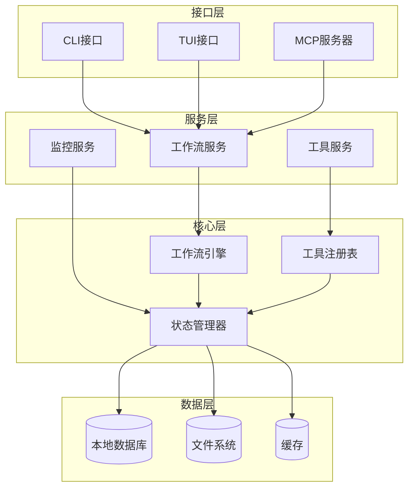
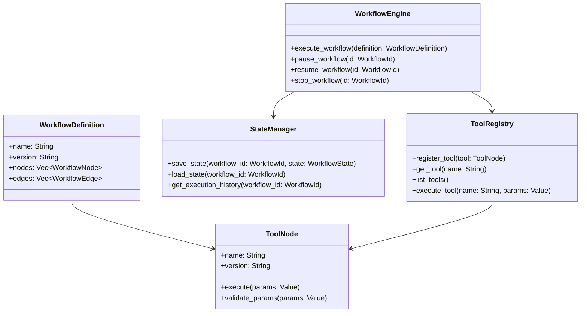

# 设计文档

## 概述

基于工作流的工具包是一个使用Rust开发的多接口工具系统，采用模块化架构设计，支持CLI、TUI和MCP服务器三种接口。系统核心围绕工作流执行引擎构建，提供可复用的工具节点机制，确保高性能、类型安全和并发执行能力。

## 架构

### 整体架构

系统采用分层架构模式，从底层到顶层包括：



### 核心组件关系



## 技术栈选型

### 核心依赖

```toml
[dependencies]
# 异步运行时
tokio = { version = "1.42", features = ["full"] }
tokio-util = "0.7"

# 序列化和配置
serde = { version = "1.0", features = ["derive"] }
serde_json = "1.0"
serde_yaml = "0.9"
config = "0.14"

# CLI框架
clap = { version = "4.5", features = ["derive", "env"] }

# TUI框架
ratatui = "0.29"
crossterm = "0.28"

# MCP协议
mcp-protocol-server = "0.2"
jsonrpc-core = "18.0"
jsonrpc-http-server = "18.0"
jsonrpc-ws-server = "18.0"

# 数据库和存储
lancedb = "0.20"
arrow = "54.0"
parquet = "54.0"

# 缓存
moka = { version = "0.12", features = ["future"] }

# 日志和监控
tracing = "0.1"
tracing-subscriber = { version = "0.3", features = ["env-filter"] }
metrics = "0.24"
metrics-exporter-prometheus = "0.16"

# 插件系统
libloading = "0.8"
wasmtime = "27.0"
extism = "1.8"

# 工作流调度
petgraph = "0.6"
uuid = { version = "1.11", features = ["v4", "serde"] }
chrono = { version = "0.4", features = ["serde"] }

# 错误处理
anyhow = "1.0"
thiserror = "2.0"

# 并发和同步
dashmap = "6.1"
parking_lot = "0.12"

# 异步trait支持
async-trait = "0.1"
```

## 组件和接口

### 1. 工作流引擎 (WorkflowEngine)

**职责**: 工作流的解析、执行、调度和生命周期管理

**技术实现**:
- 使用 `petgraph` 构建DAG工作流结构
- 基于 `tokio` 的异步任务执行器
- `dashmap` 提供并发安全的状态管理
- `parking_lot` 提供高性能锁机制

**核心接口**:
```rust
pub trait WorkflowEngine {
    async fn execute_workflow(&self, definition: WorkflowDefinition) -> Result<WorkflowExecution>;
    async fn pause_workflow(&self, id: WorkflowId) -> Result<()>;
    async fn resume_workflow(&self, id: WorkflowId) -> Result<()>;
    async fn stop_workflow(&self, id: WorkflowId) -> Result<()>;
    async fn get_workflow_status(&self, id: WorkflowId) -> Result<WorkflowStatus>;
}
```

**实现特性**:
- 支持DAG（有向无环图）工作流结构
- 异步任务执行和并发控制
- 条件分支和循环逻辑
- 检查点和恢复机制
- 错误处理和重试策略

### 2. 插件系统和工具注册表 (PluginSystem & ToolRegistry)

**职责**: 插件加载、工具节点注册、第三方包封装和执行

**技术实现**:
- 使用 `libloading` 支持动态库插件加载
- 使用 `wasmtime` 支持WebAssembly插件
- 使用 `extism` 提供多语言插件支持
- 支持Python、Node.js、Go等第三方包封装

**插件架构**:
```rust
pub trait Plugin: Send + Sync {
    fn name(&self) -> &str;
    fn version(&self) -> &str;
    fn initialize(&mut self, config: PluginConfig) -> Result<()>;
    fn get_tools(&self) -> Vec<Box<dyn ToolNode>>;
    fn shutdown(&mut self) -> Result<()>;
}

pub enum PluginType {
    Native(NativePlugin),      // Rust动态库
    Wasm(WasmPlugin),         // WebAssembly模块
    Python(PythonPlugin),     // Python包装器
    NodeJs(NodeJsPlugin),     // Node.js包装器
    Go(GoPlugin),             // Go二进制包装器
    Docker(DockerPlugin),     // Docker容器插件
}

pub struct PluginManager {
    plugins: DashMap<String, Box<dyn Plugin>>,
    plugin_configs: HashMap<String, PluginConfig>,
    runtime_manager: RuntimeManager,
}
```

**第三方包封装支持**:

1. **Python插件封装**:
```rust
pub struct PythonPlugin {
    module_path: PathBuf,
    python_env: PythonEnvironment,
    tools: Vec<PythonTool>,
}

impl PythonPlugin {
    pub fn from_requirements(&self, requirements_txt: &Path) -> Result<Self> {
        // 自动创建虚拟环境并安装依赖
        let venv = self.create_virtual_env()?;
        venv.install_requirements(requirements_txt)?;
        Ok(Self { python_env: venv, ..Default::default() })
    }
}
```

2. **Node.js插件封装**:
```rust
pub struct NodeJsPlugin {
    package_json: PathBuf,
    node_modules: PathBuf,
    tools: Vec<NodeJsTool>,
}

impl NodeJsPlugin {
    pub fn from_package_json(&self, package_json: &Path) -> Result<Self> {
        // 自动运行npm install并加载模块
        let npm_manager = NpmManager::new();
        npm_manager.install_dependencies(package_json)?;
        Ok(Self { package_json: package_json.to_path_buf(), ..Default::default() })
    }
}
```

3. **Docker插件封装**:
```rust
pub struct DockerPlugin {
    image: String,
    container_config: ContainerConfig,
    tools: Vec<DockerTool>,
}

impl DockerPlugin {
    pub fn from_dockerfile(&self, dockerfile: &Path) -> Result<Self> {
        // 自动构建Docker镜像并创建容器
        let docker = Docker::connect_with_local_defaults()?;
        let image_id = docker.build_image(dockerfile)?;
        Ok(Self { image: image_id, ..Default::default() })
    }
}
```

**工具注册表接口**:
```rust
pub trait ToolRegistry {
    fn register_plugin(&mut self, plugin: Box<dyn Plugin>) -> Result<()>;
    fn register_tool(&mut self, tool: Box<dyn ToolNode>) -> Result<()>;
    fn get_tool(&self, name: &str) -> Option<&dyn ToolNode>;
    fn list_tools(&self) -> Vec<ToolInfo>;
    async fn execute_tool(&self, name: &str, params: Value) -> Result<Value>;
    fn validate_tool_params(&self, name: &str, params: &Value) -> Result<()>;
    fn reload_plugin(&mut self, plugin_name: &str) -> Result<()>;
}
```

**插件配置格式**:
```yaml
plugins:
  - name: "data-processing"
    type: "python"
    config:
      requirements_file: "./plugins/data-processing/requirements.txt"
      entry_point: "main.py"
      tools:
        - name: "csv_processor"
          function: "process_csv"
        - name: "json_transformer"
          function: "transform_json"
  
  - name: "web-scraper"
    type: "nodejs"
    config:
      package_json: "./plugins/web-scraper/package.json"
      entry_point: "index.js"
      tools:
        - name: "scrape_website"
          function: "scrapeWebsite"
  
  - name: "image-processor"
    type: "docker"
    config:
      dockerfile: "./plugins/image-processor/Dockerfile"
      tools:
        - name: "resize_image"
          endpoint: "/api/resize"
        - name: "convert_format"
          endpoint: "/api/convert"
```

### 3. 统一存储接口和状态管理器 (StorageInterface & StateManager)

**职责**: 提供统一的数据存储接口，支持多种存储后端实现

**技术实现**:
- 使用 `lancedb` 作为主要向量数据库，支持高性能查询
- 使用 `moka` 提供本地内存缓存
- 定义统一的存储接口，支持后端切换
- 支持事务和一致性保证

```rust
use arrow::array::{BinaryArray, StringArray, TimestampMillisecondArray};
use arrow::datatypes::{DataType, Field, Schema, TimeUnit};
use arrow::record_batch::RecordBatch;
use chrono::{DateTime, Utc};
use std::sync::Arc;
use std::time::Duration;
use std::path::Path;

#[derive(Debug, Clone, Serialize, Deserialize)]
pub struct RetentionPolicy {
    pub max_age: chrono::Duration,
    pub max_count: Option<usize>,
}

#[derive(Debug, Clone, Serialize, Deserialize)]
pub struct ExecutionRecord {
    pub workflow_id: WorkflowId,
    pub execution_id: String,
    pub timestamp: DateTime<Utc>,
    pub status: ExecutionStatus,
    pub result: Option<Value>,
}

#[async_trait]
#[async_trait]
pub trait StorageBackend: Send + Sync {
    async fn save(&self, key: &str, value: &[u8]) -> Result<()>;
    async fn load(&self, key: &str) -> Result<Option<Vec<u8>>>;
    async fn delete(&self, key: &str) -> Result<()>;
    async fn list_keys(&self, prefix: &str) -> Result<Vec<String>>;
    async fn exists(&self, key: &str) -> Result<bool>;
    async fn batch_save(&self, items: Vec<(String, Vec<u8>)>) -> Result<()>;
    async fn batch_load(&self, keys: Vec<String>) -> Result<Vec<Option<Vec<u8>>>>;
}

#[async_trait]
pub trait CacheBackend: Send + Sync {
    async fn get(&self, key: &str) -> Option<Vec<u8>>;
    async fn set(&self, key: &str, value: Vec<u8>, ttl: Option<Duration>) -> Result<()>;
    async fn delete(&self, key: &str) -> Result<()>;
    async fn clear(&self) -> Result<()>;
    fn size(&self) -> usize;
}

// LanceDB存储实现
pub struct LanceDbStorage {
    connection: Arc<lancedb::Connection>,
    table_name: String,
}

impl LanceDbStorage {
    pub async fn new(db_path: &Path, table_name: &str) -> Result<Self> {
        let connection = lancedb::connect(db_path).execute().await?;
        
        // 创建表结构用于存储工作流数据
        let schema = Arc::new(Schema::new(vec![
            Field::new("key", DataType::Utf8, false),
            Field::new("value", DataType::Binary, false),
            Field::new("timestamp", DataType::Timestamp(TimeUnit::Millisecond, None), false),
            Field::new("metadata", DataType::Utf8, true),
        ]));
        
        Ok(Self {
            connection: Arc::new(connection),
            table_name: table_name.to_string(),
        })
    }
}

#[async_trait]
impl StorageBackend for LanceDbStorage {
    async fn save(&self, key: &str, value: &[u8]) -> Result<()> {
        let table = self.connection.open_table(&self.table_name).execute().await?;
        
        let batch = RecordBatch::try_new(
            table.schema().clone(),
            vec![
                Arc::new(StringArray::from(vec![key])),
                Arc::new(BinaryArray::from(vec![value])),
                Arc::new(TimestampMillisecondArray::from(vec![
                    Utc::now().timestamp_millis()
                ])),
                Arc::new(StringArray::from(vec![Option::<&str>::None])),
            ],
        )?;
        
        table.add(batch).execute().await?;
        Ok(())
    }
    
    async fn load(&self, key: &str) -> Result<Option<Vec<u8>>> {
        let table = self.connection.open_table(&self.table_name).execute().await?;
        
        let results = table
            .search(vec![])
            .where_clause(format!("key = '{}'", key))
            .execute()
            .await?;
            
        if let Some(batch) = results.first() {
            if let Some(binary_array) = batch.column(1).as_any().downcast_ref::<BinaryArray>() {
                if binary_array.len() > 0 {
                    return Ok(Some(binary_array.value(0).to_vec()));
                }
            }
        }
        
        Ok(None)
    }
    
    async fn delete(&self, key: &str) -> Result<()> {
        let table = self.connection.open_table(&self.table_name).execute().await?;
        table.delete(&format!("key = '{}'", key)).await?;
        Ok(())
    }
    
    async fn list_keys(&self, prefix: &str) -> Result<Vec<String>> {
        let table = self.connection.open_table(&self.table_name).execute().await?;
        
        let results = table
            .search(vec![])
            .where_clause(format!("key LIKE '{}%'", prefix))
            .execute()
            .await?;
            
        let mut keys = Vec::new();
        for batch in results {
            if let Some(string_array) = batch.column(0).as_any().downcast_ref::<StringArray>() {
                for i in 0..string_array.len() {
                    if let Some(key) = string_array.value(i).to_string() {
                        keys.push(key);
                    }
                }
            }
        }
        
        Ok(keys)
    }
    
    async fn exists(&self, key: &str) -> Result<bool> {
        Ok(self.load(key).await?.is_some())
    }
    
    async fn batch_save(&self, items: Vec<(String, Vec<u8>)>) -> Result<()> {
        let table = self.connection.open_table(&self.table_name).execute().await?;
        
        let keys: Vec<String> = items.iter().map(|(k, _)| k.clone()).collect();
        let values: Vec<Vec<u8>> = items.iter().map(|(_, v)| v.clone()).collect();
        let timestamps: Vec<i64> = vec![Utc::now().timestamp_millis(); items.len()];
        let metadata: Vec<Option<&str>> = vec![None; items.len()];
        
        let batch = RecordBatch::try_new(
            table.schema().clone(),
            vec![
                Arc::new(StringArray::from(keys)),
                Arc::new(BinaryArray::from(values)),
                Arc::new(TimestampMillisecondArray::from(timestamps)),
                Arc::new(StringArray::from(metadata)),
            ],
        )?;
        
        table.add(batch).execute().await?;
        Ok(())
    }
    
    async fn batch_load(&self, keys: Vec<String>) -> Result<Vec<Option<Vec<u8>>>> {
        let mut results = Vec::new();
        for key in keys {
            results.push(self.load(&key).await?);
        }
        Ok(results)
    }
}

// 本地内存缓存实现
pub struct LocalMemoryCache {
    cache: Arc<moka::future::Cache<String, Vec<u8>>>,
}

impl LocalMemoryCache {
    pub fn new(max_capacity: u64, ttl: Option<Duration>) -> Self {
        let mut builder = moka::future::Cache::builder()
            .max_capacity(max_capacity);
            
        if let Some(ttl) = ttl {
            builder = builder.time_to_live(ttl);
        }
        
        Self {
            cache: Arc::new(builder.build()),
        }
    }
}

#[async_trait]
impl CacheBackend for LocalMemoryCache {
    async fn get(&self, key: &str) -> Option<Vec<u8>> {
        self.cache.get(key).await
    }
    
    async fn set(&self, key: &str, value: Vec<u8>, _ttl: Option<Duration>) -> Result<()> {
        self.cache.insert(key.to_string(), value).await;
        Ok(())
    }
    
    async fn delete(&self, key: &str) -> Result<()> {
        self.cache.invalidate(key).await;
        Ok(())
    }
    
    async fn clear(&self) -> Result<()> {
        self.cache.invalidate_all();
        Ok(())
    }
    
    fn size(&self) -> usize {
        self.cache.entry_count() as usize
    }
}

// 状态管理器实现
pub struct StateManager {
    storage: Arc<dyn StorageBackend>,
    cache: Arc<dyn CacheBackend>,
}

impl StateManager {
    pub fn new(
        storage: Arc<dyn StorageBackend>,
        cache: Arc<dyn CacheBackend>,
    ) -> Self {
        Self { storage, cache }
    }
    
    pub async fn with_lancedb_and_local_cache(
        db_path: &Path,
        cache_capacity: u64,
        cache_ttl: Option<Duration>,
    ) -> Result<Self> {
        let storage = Arc::new(LanceDbStorage::new(db_path, "workflow_states").await?);
        let cache = Arc::new(LocalMemoryCache::new(cache_capacity, cache_ttl));
        
        Ok(Self::new(storage, cache))
    }
}

#[async_trait]
impl StateManager {
    async fn save_workflow_state(&self, id: WorkflowId, state: WorkflowState) -> Result<()> {
        let key = format!("workflow_state:{}", id);
        let value = serde_json::to_vec(&state)?;
        
        // 先保存到存储后端
        self.storage.save(&key, &value).await?;
        
        // 然后更新缓存
        self.cache.set(&key, value, Some(Duration::from_secs(3600))).await?;
        
        Ok(())
    }
    
    async fn load_workflow_state(&self, id: WorkflowId) -> Result<Option<WorkflowState>> {
        let key = format!("workflow_state:{}", id);
        
        // 先尝试从缓存获取
        if let Some(cached_value) = self.cache.get(&key).await {
            if let Ok(state) = serde_json::from_slice(&cached_value) {
                return Ok(Some(state));
            }
        }
        
        // 缓存未命中，从存储后端获取
        if let Some(value) = self.storage.load(&key).await? {
            let state: WorkflowState = serde_json::from_slice(&value)?;
            
            // 更新缓存
            self.cache.set(&key, value, Some(Duration::from_secs(3600))).await?;
            
            Ok(Some(state))
        } else {
            Ok(None)
        }
    }
    
    async fn get_execution_history(&self, id: WorkflowId) -> Result<Vec<ExecutionRecord>> {
        let prefix = format!("execution_history:{}", id);
        let keys = self.storage.list_keys(&prefix).await?;
        let values = self.storage.batch_load(keys).await?;
        
        let mut history = Vec::new();
        for value_opt in values {
            if let Some(value) = value_opt {
                if let Ok(record) = serde_json::from_slice::<ExecutionRecord>(&value) {
                    history.push(record);
                }
            }
        }
        
        // 按时间排序
        history.sort_by(|a, b| a.timestamp.cmp(&b.timestamp));
        
        Ok(history)
    }
    
    async fn cleanup_old_states(&self, retention_policy: RetentionPolicy) -> Result<()> {
        let cutoff_time = Utc::now() - retention_policy.max_age;
        let all_keys = self.storage.list_keys("").await?;
        
        for key in all_keys {
            if let Some(value) = self.storage.load(&key).await? {
                // 这里需要根据具体的数据结构来判断时间戳
                // 简化实现，实际应该解析数据获取时间戳
                // if timestamp < cutoff_time {
                //     self.storage.delete(&key).await?;
                //     self.cache.delete(&key).await?;
                // }
            }
        }
        
        Ok(())
    }
}
```

### 4. CLI接口

**技术实现**: 
- 使用 `clap` v4 进行命令行解析，支持子命令和参数验证
- 使用 `tokio` 提供异步运行时
- 集成 `tracing` 进行结构化日志输出
- 支持命令补全和彩色输出

**主要命令**:
```bash
workflow-toolkit workflow create <definition-file>
workflow-toolkit workflow execute <workflow-name> [--params <params-file>]
workflow-toolkit workflow status <workflow-id>
workflow-toolkit workflow pause <workflow-id>
workflow-toolkit workflow resume <workflow-id>
workflow-toolkit workflow stop <workflow-id>
workflow-toolkit tool list
workflow-toolkit tool execute <tool-name> [--params <params>]
workflow-toolkit plugin install <plugin-path>
workflow-toolkit plugin list
workflow-toolkit plugin reload <plugin-name>
```

### 5. TUI接口

**技术实现**: 
- 使用 `ratatui` v0.28 构建响应式终端界面
- 使用 `crossterm` v0.28 处理跨平台终端操作
- 实现事件驱动的UI更新机制
- 支持鼠标和键盘交互

**界面组件**:
```rust
pub struct TuiApp {
    workflow_list: WorkflowListWidget,
    execution_monitor: ExecutionMonitorWidget,
    tool_manager: ToolManagerWidget,
    system_status: SystemStatusWidget,
    log_viewer: LogViewerWidget,
}

pub struct WorkflowListWidget {
    workflows: Vec<WorkflowInfo>,
    selected_index: usize,
    filter: String,
}

pub struct ExecutionMonitorWidget {
    current_execution: Option<WorkflowExecution>,
    progress_bars: Vec<ProgressBar>,
    real_time_logs: Vec<LogEntry>,
}
```

**界面布局**:
```
┌─────────────────────────────────────────────────────────────┐
│ 工作流工具包 v1.0.0                                         │
├─────────────────────────────────────────────────────────────┤
│ [工作流列表] │ [执行监控] │ [工具管理] │ [系统状态]         │
├─────────────────────────────────────────────────────────────┤
│                                                             │
│  当前工作流: data-processing-pipeline                       │
│  状态: 运行中 (3/5 任务完成)                               │
│  ┌─────────────────────────────────────────────────────┐   │
│  │ ● 数据获取     [完成]                               │   │
│  │ ● 数据清洗     [完成]                               │   │
│  │ ● 数据转换     [运行中] ████████░░ 80%              │   │
│  │ ○ 数据验证     [等待中]                             │   │
│  │ ○ 数据存储     [等待中]                             │   │
│  └─────────────────────────────────────────────────────┘   │
│                                                             │
├─────────────────────────────────────────────────────────────┤
│ [P]暂停 [R]恢复 [S]停止 [Q]退出                            │
└─────────────────────────────────────────────────────────────┘
```

### 6. MCP服务器

**技术实现**: 
- 使用 `mcp-protocol-server` crate 实现MCP协议规范
- 使用 `jsonrpc-core` 处理JSON-RPC 2.0消息
- 使用 `jsonrpc-http-server` 提供HTTP接口
- 使用 `jsonrpc-ws-server` 提供WebSocket实时通信
- 集成 `serde_json` 进行消息序列化

**服务器配置**:
```rust
pub struct McpServerConfig {
    pub http_port: u16,
    pub ws_port: u16,
    pub auth_enabled: bool,
    pub cors_origins: Vec<String>,
    pub rate_limit: RateLimitConfig,
}

pub struct McpServer {
    http_server: HttpServer,
    ws_server: WsServer,
    workflow_service: Arc<WorkflowService>,
    tool_service: Arc<ToolService>,
    auth_service: Arc<AuthService>,
}
```

**MCP工具定义**:
```json
{
  "tools": [
    {
      "name": "execute_workflow",
      "description": "执行指定的工作流",
      "inputSchema": {
        "type": "object",
        "properties": {
          "workflow_name": {"type": "string"},
          "parameters": {"type": "object"}
        },
        "required": ["workflow_name"]
      }
    },
    {
      "name": "get_workflow_status",
      "description": "获取工作流执行状态",
      "inputSchema": {
        "type": "object",
        "properties": {
          "workflow_id": {"type": "string"}
        },
        "required": ["workflow_id"]
      }
    },
    {
      "name": "install_plugin",
      "description": "安装新的插件",
      "inputSchema": {
        "type": "object",
        "properties": {
          "plugin_source": {"type": "string"},
          "plugin_type": {"type": "string", "enum": ["python", "nodejs", "docker", "wasm", "native"]}
        },
        "required": ["plugin_source", "plugin_type"]
      }
    }
  ]
}
```

## 数据模型

### 工作流定义模型

```rust
#[derive(Debug, Clone, Serialize, Deserialize)]
pub struct WorkflowDefinition {
    pub name: String,
    pub version: String,
    pub description: Option<String>,
    pub metadata: HashMap<String, Value>,
    pub nodes: Vec<WorkflowNode>,
    pub edges: Vec<WorkflowEdge>,
    pub global_config: WorkflowConfig,
}

#[derive(Debug, Clone, Serialize, Deserialize)]
pub struct WorkflowNode {
    pub id: String,
    pub node_type: NodeType,
    pub tool_name: Option<String>,
    pub parameters: Value,
    pub retry_policy: Option<RetryPolicy>,
    pub timeout: Option<Duration>,
}

#[derive(Debug, Clone, Serialize, Deserialize)]
pub enum NodeType {
    Tool,
    Condition,
    Loop,
    Parallel,
    Checkpoint,
}

#[derive(Debug, Clone, Serialize, Deserialize)]
pub struct WorkflowEdge {
    pub from: String,
    pub to: String,
    pub condition: Option<String>,
}
```

### 工具节点模型

```rust
#[derive(Debug, Clone, Serialize, Deserialize)]
pub struct ToolDefinition {
    pub name: String,
    pub version: String,
    pub description: String,
    pub parameters_schema: Value,
    pub return_schema: Value,
    pub dependencies: Vec<String>,
    pub metadata: HashMap<String, Value>,
    pub plugin_info: Option<PluginInfo>,
}

#[derive(Debug, Clone, Serialize, Deserialize)]
pub struct PluginInfo {
    pub plugin_name: String,
    pub plugin_type: PluginType,
    pub runtime_config: RuntimeConfig,
}

#[derive(Debug, Clone, Serialize, Deserialize)]
pub enum RuntimeConfig {
    Python {
        virtual_env: PathBuf,
        requirements: Vec<String>,
        entry_point: String,
    },
    NodeJs {
        node_modules: PathBuf,
        package_json: PathBuf,
        entry_point: String,
    },
    Docker {
        image: String,
        container_config: ContainerConfig,
        api_endpoints: Vec<ApiEndpoint>,
    },
    Wasm {
        module_path: PathBuf,
        memory_limit: u64,
        timeout: Duration,
    },
    Native {
        library_path: PathBuf,
        symbol_name: String,
    },
}

pub trait ToolNode: Send + Sync {
    fn name(&self) -> &str;
    fn version(&self) -> &str;
    fn validate_parameters(&self, params: &Value) -> Result<()>;
    async fn execute(&self, params: Value, context: ExecutionContext) -> Result<Value>;
    fn get_schema(&self) -> ToolDefinition;
    fn get_plugin_info(&self) -> Option<&PluginInfo>;
}

// 不同类型的工具节点实现
pub struct PythonToolNode {
    definition: ToolDefinition,
    python_runtime: PythonRuntime,
}

pub struct NodeJsToolNode {
    definition: ToolDefinition,
    nodejs_runtime: NodeJsRuntime,
}

pub struct DockerToolNode {
    definition: ToolDefinition,
    docker_client: DockerClient,
    container_id: Option<String>,
}

pub struct WasmToolNode {
    definition: ToolDefinition,
    wasm_module: WasmModule,
    runtime: WasmRuntime,
}
```

### 执行状态模型

```rust
#[derive(Debug, Clone, Serialize, Deserialize)]
pub struct WorkflowExecution {
    pub id: WorkflowId,
    pub workflow_name: String,
    pub status: ExecutionStatus,
    pub started_at: DateTime<Utc>,
    pub completed_at: Option<DateTime<Utc>>,
    pub current_node: Option<String>,
    pub node_states: HashMap<String, NodeExecutionState>,
    pub global_context: Value,
}

#[derive(Debug, Clone, Serialize, Deserialize)]
pub enum ExecutionStatus {
    Pending,
    Running,
    Paused,
    Completed,
    Failed,
    Cancelled,
}

#[derive(Debug, Clone, Serialize, Deserialize)]
pub struct NodeExecutionState {
    pub status: ExecutionStatus,
    pub started_at: Option<DateTime<Utc>>,
    pub completed_at: Option<DateTime<Utc>>,
    pub result: Option<Value>,
    pub error: Option<String>,
    pub retry_count: u32,
}
```

## 正确性属性

*属性是应该在系统所有有效执行中保持为真的特征或行为——本质上是关于系统应该做什么的正式陈述。属性作为人类可读规范和机器可验证正确性保证之间的桥梁。*

### 属性 1: 配置解析往返一致性
*对于任何*有效的配置对象，序列化然后反序列化应该产生等效的对象
**验证需求: 需求 1.1, 9.1**

### 属性 2: 工作流定义验证正确性
*对于任何*工作流定义输入，验证函数应该正确识别有效和无效的定义
**验证需求: 需求 1.2**

### 属性 3: 依赖执行顺序正确性
*对于任何*包含依赖关系的工作流，任务执行顺序应该遵循拓扑排序规则
**验证需求: 需求 1.4**

### 属性 4: 工作流状态控制一致性
*对于任何*工作流，暂停操作后的恢复应该从正确的状态继续执行
**验证需求: 需求 2.3, 5.3**

### 属性 5: 批量执行完整性
*对于任何*工作流列表，批量执行应该启动所有指定的工作流
**验证需求: 需求 2.5**

### 属性 6: CLI输出信息完整性
*对于任何*完成的工作流执行，CLI输出应该包含执行结果和统计信息
**验证需求: 需求 2.4**

### 属性 7: MCP API响应格式正确性
*对于任何*工作流执行请求，MCP服务器响应应该包含执行ID和状态信息
**验证需求: 需求 4.3**

### 属性 8: 身份验证访问控制
*对于任何*MCP请求，未授权请求应该被拒绝，授权请求应该被接受
**验证需求: 需求 4.5**

### 属性 9: 同步异步执行模式
*对于任何*任务类型，同步执行应该阻塞直到完成，异步执行应该立即返回
**验证需求: 需求 5.1**

### 属性 10: 重试策略执行正确性
*对于任何*失败的任务，重试次数和间隔应该符合配置的重试策略
**验证需求: 需求 5.2, 8.1**

### 属性 11: 执行日志完整性
*对于任何*工作流执行，日志应该包含所有任务的开始、结束和结果信息
**验证需求: 需求 5.4**

### 属性 12: 系统恢复一致性
*对于任何*中断的工作流，系统重启后应该能够从正确的检查点恢复执行
**验证需求: 需求 5.5**

### 属性 13: 工具节点执行一致性
*对于任何*工具节点，在工作流中执行和独立调用应该产生相同的结果
**验证需求: 需求 6.2, 6.3**

### 属性 14: 工具版本依赖解析
*对于任何*工具节点依赖图，版本冲突应该被正确检测和解决
**验证需求: 需求 6.4**

### 属性 15: 参数模板展开正确性
*对于任何*参数化工具节点，模板参数应该正确展开为实际值
**验证需求: 需求 6.5**

### 属性 16: 数据持久化往返一致性
*对于任何*工作流状态，保存后读取应该得到等效的状态对象
**验证需求: 需求 7.1, 4.2**

### 属性 17: 执行历史查询正确性
*对于任何*工作流ID，历史查询应该返回该工作流的所有执行记录
**验证需求: 需求 7.2**

### 属性 18: 并发数据一致性
*对于任何*并发工作流执行，状态管理器应该保证数据不会出现竞态条件
**验证需求: 需求 7.3**

### 属性 19: 备份恢复完整性
*对于任何*系统状态，备份后恢复应该保持数据完整性
**验证需求: 需求 7.4**

### 属性 20: 缓存结果一致性
*对于任何*相同输入的工作流执行，缓存结果应该与实际执行结果一致
**验证需求: 需求 7.5**

### 属性 21: 配置优先级正确性
*对于任何*配置项，环境变量和命令行参数应该按优先级覆盖配置文件值
**验证需求: 需求 9.3**

### 属性 22: 配置验证和默认值
*对于任何*配置输入，无效配置应该被拒绝，缺失配置应该使用默认值
**验证需求: 需求 9.4**

### 属性 24: 插件加载和卸载一致性
*对于任何*有效的插件，加载后卸载再重新加载应该产生相同的功能
**验证需求: 需求 6.1, 6.6**

### 属性 25: 第三方包依赖解析正确性
*对于任何*插件的依赖声明，系统应该正确安装和管理所有依赖包
**验证需求: 需求 6.4**

### 属性 26: 跨语言插件执行一致性
*对于任何*相同功能的不同语言实现插件，执行结果应该保持一致
**验证需求: 需求 6.3**

### 属性 27: 插件沙箱隔离安全性
*对于任何*插件执行，不应该影响系统其他部分的状态和数据
**验证需求: 需求 8.5**

## 错误处理

### 错误分类

系统采用分层错误处理策略，将错误分为以下类别：

1. **用户错误** (UserError)
   - 无效的工作流定义
   - 错误的参数格式
   - 权限不足

2. **系统错误** (SystemError)
   - 数据库连接失败
   - 文件系统错误
   - 网络连接问题

3. **运行时错误** (RuntimeError)
   - 工具执行失败
   - 资源不足
   - 超时错误

### 错误处理策略

```rust
#[derive(Debug, Clone, Serialize, Deserialize)]
pub struct ErrorPolicy {
    pub retry_strategy: RetryStrategy,
    pub fallback_action: FallbackAction,
    pub notification_level: NotificationLevel,
}

#[derive(Debug, Clone, Serialize, Deserialize)]
pub enum RetryStrategy {
    None,
    FixedInterval { attempts: u32, interval: Duration },
    ExponentialBackoff { max_attempts: u32, base_delay: Duration, max_delay: Duration },
    Custom(String), // 自定义重试逻辑
}

#[derive(Debug, Clone, Serialize, Deserialize)]
pub enum FallbackAction {
    Fail,
    Skip,
    UseDefault(Value),
    ExecuteAlternative(String),
}
```

### 错误恢复机制

- **检查点恢复**: 工作流在关键节点自动创建检查点
- **部分重试**: 只重试失败的任务，而不是整个工作流
- **降级执行**: 在资源不足时自动降低并发度
- **故障隔离**: 单个工具失败不影响其他并行任务

## 测试策略

### 双重测试方法

系统采用单元测试和基于属性的测试相结合的方法：

**单元测试**:
- 验证具体示例和边缘情况
- 测试组件间的集成点
- 验证错误条件和异常处理
- 使用 `tokio-test` 进行异步代码测试

**基于属性的测试**:
- 验证跨所有输入的通用属性
- 使用 `proptest` 库生成随机测试数据
- 每个属性测试最少运行100次迭代
- 测试标签格式: **Feature: workflow-toolkit, Property {number}: {property_text}**

### 测试配置

```toml
[dev-dependencies]
proptest = "1.6"
tokio-test = "0.4"
tempfile = "3.14"
mockall = "0.13"
testcontainers = "0.23"  # Docker容器测试
pyo3 = "0.23"           # Python集成测试

[[test]]
name = "property_tests"
path = "tests/property_tests.rs"

[[test]]
name = "integration_tests"
path = "tests/integration_tests.rs"

[[test]]
name = "plugin_tests"
path = "tests/plugin_tests.rs"
```

### 测试数据生成策略

- **工作流生成器**: 创建有效和无效的工作流定义
- **工具节点生成器**: 生成各种类型的工具节点
- **插件生成器**: 模拟不同类型的插件加载和执行
- **执行状态生成器**: 模拟各种执行状态和转换
- **配置生成器**: 生成有效和无效的配置组合

### 插件测试策略

- **沙箱测试**: 在隔离环境中测试插件执行
- **容器测试**: 使用 `testcontainers` 测试Docker插件
- **虚拟环境测试**: 测试Python和Node.js插件的依赖管理
- **WASM测试**: 测试WebAssembly插件的内存和性能限制
- **故障注入**: 测试插件失败时的系统恢复能力

### 性能测试

- **负载测试**: 测试大量并发工作流执行
- **插件性能测试**: 测试不同类型插件的执行性能
- **压力测试**: 测试系统在资源限制下的行为
- **持久化性能**: 测试大量状态数据的读写性能
- **内存泄漏检测**: 使用 `valgrind` 检测内存问题