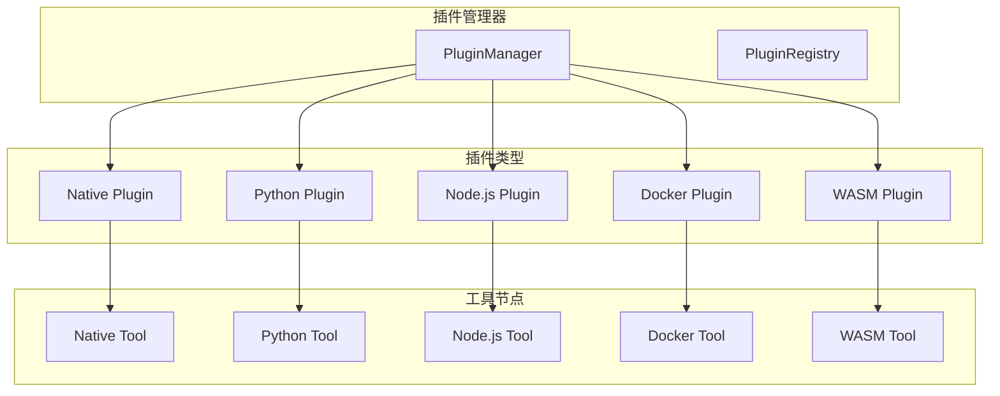

# 插件开发指南

## 概述

工作流工具包提供了强大的插件系统，支持多种编程语言和运行环境。本指南将详细介绍如何 develop、测试和部署各种类型的插件。

## 插件系统架构

### 插件类型概览

工作流工具包支持以下五种插件类型：

1. **Native插件** - Rust动态库，性能最佳
2. **Python插件** - Python脚本和包，易于开发
3. **Node.js插件** - JavaScript/TypeScript，生态丰富
4. **Docker插件** - 容器化工具，环境隔离
5. **WASM插件** - WebAssembly模块，跨平台安全

### 插件架构图



### 核心接口

所有插件都必须实现以下核心接口：

```rust
#[async_trait]
pub trait Plugin: Send + Sync {
    fn name(&self) -> &str;
    fn version(&self) -> &str;
    async fn initialize(&mut self, config: PluginConfig) -> Result<()>;
    fn get_tools(&self) -> Vec<Box<dyn ToolNode>>;
    async fn shutdown(&mut self) -> Result<()>;
}

#[async_trait]
pub trait ToolNode: Send + Sync {
    fn name(&self) -> &str;
    fn version(&self) -> &str;
    async fn execute(&self, params: Value, context: ExecutionContext) -> Result<Value>;
    fn validate_parameters(&self, params: &Value) -> Result<()>;
    fn get_schema(&self) -> ToolDefinition;
}
```

## Native插件开发

### 1. 创建Native插件

Native插件是使用Rust编写的动态库，提供最佳性能。

#### 项目结构

```
my-native-plugin/
├── Cargo.toml
├── src/
│   ├── lib.rs
│   └── tools/
│       ├── mod.rs
│       └── calculator.rs
└── examples/
    └── usage.rs
```
