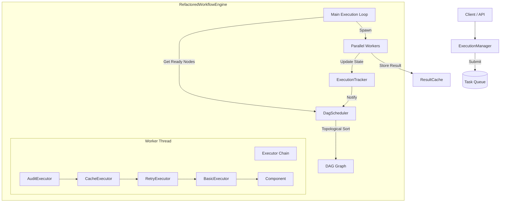

# 工作流引擎设计 (v2)

## 版本变更记录

| 版本 | 日期 | 作者 | 变更内容 |
|------|------|------|----------|
| v2.0 | 2026-01-16 | Trae AI | 重构为 LiteFlow 架构，引入并行执行、责任链模式和细粒度状态管理 |

## 1. 架构概览

新版工作流引擎（`RefactoredWorkflowEngine`）采用了 **LiteFlow** 设计原则，旨在提供一个模块化、高性能且真正的并行执行环境。

### 1.1 核心设计理念

*   **真正的并行 (True Parallelism)**: 利用 Rust 的异步运行时 (`tokio`) 和多线程能力，同时执行无依赖的节点，而非简单的并发调度。
*   **责任链模式 (Chain of Responsibility)**: 将核心业务逻辑与横切关注点（如重试、缓存、审计）分离，通过执行器链 (Executor Chain) 组合。
*   **单一事实来源 (Single Source of Truth)**: 使用统一的 `ExecutionTracker` 管理所有状态，确保线程安全和数据一致性。
*   **组件化 (Component-based)**: 所有执行单元封装为 `Component`，便于扩展和测试。

### 1.2 系统架构图

## 2. 核心模块详解

### 2.1 RefactoredWorkflowEngine (`src/workflow/engine_v2.rs`)

引擎的核心是一个基于事件循环的调度器。

*   **职责**: 
    *   初始化工作流上下文。
    *   驱动主循环：`check_ready` -> `execute_parallel` -> `update_state`。
    *   管理生命周期（启动、暂停、恢复、停止）。
*   **并行机制**: 使用 `futures::future::join_all` 并发等待多个 `tokio::spawn` 任务的完成。

### 2.2 DagScheduler (`src/workflow/scheduler.rs`)

基于 `petgraph` 的 DAG 调度器。

*   **职责**:
    *   **构建图**: 将 `WorkflowDefinition` 转换为内存中的有向图。
    *   **拓扑排序**: 检测循环依赖并确定静态执行顺序。
    *   **动态就绪检测**: 维护 `ready_nodes` 队列。当节点完成时，检查其后继节点的依赖是否全部满足。
    *   **关键路径计算**: 识别影响总执行时间的关键路径 (Critical Path)。

### 2.3 ExecutionManager (`src/workflow/execution_manager.rs`)

面向外部的高层管理器。

*   **职责**:
    *   **任务队列**: 管理异步执行请求。
    *   **资源控制**: 使用 `Semaphore` 限制全局并发工作流数量。
    *   **同步/异步桥接**: 提供 `execute_async` 和 `execute_sync` 接口。

### 2.4 Executor Chain (`src/workflow/executor/`)

执行逻辑被拆分为多个中间件式的执行器：

1.  **AuditExecutor**: 记录节点开始和结束的审计日志。
2.  **CacheExecutor**: 
    *   计算 `CacheKey` (WorkflowID + NodeID + InputHash)。
    *   查询缓存，命中则跳过后续执行。
    *   执行后将结果写入缓存。
3.  **RetryExecutor**: 
    *   捕获执行错误。
    *   根据 `RetryPolicy` (次数、间隔、策略) 进行重试。
4.  **BasicExecutor**: 最终调用具体的 `Component`。

### 2.5 ExecutionTracker (`src/workflow/state/mod.rs`)

状态管理中心。
