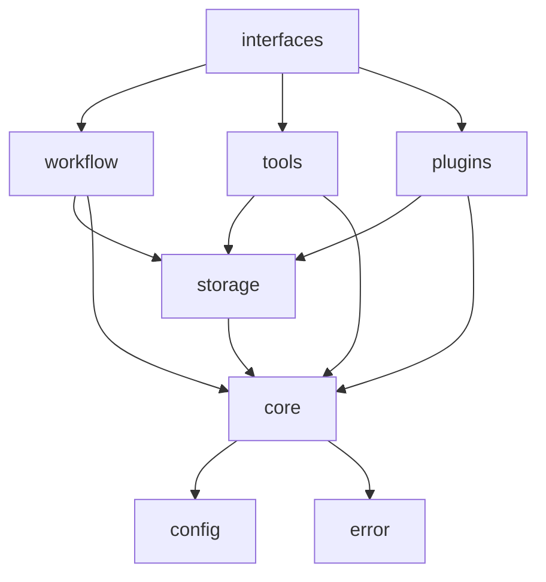

# 工作流工具包二次开发指南

## 概述

本指南旨在帮助开发者理解工作流工具包的架构设计，掌握代码结构和设计模式，了解系统扩展点，并快速搭建开发环境。

## 系统架构

### 整体架构设计

工作流工具包采用分层架构模式，从底层到顶层包括：

```
┌─────────────────────────────────────────────────────────────┐
│                    接口层 (Interface Layer)                 │
├─────────────────────────────────────────────────────────────┤
│  CLI Interface  │  TUI Interface  │  MCP Server Interface   │
└─────────────────────────────────────────────────────────────┘
┌─────────────────────────────────────────────────────────────┐
│                    服务层 (Service Layer)                   │
├─────────────────────────────────────────────────────────────┤
│ Workflow Service │ Tool Service │ Plugin Service │ Monitor │
└─────────────────────────────────────────────────────────────┘
┌─────────────────────────────────────────────────────────────┐
│                     核心层 (Core Layer)                     │
├─────────────────────────────────────────────────────────────┤
│ Workflow Engine │ Tool Registry │ Plugin Manager │ State Mgr│
└─────────────────────────────────────────────────────────────┘
┌─────────────────────────────────────────────────────────────┐
│                    数据层 (Data Layer)                      │
├─────────────────────────────────────────────────────────────┤
│   LanceDB Storage   │   Memory Cache   │   File System     │
└─────────────────────────────────────────────────────────────┘
```

### 核心模块关系

- **接口层**: 提供多种用户交互方式
  - CLI: 命令行接口，适用于脚本和自动化
  - TUI: 终端用户界面，提供交互式体验
  - MCP: Model Context Protocol服务器，支持API集成

- **服务层**: 业务逻辑封装
  - 工作流服务: 工作流生命周期管理
  - 工具服务: 工具节点管理和执行
  - 插件服务: 插件加载和管理
  - 监控服务: 系统状态和性能监控

- **核心层**: 系统核心功能
  - 工作流引擎: DAG执行和调度
  - 工具注册表: 工具发现和调用
  - 插件管理器: 多语言插件支持
  - 状态管理器: 数据持久化和缓存

- **数据层**: 数据存储和访问
  - LanceDB: 向量数据库，支持高性能查询
  - 内存缓存: moka缓存，提供快速访问
  - 文件系统: 配置文件和临时数据

## 代码结构

### 目录结构说明

```
workflow-toolkit/
├── src/                    # 源代码目录
│   ├── lib.rs             # 库入口点，公共API导出
│   ├── main.rs            # CLI应用程序入口
│   ├── config.rs          # 分层配置管理
│   ├── core.rs            # 核心类型定义
│   ├── error.rs           # 统一错误处理
│   ├── interfaces/        # 接口层实现
│   │   ├── cli/           # CLI接口
│   │   ├── tui.rs         # TUI接口
│   │   └── mcp.rs         # MCP服务器
│   ├── workflow/          # 工作流引擎
│   │   ├── definition.rs  # 工作流定义
│   │   ├── engine.rs      # 执行引擎
│   │   ├── scheduler.rs   # 任务调度
│   │   └── validator.rs   # 验证逻辑
│   ├── tools/             # 工具系统
│   │   ├── node.rs        # 工具节点
│   │   └── registry.rs    # 工具注册表
│   ├── plugins/           # 插件系统
│   │   ├── manager.rs     # 插件管理
│   │   ├── native.rs      # 原生插件
│   │   ├── python.rs      # Python插件
│   │   ├── nodejs.rs      # Node.js插件
│   │   ├── docker.rs      # Docker插件
│   │   └── wasm.rs        # WASM插件
│   └── storage/           # 存储层
│       ├── backends.rs    # 存储后端
│       └── state_manager.rs # 状态管理
├── examples/              # 示例代码
├── config/               # 默认配置
├── docs/                 # 文档目录
└── tests/                # 集成测试
```

### 模块依赖关系



## 设计模式

### 1. Trait-based 架构

系统大量使用Rust的trait系统来定义接口和抽象：

```rust
// 工作流引擎trait
#[async_trait]
pub trait WorkflowEngine: Send + Sync {
    async fn execute_workflow(&self, definition: WorkflowDefinition) -> Result<WorkflowExecution>;
    async fn pause_workflow(&self, id: WorkflowId) -> Result<()>;
    async fn resume_workflow(&self, id: WorkflowId) -> Result<()>;
    async fn stop_workflow(&self, id: WorkflowId) -> Result<()>;
}

// 工具节点trait
#[async_trait]
pub trait ToolNode: Send + Sync {
    fn name(&self) -> &str;
    fn version(&self) -> &str;
    async fn execute(&self, params: Value, context: ExecutionContext) -> Result<Value>;
    fn validate_parameters(&self, params: &Value) -> Result<()>;
}

// 存储后端trait
#[async_trait]
pub trait StorageBackend: Send + Sync {
    async fn save(&self, key: &str, value: &[u8]) -> Result<()>;
    async fn load(&self, key: &str) -> Result<Option<Vec<u8>>>;
    async fn delete(&self, key: &str) -> Result<()>;
}
```

### 2. 插件架构模式

支持多种插件类型的统一管理：

```rust
pub enum PluginType {
    Native(NativePlugin),      // Rust动态库
    Wasm(WasmPlugin),         // WebAssembly模块
    Python(PythonPlugin),     // Python包装器
    NodeJs(NodeJsPlugin),     // Node.js包装器
    Docker(DockerPlugin),     // Docker容器插件
}

#[async_trait]
pub trait Plugin: Send + Sync {
    fn name(&self) -> &str;
    fn version(&self) -> &str;
    async fn initialize(&mut self, config: PluginConfig) -> Result<()>;
    fn get_tools(&self) -> Vec<Box<dyn ToolNode>>;
    async fn shutdown(&mut self) -> Result<()>;
}
```

### 3. 状态管理模式

采用分层缓存和持久化策略：

```rust
pub struct StateManager {
    storage: Arc<dyn StorageBackend>,
    cache: Arc<dyn CacheBackend>,
}

impl StateManager {
    // 写入时同时更新存储和缓存
    pub async fn save_state(&self, key: &str, state: &WorkflowState) -> Result<()> {
        let data = serde_json::to_vec(state)?;
        self.storage.save(key, &data).await?;
        self.cache.set(key, data, Some(Duration::from_secs(3600))).await?;
        Ok(())
    }
    
    // 读取时优先从缓存获取
    pub async fn load_state(&self, key: &str) -> Result<Option<WorkflowState>> {
        if let Some(cached) = self.cache.get(key).await {
            return Ok(Some(serde_json::from_slice(&cached)?));
        }
        
        if let Some(stored) = self.storage.load(key).await? {
            let state = serde_json::from_slice(&stored)?;
            self.cache.set(key, stored, Some(Duration::from_secs(3600))).await?;
            Ok(Some(state))
        } else {
            Ok(None)
        }
    }
}
```

### 4. 错误处理模式

使用thiserror和anyhow进行结构化错误处理：

```rust
#[derive(Debug, thiserror::Error)]
pub enum WorkflowError {
    #[error("工作流定义无效: {message}")]
    InvalidDefinition { message: String },
    
    #[error("工作流执行失败: {workflow_id}")]
    ExecutionFailed { workflow_id: WorkflowId },
    
    #[error("工具节点错误: {tool_name} - {source}")]
    ToolError { tool_name: String, #[source] source: anyhow::Error },
    
    #[error("存储错误: {source}")]
    StorageError { #[from] source: StorageError },
}
```

## 扩展点和接口

### 1. 工具节点扩展

创建自定义工具节点：

```rust
pub struct CustomTool {
    name: String,
    version: String,
}

#[async_trait]
impl ToolNode for CustomTool {
    fn name(&self) -> &str { &self.name }
    fn version(&self) -> &str { &self.version }
    
    async fn execute(&self, params: Value, _context: ExecutionContext) -> Result<Value> {
        // 实现自定义逻辑
        Ok(json!({"result": "success"}))
    }
    
    fn validate_parameters(&self, params: &Value) -> Result<()> {
        // 参数验证逻辑
        Ok(())
    }
}
```

### 2. 插件系统扩展

实现新的插件类型：

```rust
pub struct CustomPlugin {
    tools: Vec<Box<dyn ToolNode>>,
}

#[async_trait]
impl Plugin for CustomPlugin {
    fn name(&self) -> &str { "custom-plugin" }
    fn version(&self) -> &str { "1.0.0" }
    
    async fn initialize(&mut self, config: PluginConfig) -> Result<()> {
        // 插件初始化逻辑
        Ok(())
    }
    
    fn get_tools(&self) -> Vec<Box<dyn ToolNode>> {
        self.tools.iter().map(|t| t.clone()).collect()
    }
    
    async fn shutdown(&mut self) -> Result<()> {
        // 清理资源
        Ok(())
    }
}
```

### 3. 存储后端扩展

实现新的存储后端：

```rust
pub struct CustomStorage {
    // 自定义存储实现
}

#[async_trait]
impl StorageBackend for CustomStorage {
    async fn save(&self, key: &str, value: &[u8]) -> Result<()> {
        // 实现保存逻辑
        Ok(())
    }
    
    async fn load(&self, key: &str) -> Result<Option<Vec<u8>>> {
        // 实现加载逻辑
        Ok(None)
    }
    
    async fn delete(&self, key: &str) -> Result<()> {
        // 实现删除逻辑
        Ok(())
    }
}
```

### 4. 接口层扩展

添加新的用户接口：

```rust
pub struct CustomInterface {
    workflow_engine: Arc<dyn WorkflowEngine>,
    tool_registry: Arc<dyn ToolRegistry>,
}

impl CustomInterface {
    pub async fn start(&self) -> Result<()> {
        // 启动自定义接口
        Ok(())
    }
    
    pub async fn handle_request(&self, request: CustomRequest) -> Result<CustomResponse> {
        // 处理请求逻辑
        Ok(CustomResponse::default())
    }
}
```

## 开发环境设置

### 1. 系统要求

- **Rust**: 1.70+ (2021 Edition)
- **操作系统**: Linux, macOS, Windows
- **内存**: 最少4GB，推荐8GB+
- **磁盘**: 至少2GB可用空间

### 2. 依赖安装

```bash
# 安装Rust工具链
curl --proto '=https' --tlsv1.2 -sSf https://sh.rustup.rs | sh
source ~/.cargo/env

# 安装必要的系统依赖
# Ubuntu/Debian
sudo apt-get update
sudo apt-get install build-essential pkg-config libssl-dev

# macOS
brew install openssl pkg-config

# Windows (使用chocolatey)
choco install openssl pkgconfiglite
```

### 3. 项目克隆和构建

```bash
# 克隆项目
git clone <repository-url>
cd workflow-toolkit

# 检查依赖
cargo check

# 构建项目
cargo build

# 运行测试
cargo test

# 构建发布版本
cargo build --release
```

### 4. 开发工具配置

#### VS Code配置

创建 `.vscode/settings.json`:

```json
{
    "rust-analyzer.cargo.features": "all",
    "rust-analyzer.checkOnSave.command": "clippy",
    "rust-analyzer.cargo.loadOutDirsFromCheck": true,
    "files.watcherExclude": {
        "**/target/**": true
    }
}
```

#### 推荐扩展

- rust-analyzer: Rust语言服务器
- CodeLLDB: 调试支持
- Better TOML: TOML文件支持
- Error Lens: 内联错误显示

### 5. 调试配置

创建 `.vscode/launch.json`:

```json
{
    "version": "0.2.0",
    "configurations": [
        {
            "type": "lldb",
            "request": "launch",
            "name": "Debug workflow-toolkit",
            "cargo": {
                "args": ["build", "--bin=workflow-toolkit"],
                "filter": {
                    "name": "workflow-toolkit",
                    "kind": "bin"
                }
            },
            "args": ["--help"],
            "cwd": "${workspaceFolder}",
            "env": {
                "RUST_LOG": "debug"
            }
        }
    ]
}
```

## 构建流程

### 1. 开发构建

```bash
# 快速检查语法
cargo check

# 构建调试版本
cargo build

# 运行特定示例
cargo run --example tools_example

# 运行CLI
cargo run -- --help
```

### 2. 测试流程

```bash
# 运行所有测试
cargo test

# 运行特定模块测试
cargo test storage::tests

# 运行属性测试
cargo test property_tests

# 显示测试输出
cargo test -- --nocapture

# 运行基准测试
cargo bench
```

### 3. 代码质量检查

```bash
# 代码格式化
cargo fmt

# 代码检查
cargo clippy

# 更严格的检查
cargo clippy -- -D warnings

# 文档生成
cargo doc --open

# 依赖审计
cargo audit
```

### 4. 发布构建

```bash
# 构建优化版本
cargo build --release

# 构建所有特性
cargo build --release --all-features

# 交叉编译 (示例)
cargo build --release --target x86_64-pc-windows-gnu
```

## 贡献指南

### 1. 代码风格

- 遵循Rust官方代码风格指南
- 使用 `cargo fmt` 格式化代码
- 通过 `cargo clippy` 检查
- 编写清晰的文档注释

### 2. 提交规范

```bash
# 提交格式
<type>(<scope>): <description>

# 示例
feat(workflow): add parallel execution support
fix(storage): resolve cache invalidation issue
docs(api): update tool registry documentation
```

### 3. 测试要求

- 新功能必须包含单元测试
- 复杂逻辑需要属性测试
- 集成测试覆盖关键路径
- 测试覆盖率不低于80%

### 4. 文档要求

- 公共API必须有文档注释
- 复杂模块需要DESIGN.md文档
- 示例代码保持最新
- 更新相关的用户文档

## 性能优化指南

### 1. 编译优化

在 `Cargo.toml` 中配置：

```toml
[profile.release]
opt-level = 3
lto = true
codegen-units = 1
panic = "abort"

[profile.dev]
opt-level = 0
debug = true
```

### 2. 内存管理

- 使用 `Arc<T>` 共享不可变数据
- 使用 `Rc<RefCell<T>>` 单线程可变共享
- 避免不必要的克隆操作
- 合理使用生命周期参数

### 3. 并发优化

- 使用 `tokio` 异步运行时
- 合理配置线程池大小
- 避免阻塞异步任务
- 使用 `dashmap` 进行并发访问

### 4. 缓存策略

- 合理设置缓存TTL
- 监控缓存命中率
- 实现缓存预热机制
- 避免缓存雪崩

## 故障排除

### 1. 常见编译错误

**错误**: `cannot find crate`
**解决**: 检查 `Cargo.toml` 依赖配置

**错误**: `trait bound not satisfied`
**解决**: 确认类型实现了所需的trait

**错误**: `lifetime mismatch`
**解决**: 调整生命周期参数或使用 `Arc<T>`

### 2. 运行时问题

**问题**: 工作流执行卡住
**排查**: 检查日志，确认任务依赖关系

**问题**: 内存使用过高
**排查**: 使用 `valgrind` 或 `heaptrack` 分析

**问题**: 插件加载失败
**排查**: 检查插件路径和权限设置

### 3. 调试技巧

```rust
// 使用tracing进行结构化日志
use tracing::{info, warn, error, debug};

#[tracing::instrument]
async fn execute_workflow(definition: WorkflowDefinition) -> Result<()> {
    info!("开始执行工作流: {}", definition.name);
    // 执行逻辑
    Ok(())
}

// 使用条件编译进行调试
#[cfg(debug_assertions)]
println!("调试信息: {:?}", state);
```

## 下一步

1. 阅读 [插件开发指南](PLUGIN_DEVELOPMENT.md)
2. 查看 [API参考文档](API_REFERENCE.md)
3. 学习 [用户使用手册](USER_MANUAL.md)
4. 参与社区讨论和贡献代码

---

*本指南持续更新，如有问题请提交Issue或Pull Request。*