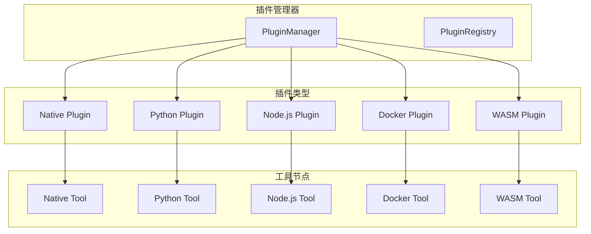

# 插件开发指南

## 概述

工作流工具包提供了强大的插件系统，支持多种编程语言和运行环境。本指南将详细介绍如何开发、测试和部署各种类型的插件。

## 插件系统架构

### 插件类型概览

工作流工具包支持以下五种插件类型：

1. **Native插件** - Rust动态库，性能最佳
2. **Python插件** - Python脚本和包，易于开发
3. **Node.js插件** - JavaScript/TypeScript，生态丰富
4. **Docker插件** - 容器化工具，环境隔离
5. **WASM插件** - WebAssembly模块，跨平台安全

### 插件架构图



### 核心接口

所有插件都必须实现以下核心接口：

```rust
#[async_trait]
pub trait Plugin: Send + Sync {
    fn name(&self) -> &str;
    fn version(&self) -> &str;
    async fn initialize(&mut self, config: PluginConfig) -> Result<()>;
    fn get_tools(&self) -> Vec<Box<dyn ToolNode>>;
    async fn shutdown(&mut self) -> Result<()>;
}

#[async_trait]
pub trait ToolNode: Send + Sync {
    fn name(&self) -> &str;
    fn definition(&self) -> ToolInfo;
    async fn execute(&self, params: Value, context: ExecutionContext) -> Result<Value>;
    fn validate_parameters(&self, params: &Value) -> Result<()>;
}
```

## Native插件开发

### 1. 创建Native插件

Native插件是使用Rust编写的动态库，提供最佳性能。

#### 项目结构

```
my-native-plugin/
├── Cargo.toml
├── src/
│   ├── lib.rs
│   └── tools/
│       ├── mod.rs
│       └── calculator.rs
└── examples/
    └── usage.rs
```

#### Cargo.toml配置

```toml
[package]
name = "my-native-plugin"
version = "0.1.0"
edition = "2021"

[lib]
crate-type = ["cdylib"]

[dependencies]
workflow-toolkit = { path = "../workflow-toolkit" }
serde = { version = "1.0", features = ["derive"] }
serde_json = "1.0"
async-trait = "0.1"
anyhow = "1.0"
```

#### 插件实现

```rust
// src/lib.rs
use workflow_toolkit::plugins::{Plugin, PluginConfig};
use workflow_toolkit::tools::ToolNode;
use async_trait::async_trait;
use serde_json::Value;
use std::collections::HashMap;

mod tools;
use tools::Calculator;

pub struct MyNativePlugin {
    tools: Vec<Box<dyn ToolNode>>,
}

impl MyNativePlugin {
    pub fn new() -> Self {
        Self {
            tools: vec![
                Box::new(Calculator::new()),
            ],
        }
    }
}

#[async_trait]
impl Plugin for MyNativePlugin {
    fn name(&self) -> &str {
        "my-native-plugin"
    }
    
    fn version(&self) -> &str {
        "0.1.0"
    }
    
    async fn initialize(&mut self, config: PluginConfig) -> anyhow::Result<()> {
        // 插件初始化逻辑
        println!("初始化Native插件: {}", self.name());
        Ok(())
    }
    
    fn get_tools(&self) -> Vec<Box<dyn ToolNode>> {
        self.tools.iter().map(|tool| tool.clone()).collect()
    }
    
    async fn shutdown(&mut self) -> anyhow::Result<()> {
        println!("关闭Native插件: {}", self.name());
        Ok(())
    }
}

// 导出插件创建函数
#[no_mangle]
pub extern "C" fn create_plugin() -> *mut dyn Plugin {
    Box::into_raw(Box::new(MyNativePlugin::new()))
}

#[no_mangle]
pub extern "C" fn destroy_plugin(plugin: *mut dyn Plugin) {
    unsafe {
        drop(Box::from_raw(plugin));
    }
}
```

#### 工具节点实现

```rust
// src/tools/calculator.rs
use workflow_toolkit::tools::{ToolNode, ToolDefinition, ExecutionContext};
use async_trait::async_trait;
use serde_json::{Value, json};

#[derive(Clone)]
pub struct Calculator {
    name: String,
    version: String,
}

impl Calculator {
    pub fn new() -> Self {
        Self {
            name: "calculator".to_string(),
            version: "1.0.0".to_string(),
        }
    }
}

#[async_trait]
impl ToolNode for Calculator {
    fn name(&self) -> &str {
        &self.name
    }
    
    fn version(&self) -> &str {
        &self.version
    }
    
    async fn execute(&self, params: Value, _context: ExecutionContext) -> anyhow::Result<Value> {
        let operation = params["operation"].as_str()
            .ok_or_else(|| anyhow::anyhow!("缺少operation参数"))?;
        let a = params["a"].as_f64()
            .ok_or_else(|| anyhow::anyhow!("缺少参数a"))?;
        let b = params["b"].as_f64()
            .ok_or_else(|| anyhow::anyhow!("缺少参数b"))?;
        
        let result = match operation {
            "add" => a + b,
            "subtract" => a - b,
            "multiply" => a * b,
            "divide" => {
                if b == 0.0 {
                    return Err(anyhow::anyhow!("除数不能为零"));
                }
                a / b
            }
            _ => return Err(anyhow::anyhow!("不支持的操作: {}", operation)),
        };
        
        Ok(json!({
            "result": result,
            "operation": operation,
            "operands": [a, b]
        }))
    }
    
    fn validate_parameters(&self, params: &Value) -> anyhow::Result<()> {
        if !params.is_object() {
            return Err(anyhow::anyhow!("参数必须是对象"));
        }
        
        if !params["operation"].is_string() {
            return Err(anyhow::anyhow!("operation必须是字符串"));
        }
        
        if !params["a"].is_number() || !params["b"].is_number() {
            return Err(anyhow::anyhow!("a和b必须是数字"));
        }
        
        Ok(())
    }
    
    fn get_schema(&self) -> ToolDefinition {
        ToolDefinition {
            name: self.name.clone(),
            version: self.version.clone(),
            description: "基础数学计算器".to_string(),
            parameters_schema: json!({
                "type": "object",
                "properties": {
                    "operation": {
                        "type": "string",
                        "enum": ["add", "subtract", "multiply", "divide"]
                    },
                    "a": {"type": "number"},
                    "b": {"type": "number"}
                },
                "required": ["operation", "a", "b"]
            }),
            return_schema: json!({
                "type": "object",
                "properties": {
                    "result": {"type": "number"},
                    "operation": {"type": "string"},
                    "operands": {
                        "type": "array",
                        "items": {"type": "number"}
                    }
                }
            }),
            dependencies: vec![],
            metadata: std::collections::HashMap::new(),
            plugin_info: None,
        }
    }
}
```

### 2. 构建和测试

```bash
# 构建插件
cargo build --release

# 运行测试
cargo test

# 生成文档
cargo doc --open
```

## Python插件开发

### 1. 创建Python插件

Python插件通过进程间通信与主系统交互，支持丰富的Python生态。

#### 项目结构

```
my-python-plugin/
├── requirements.txt
├── setup.py
├── plugin.py
├── tools/
│   ├── __init__.py
│   ├── data_processor.py
│   └── web_scraper.py
└── tests/
    ├── test_data_processor.py
    └── test_web_scraper.py
```

#### requirements.txt

```txt
requests>=2.28.0
pandas>=1.5.0
numpy>=1.24.0
beautifulsoup4>=4.11.0
lxml>=4.9.0
```

#### 插件主文件

```python
# plugin.py
import json
import sys
from typing import Dict, Any, List
from tools.data_processor import DataProcessor
from tools.web_scraper import WebScraper

class PythonPlugin:
    def __init__(self):
        self.name = "my-python-plugin"
        self.version = "1.0.0"
        self.tools = {
            "data_processor": DataProcessor(),
            "web_scraper": WebScraper(),
        }
    
    def get_info(self) -> Dict[str, Any]:
        return {
            "name": self.name,
            "version": self.version,
            "tools": list(self.tools.keys())
        }
    
    def get_tool_schema(self, tool_name: str) -> Dict[str, Any]:
        if tool_name not in self.tools:
            raise ValueError(f"工具不存在: {tool_name}")
        return self.tools[tool_name].get_schema()
    
    def execute_tool(self, tool_name: str, params: Dict[str, Any]) -> Dict[str, Any]:
        if tool_name not in self.tools:
            raise ValueError(f"工具不存在: {tool_name}")
        
        tool = self.tools[tool_name]
        tool.validate_parameters(params)
        return tool.execute(params)

def main():
    plugin = PythonPlugin()
    
    # 处理来自主进程的命令
    for line in sys.stdin:
        try:
            command = json.loads(line.strip())
            action = command.get("action")
            
            if action == "get_info":
                result = plugin.get_info()
            elif action == "get_schema":
                tool_name = command.get("tool_name")
                result = plugin.get_tool_schema(tool_name)
            elif action == "execute":
                tool_name = command.get("tool_name")
                params = command.get("params", {})
                result = plugin.execute_tool(tool_name, params)
            else:
                result = {"error": f"未知操作: {action}"}
            
            # 返回结果
            print(json.dumps(result))
            sys.stdout.flush()
            
        except Exception as e:
            error_result = {"error": str(e)}
            print(json.dumps(error_result))
            sys.stdout.flush()

if __name__ == "__main__":
    main()
```

#### 工具实现示例

```python
# tools/data_processor.py
import pandas as pd
import json
from typing import Dict, Any

class DataProcessor:
    def __init__(self):
        self.name = "data_processor"
        self.version = "1.0.0"
    
    def get_schema(self) -> Dict[str, Any]:
        return {
            "name": self.name,
            "version": self.version,
            "description": "数据处理工具",
            "parameters_schema": {
                "type": "object",
                "properties": {
                    "operation": {
                        "type": "string",
                        "enum": ["filter", "aggregate", "transform"]
                    },
                    "data": {
                        "type": "array",
                        "items": {"type": "object"}
                    },
                    "config": {"type": "object"}
                },
                "required": ["operation", "data"]
            },
            "return_schema": {
                "type": "object",
                "properties": {
                    "result": {"type": "array"},
                    "metadata": {"type": "object"}
                }
            }
        }
    
    def validate_parameters(self, params: Dict[str, Any]) -> None:
        if "operation" not in params:
            raise ValueError("缺少operation参数")
        if "data" not in params:
            raise ValueError("缺少data参数")
        if not isinstance(params["data"], list):
            raise ValueError("data必须是数组")
    
    def execute(self, params: Dict[str, Any]) -> Dict[str, Any]:
        operation = params["operation"]
        data = params["data"]
        config = params.get("config", {})
        
        # 转换为DataFrame
        df = pd.DataFrame(data)
        
        if operation == "filter":
            # 数据过滤
            condition = config.get("condition", {})
            for column, value in condition.items():
                if column in df.columns:
                    df = df[df[column] == value]
        
        elif operation == "aggregate":
            # 数据聚合
            group_by = config.get("group_by", [])
            agg_func = config.get("function", "sum")
            if group_by:
                df = df.groupby(group_by).agg(agg_func).reset_index()
        
        elif operation == "transform":
            # 数据转换
            transforms = config.get("transforms", {})
            for column, transform in transforms.items():
                if column in df.columns:
                    if transform == "uppercase":
                        df[column] = df[column].str.upper()
                    elif transform == "lowercase":
                        df[column] = df[column].str.lower()
        
        result = df.to_dict(orient="records")
        
        return {
            "result": result,
            "metadata": {
                "rows_processed": len(data),
                "rows_returned": len(result),
                "operation": operation
            }
        }
```

### 2. 配置和部署

在主系统的配置文件中添加Python插件：

```yaml
plugins:
  - name: "my-python-plugin"
    type: "python"
    config:
      requirements_file: "./plugins/my-python-plugin/requirements.txt"
      entry_point: "plugin.py"
      virtual_env: "./venvs/my-python-plugin"
      tools:
        - name: "data_processor"
        - name: "web_scraper"
```

## Node.js插件开发

### 1. 创建Node.js插件

Node.js插件利用JavaScript/TypeScript的灵活性和丰富的npm生态。

#### 项目结构

```
my-nodejs-plugin/
├── package.json
├── tsconfig.json
├── src/
│   ├── index.ts
│   ├── plugin.ts
│   └── tools/
│       ├── api-client.ts
│       └── file-processor.ts
├── dist/
└── tests/
    └── plugin.test.js
```

#### package.json

```json
{
  "name": "my-nodejs-plugin",
  "version": "1.0.0",
  "description": "Node.js plugin for workflow toolkit",
  "main": "dist/index.js",
  "scripts": {
    "build": "tsc",
    "start": "node dist/index.js",
    "test": "jest",
    "dev": "ts-node src/index.ts"
  },
  "dependencies": {
    "axios": "^1.6.0",
    "lodash": "^4.17.21",
    "fs-extra": "^11.1.0"
  },
  "devDependencies": {
    "@types/node": "^20.0.0",
    "@types/lodash": "^4.14.0",
    "typescript": "^5.0.0",
    "ts-node": "^10.9.0",
    "jest": "^29.0.0"
  }
}
```

#### TypeScript配置

```json
{
  "compilerOptions": {
    "target": "ES2020",
    "module": "commonjs",
    "lib": ["ES2020"],
    "outDir": "./dist",
    "rootDir": "./src",
    "strict": true,
    "esModuleInterop": true,
    "skipLibCheck": true,
    "forceConsistentCasingInFileNames": true,
    "resolveJsonModule": true,
    "declaration": true,
    "declarationMap": true,
    "sourceMap": true
  },
  "include": ["src/**/*"],
  "exclude": ["node_modules", "dist", "tests"]
}
```

#### 插件实现

```typescript
// src/plugin.ts
import { ApiClient } from './tools/api-client';
import { FileProcessor } from './tools/file-processor';

export interface ToolSchema {
  name: string;
  version: string;
  description: string;
  parameters_schema: any;
  return_schema: any;
}

export interface Tool {
  name: string;
  version: string;
  getSchema(): ToolSchema;
  validateParameters(params: any): void;
  execute(params: any): Promise<any>;
}

export class NodeJsPlugin {
  public readonly name = 'my-nodejs-plugin';
  public readonly version = '1.0.0';
  private tools: Map<string, Tool>;

  constructor() {
    this.tools = new Map([
      ['api_client', new ApiClient()],
      ['file_processor', new FileProcessor()],
    ]);
  }

  getInfo() {
    return {
      name: this.name,
      version: this.version,
      tools: Array.from(this.tools.keys()),
    };
  }

  getToolSchema(toolName: string): ToolSchema {
    const tool = this.tools.get(toolName);
    if (!tool) {
      throw new Error(`工具不存在: ${toolName}`);
    }
    return tool.getSchema();
  }

  async executeTool(toolName: string, params: any): Promise<any> {
    const tool = this.tools.get(toolName);
    if (!tool) {
      throw new Error(`工具不存在: ${toolName}`);
    }

    tool.validateParameters(params);
    return await tool.execute(params);
  }
}
```

#### 工具实现示例

```typescript
// src/tools/api-client.ts
import axios, { AxiosRequestConfig } from 'axios';
import { Tool, ToolSchema } from '../plugin';

export class ApiClient implements Tool {
  public readonly name = 'api_client';
  public readonly version = '1.0.0';

  getSchema(): ToolSchema {
    return {
      name: this.name,
      version: this.version,
      description: 'HTTP API客户端工具',
      parameters_schema: {
        type: 'object',
        properties: {
          method: {
            type: 'string',
            enum: ['GET', 'POST', 'PUT', 'DELETE', 'PATCH']
          },
          url: { type: 'string' },
          headers: { type: 'object' },
          data: { type: 'object' },
          timeout: { type: 'number', default: 30000 }
        },
        required: ['method', 'url']
      },
      return_schema: {
        type: 'object',
        properties: {
          status: { type: 'number' },
          headers: { type: 'object' },
          data: { type: 'any' },
          duration: { type: 'number' }
        }
      }
    };
  }

  validateParameters(params: any): void {
    if (!params || typeof params !== 'object') {
      throw new Error('参数必须是对象');
    }
    if (!params.method || typeof params.method !== 'string') {
      throw new Error('method参数必须是字符串');
    }
    if (!params.url || typeof params.url !== 'string') {
      throw new Error('url参数必须是字符串');
    }
  }

  async execute(params: any): Promise<any> {
    const startTime = Date.now();
    
    const config: AxiosRequestConfig = {
      method: params.method.toLowerCase(),
      url: params.url,
      headers: params.headers || {},
      timeout: params.timeout || 30000,
    };

    if (params.data) {
      config.data = params.data;
    }

    try {
      const response = await axios(config);
      const duration = Date.now() - startTime;

      return {
        status: response.status,
        headers: response.headers,
        data: response.data,
        duration,
      };
    } catch (error: any) {
      const duration = Date.now() - startTime;
      
      if (error.response) {
        return {
          status: error.response.status,
          headers: error.response.headers,
          data: error.response.data,
          duration,
          error: error.message,
        };
      } else {
        throw new Error(`请求失败: ${error.message}`);
      }
    }
  }
}
```

#### 主入口文件

```typescript
// src/index.ts
import * as readline from 'readline';
import { NodeJsPlugin } from './plugin';

const plugin = new NodeJsPlugin();

const rl = readline.createInterface({
  input: process.stdin,
  output: process.stdout,
});

rl.on('line', async (line: string) => {
  try {
    const command = JSON.parse(line.trim());
    const action = command.action;

    let result: any;

    switch (action) {
      case 'get_info':
        result = plugin.getInfo();
        break;
      case 'get_schema':
        result = plugin.getToolSchema(command.tool_name);
        break;
      case 'execute':
        result = await plugin.executeTool(command.tool_name, command.params || {});
        break;
      default:
        result = { error: `未知操作: ${action}` };
    }

    console.log(JSON.stringify(result));
  } catch (error: any) {
    console.log(JSON.stringify({ error: error.message }));
  }
});

process.on('SIGINT', () => {
  rl.close();
  process.exit(0);
});
```

### 2. 构建和配置

```bash
# 安装依赖
npm install

# 构建项目
npm run build

# 运行测试
npm test
```

配置文件：

```yaml
plugins:
  - name: "my-nodejs-plugin"
    type: "nodejs"
    config:
      package_json: "./plugins/my-nodejs-plugin/package.json"
      entry_point: "dist/index.js"
      node_modules: "./plugins/my-nodejs-plugin/node_modules"
      tools:
        - name: "api_client"
        - name: "file_processor"
```

## Docker插件开发

### 1. 创建Docker插件

Docker插件提供完全隔离的执行环境，适合复杂的依赖管理。

#### 项目结构

```
my-docker-plugin/
├── Dockerfile
├── docker-compose.yml
├── app/
│   ├── main.py
│   ├── requirements.txt
│   └── tools/
│       ├── __init__.py
│       └── image_processor.py
└── tests/
    └── test_plugin.py
```

#### Dockerfile

```dockerfile
FROM python:3.11-slim

WORKDIR /app

# 安装系统依赖
RUN apt-get update && apt-get install -y \
    gcc \
    g++ \
    libffi-dev \
    libssl-dev \
    && rm -rf /var/lib/apt/lists/*

# 复制依赖文件
COPY app/requirements.txt .

# 安装Python依赖
RUN pip install --no-cache-dir -r requirements.txt

# 复制应用代码
COPY app/ .

# 暴露端口
EXPOSE 8080

# 启动命令
CMD ["python", "main.py"]
```

#### 应用实现

```python
# app/main.py
from flask import Flask, request, jsonify
import json
import logging
from tools.image_processor import ImageProcessor

app = Flask(__name__)
logging.basicConfig(level=logging.INFO)

# 初始化工具
tools = {
    "image_processor": ImageProcessor(),
}

@app.route('/health', methods=['GET'])
def health_check():
    return jsonify({"status": "healthy", "version": "1.0.0"})

@app.route('/tools', methods=['GET'])
def list_tools():
    return jsonify({
        "tools": [
            {
                "name": name,
                "schema": tool.get_schema()
            }
            for name, tool in tools.items()
        ]
    })

@app.route('/tools/<tool_name>/schema', methods=['GET'])
def get_tool_schema(tool_name):
    if tool_name not in tools:
        return jsonify({"error": f"工具不存在: {tool_name}"}), 404
    
    return jsonify(tools[tool_name].get_schema())

@app.route('/tools/<tool_name>/execute', methods=['POST'])
def execute_tool(tool_name):
    if tool_name not in tools:
        return jsonify({"error": f"工具不存在: {tool_name}"}), 404
    
    try:
        params = request.get_json() or {}
        tool = tools[tool_name]
        
        # 验证参数
        tool.validate_parameters(params)
        
        # 执行工具
        result = tool.execute(params)
        
        return jsonify(result)
    
    except Exception as e:
        app.logger.error(f"执行工具失败: {str(e)}")
        return jsonify({"error": str(e)}), 500

if __name__ == '__main__':
    app.run(host='0.0.0.0', port=8080, debug=False)
```

#### 工具实现

```python
# app/tools/image_processor.py
from PIL import Image, ImageFilter, ImageEnhance
import io
import base64
import json

class ImageProcessor:
    def __init__(self):
        self.name = "image_processor"
        self.version = "1.0.0"
    
    def get_schema(self):
        return {
            "name": self.name,
            "version": self.version,
            "description": "图像处理工具",
            "parameters_schema": {
                "type": "object",
                "properties": {
                    "operation": {
                        "type": "string",
                        "enum": ["resize", "rotate", "filter", "enhance"]
                    },
                    "image_data": {
                        "type": "string",
                        "description": "Base64编码的图像数据"
                    },
                    "config": {"type": "object"}
                },
                "required": ["operation", "image_data"]
            },
            "return_schema": {
                "type": "object",
                "properties": {
                    "result_image": {"type": "string"},
                    "metadata": {"type": "object"}
                }
            }
        }
    
    def validate_parameters(self, params):
        if not isinstance(params, dict):
            raise ValueError("参数必须是对象")
        
        if "operation" not in params:
            raise ValueError("缺少operation参数")
        
        if "image_data" not in params:
            raise ValueError("缺少image_data参数")
    
    def execute(self, params):
        operation = params["operation"]
        image_data = params["image_data"]
        config = params.get("config", {})
        
        # 解码图像
        image_bytes = base64.b64decode(image_data)
        image = Image.open(io.BytesIO(image_bytes))
        
        original_size = image.size
        
        # 执行操作
        if operation == "resize":
            width = config.get("width", 100)
            height = config.get("height", 100)
            image = image.resize((width, height))
        
        elif operation == "rotate":
            angle = config.get("angle", 90)
            image = image.rotate(angle)
        
        elif operation == "filter":
            filter_type = config.get("type", "blur")
            if filter_type == "blur":
                image = image.filter(ImageFilter.BLUR)
            elif filter_type == "sharpen":
                image = image.filter(ImageFilter.SHARPEN)
            elif filter_type == "edge":
                image = image.filter(ImageFilter.FIND_EDGES)
        
        elif operation == "enhance":
            enhance_type = config.get("type", "brightness")
            factor = config.get("factor", 1.5)
            
            if enhance_type == "brightness":
                enhancer = ImageEnhance.Brightness(image)
            elif enhance_type == "contrast":
                enhancer = ImageEnhance.Contrast(image)
            elif enhance_type == "color":
                enhancer = ImageEnhance.Color(image)
            else:
                enhancer = ImageEnhance.Sharpness(image)
            
            image = enhancer.enhance(factor)
        
        # 编码结果
        output_buffer = io.BytesIO()
        image.save(output_buffer, format='PNG')
        result_data = base64.b64encode(output_buffer.getvalue()).decode()
        
        return {
            "result_image": result_data,
            "metadata": {
                "operation": operation,
                "original_size": original_size,
                "result_size": image.size,
                "format": "PNG"
            }
        }
```

### 2. 构建和配置

```bash
# 构建Docker镜像
docker build -t my-docker-plugin:1.0.0 .

# 运行容器
docker run -p 8080:8080 my-docker-plugin:1.0.0

# 测试健康检查
curl http://localhost:8080/health
```

配置文件：

```yaml
plugins:
  - name: "my-docker-plugin"
    type: "docker"
    config:
      image: "my-docker-plugin:1.0.0"
      container_config:
        ports:
          - "8080:8080"
        environment:
          - "LOG_LEVEL=INFO"
        volumes:
          - "./data:/app/data"
      api_endpoints:
        - path: "/tools/{tool_name}/execute"
          method: "POST"
```

## WASM插件开发 (计划中)

> **注意**: WASM 插件支持目前由于依赖问题（`wasmtime` / `extism`）暂时处于禁用状态。以下文档仅供未来参考。

### 1. 创建WASM插件

WASM插件提供跨平台的安全执行环境，支持多种编程语言。

#### 使用Rust开发WASM插件

```rust
// src/lib.rs
use wasm_bindgen::prelude::*;
use serde::{Deserialize, Serialize};
use serde_json::{Value, json};

#[derive(Serialize, Deserialize)]
pub struct CalculatorParams {
    pub operation: String,
    pub a: f64,
    pub b: f64,
}

#[derive(Serialize, Deserialize)]
pub struct CalculatorResult {
    pub result: f64,
    pub operation: String,
}

#[wasm_bindgen]
pub struct WasmCalculator {
    name: String,
    version: String,
}

#[wasm_bindgen]
impl WasmCalculator {
    #[wasm_bindgen(constructor)]
    pub fn new() -> WasmCalculator {
        WasmCalculator {
            name: "wasm_calculator".to_string(),
            version: "1.0.0".to_string(),
        }
    }
    
    #[wasm_bindgen(getter)]
    pub fn name(&self) -> String {
        self.name.clone()
    }
    
    #[wasm_bindgen(getter)]
    pub fn version(&self) -> String {
        self.version.clone()
    }
    
    #[wasm_bindgen]
    pub fn get_schema(&self) -> String {
        let schema = json!({
            "name": self.name,
            "version": self.version,
            "description": "WASM数学计算器",
            "parameters_schema": {
                "type": "object",
                "properties": {
                    "operation": {
                        "type": "string",
                        "enum": ["add", "subtract", "multiply", "divide"]
                    },
                    "a": {"type": "number"},
                    "b": {"type": "number"}
                },
                "required": ["operation", "a", "b"]
            },
            "return_schema": {
                "type": "object",
                "properties": {
                    "result": {"type": "number"},
                    "operation": {"type": "string"}
                }
            }
        });
        
        schema.to_string()
    }
    
    #[wasm_bindgen]
    pub fn execute(&self, params_json: &str) -> Result<String, JsValue> {
        let params: CalculatorParams = serde_json::from_str(params_json)
            .map_err(|e| JsValue::from_str(&format!("参数解析失败: {}", e)))?;
        
        let result = match params.operation.as_str() {
            "add" => params.a + params.b,
            "subtract" => params.a - params.b,
            "multiply" => params.a * params.b,
            "divide" => {
                if params.b == 0.0 {
                    return Err(JsValue::from_str("除数不能为零"));
                }
                params.a / params.b
            }
            _ => return Err(JsValue::from_str(&format!("不支持的操作: {}", params.operation))),
        };
        
        let result_obj = CalculatorResult {
            result,
            operation: params.operation,
        };
        
        serde_json::to_string(&result_obj)
            .map_err(|e| JsValue::from_str(&format!("结果序列化失败: {}", e)))
    }
}
```

#### Cargo.toml配置

```toml
[package]
name = "wasm-calculator"
version = "0.1.0"
edition = "2021"

[lib]
crate-type = ["cdylib"]

[dependencies]
wasm-bindgen = "0.2"
serde = { version = "1.0", features = ["derive"] }
serde_json = "1.0"

[dependencies.web-sys]
version = "0.3"
features = [
  "console",
]
```

#### 构建WASM模块

```bash
# 安装wasm-pack
cargo install wasm-pack

# 构建WASM包
wasm-pack build --target nodejs --out-dir pkg

# 生成的文件
ls pkg/
# wasm_calculator.js
# wasm_calculator_bg.wasm
# wasm_calculator.d.ts
# package.json
```

### 2. JavaScript包装器

```javascript
// wrapper.js
const wasm = require('./pkg/wasm_calculator');

class WasmPlugin {
    constructor() {
        this.name = 'wasm-calculator-plugin';
        this.version = '1.0.0';
        this.calculator = new wasm.WasmCalculator();
    }
    
    getInfo() {
        return {
            name: this.name,
            version: this.version,
            tools: ['wasm_calculator']
        };
    }
    
    getToolSchema(toolName) {
        if (toolName === 'wasm_calculator') {
            return JSON.parse(this.calculator.get_schema());
        }
        throw new Error(`工具不存在: ${toolName}`);
    }
    
    executeTool(toolName, params) {
        if (toolName === 'wasm_calculator') {
            const paramsJson = JSON.stringify(params);
            const resultJson = this.calculator.execute(paramsJson);
            return JSON.parse(resultJson);
        }
        throw new Error(`工具不存在: ${toolName}`);
    }
}

module.exports = WasmPlugin;
```

## 插件测试和调试

### 1. 单元测试

#### Rust插件测试

```rust
#[cfg(test)]
mod tests {
    use super::*;
    use serde_json::json;
    
    #[tokio::test]
    async fn test_calculator_add() {
        let calculator = Calculator::new();
        let params = json!({
            "operation": "add",
            "a": 5.0,
            "b": 3.0
        });
        
        let result = calculator.execute(params, ExecutionContext::default()).await.unwrap();
        assert_eq!(result["result"], 8.0);
    }
    
    #[test]
    fn test_parameter_validation() {
        let calculator = Calculator::new();
        let invalid_params = json!({
            "operation": "add",
            "a": "not_a_number"
        });
        
        assert!(calculator.validate_parameters(&invalid_params).is_err());
    }
}
```

#### Python插件测试

```python
# tests/test_data_processor.py
import unittest
from tools.data_processor import DataProcessor

class TestDataProcessor(unittest.TestCase):
    def setUp(self):
        self.processor = DataProcessor()
    
    def test_filter_operation(self):
        params = {
            "operation": "filter",
            "data": [
                {"name": "Alice", "age": 25},
                {"name": "Bob", "age": 30},
                {"name": "Charlie", "age": 25}
            ],
            "config": {
                "condition": {"age": 25}
            }
        }
        
        result = self.processor.execute(params)
        self.assertEqual(len(result["result"]), 2)
        self.assertEqual(result["metadata"]["rows_returned"], 2)
    
    def test_parameter_validation(self):
        invalid_params = {"operation": "filter"}
        
        with self.assertRaises(ValueError):
            self.processor.validate_parameters(invalid_params)

if __name__ == '__main__':
    unittest.main()
```

### 2. 集成测试

```rust
// tests/integration_test.rs
use workflow_toolkit::plugins::{PluginManager, PluginConfig};
use std::path::PathBuf;

#[tokio::test]
async fn test_plugin_loading() {
    let mut manager = PluginManager::new();
    
    let config = PluginConfig {
        plugin_type: "native".to_string(),
        plugin_path: PathBuf::from("./target/release/libmy_native_plugin.so"),
        config: serde_json::json!({}),
    };
    
    let result = manager.load_plugin("test-plugin", config).await;
    assert!(result.is_ok());
    
    let tools = manager.list_tools();
    assert!(!tools.is_empty());
}
```

### 3. 调试技巧

#### 日志记录

```rust
use tracing::{info, warn, error, debug};

#[tracing::instrument]
async fn execute_tool(&self, params: Value) -> Result<Value> {
    info!("开始执行工具: {}", self.name());
    debug!("参数: {:?}", params);
    
    let result = self.do_execute(params).await?;
    
    info!("工具执行完成");
    Ok(result)
}
```

#### 错误处理

```python
import logging
import traceback

logger = logging.getLogger(__name__)

def execute(self, params):
    try:
        # 执行逻辑
        return self._do_execute(params)
    except Exception as e:
        logger.error(f"工具执行失败: {str(e)}")
        logger.error(f"堆栈跟踪: {traceback.format_exc()}")
        raise
```

#### 性能监控

```javascript
const { performance } = require('perf_hooks');

async execute(params) {
    const startTime = performance.now();
    
    try {
        const result = await this._doExecute(params);
        const duration = performance.now() - startTime;
        
        console.log(`工具执行耗时: ${duration.toFixed(2)}ms`);
        return result;
    } catch (error) {
        const duration = performance.now() - startTime;
        console.error(`工具执行失败 (耗时: ${duration.toFixed(2)}ms):`, error);
        throw error;
    }
}
```

## 最佳实践

### 1. 设计原则

- **单一职责**: 每个工具只做一件事
- **参数验证**: 严格验证输入参数
- **错误处理**: 提供清晰的错误信息
- **文档完整**: 提供详细的schema和示例
- **性能优化**: 避免不必要的资源消耗

### 2. 安全考虑

- **输入验证**: 验证所有外部输入
- **资源限制**: 设置内存和时间限制
- **权限控制**: 最小权限原则
- **沙箱隔离**: 使用容器或WASM隔离
- **依赖管理**: 定期更新依赖包

### 3. 性能优化

- **缓存机制**: 缓存计算结果
- **批处理**: 支持批量操作
- **异步执行**: 使用异步I/O
- **资源池**: 复用连接和对象
- **监控指标**: 收集性能数据

### 4. 部署建议

- **版本管理**: 使用语义化版本
- **配置管理**: 外部化配置
- **健康检查**: 提供健康检查接口
- **日志记录**: 结构化日志输出
- **监控告警**: 设置监控和告警

## 故障排除

### 1. 常见问题

**问题**: 插件加载失败
**解决**: 检查插件路径、权限和依赖

**问题**: 工具执行超时
**解决**: 增加超时时间或优化算法

**问题**: 内存泄漏
**解决**: 检查资源释放和循环引用

### 2. 调试工具

- **日志分析**: 使用结构化日志
- **性能分析**: 使用profiler工具
- **内存分析**: 使用内存分析器
- **网络分析**: 使用网络抓包工具

---

*本指南持续更新，如有问题请参考API文档或提交Issue。*