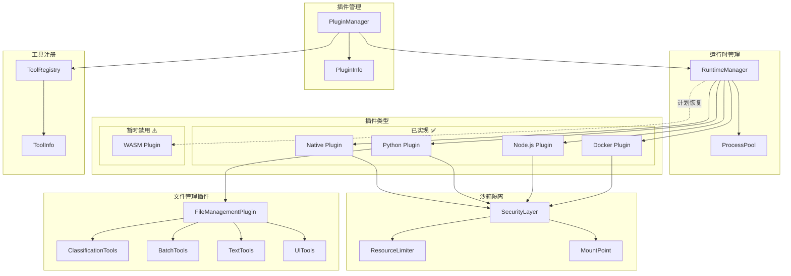
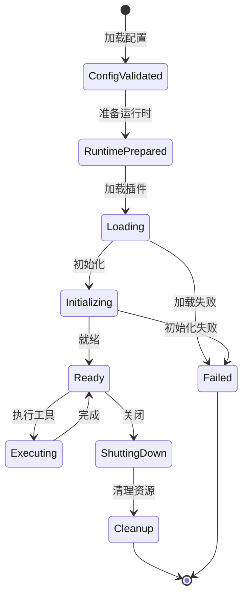
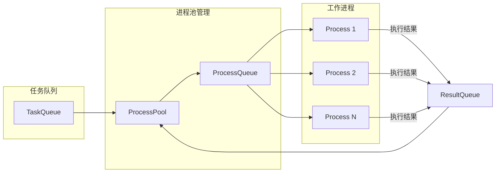
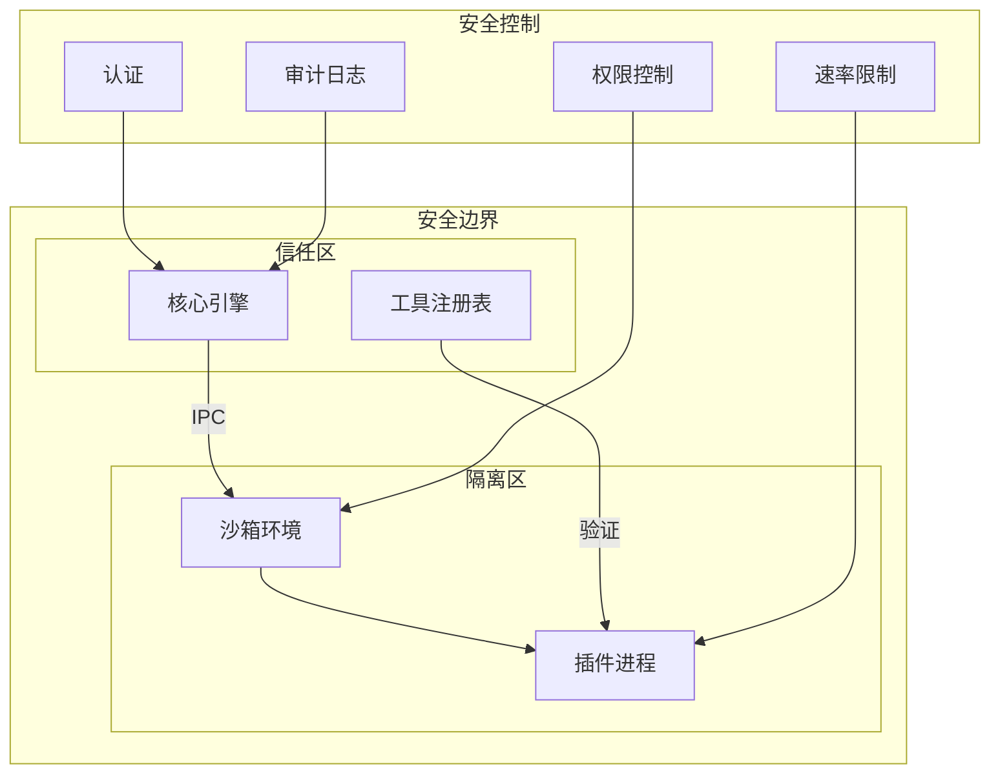

# 插件系统 (Plugin System)

## 0. 架构概览

### 0.0 整体架构图



### 0.1 插件生命周期图



### 0.2 进程池架构



## 1. 核心定义 (Stable)

### 1.1 模块职责

插件系统负责管理外部插件的生命周期，支持多种插件类型（Native、Python、Node.js、Docker）。提供统一的插件接口和沙箱执行环境。

### 1.2 模块结构

```
plugins/
├── manager.rs        # 插件管理器
├── runtime.rs        # 运行时管理
├── types.rs          # 插件类型定义
├── integration.rs    # 集成层
├── error.rs          # 错误处理
├── macros.rs         # 宏定义
├── native.rs         # Native 插件
├── python.rs         # Python 插件
├── nodejs.rs         # Node.js 插件
├── docker.rs         # Docker 插件
└── file_management/  # 文件管理插件
    ├── mod.rs
    ├── plugin.rs
    ├── classification/
    ├── batch/
    ├── text/
    └── ui/
```

### 1.3 核心类型

#### 插件 Trait

```rust
/// 插件核心 trait
pub trait Plugin: Send + Sync {
    fn name(&self) -> &str;
    fn version(&self) -> &str;
    fn plugin_type(&self) -> PluginType;
    
    /// 初始化插件
    async fn initialize(&mut self) -> PluginResult<()>;
    
    /// 执行工具
    async fn execute(&self, tool_name: &str, input: Value) -> PluginResult<Value>;
    
    /// 关闭插件
    async fn shutdown(&mut self) -> PluginResult<()>;
}

/// 插件类型
/// 
/// 版本: v1.0 | 最后更新: 2026-02-26
pub enum PluginType {
    Native,     // Rust 动态库（Dynamic Library）- 已实现 ✅
    Python,     // Python 脚本 - 已实现 ✅
    NodeJs,     // Node.js 模块 - 已实现 ✅
    Wasm,       // WebAssembly - **暂时禁用** ⚠️（依赖问题，计划恢复）
    Docker,     // Docker 容器 - 已实现 ✅
}
```

**WASM 插件状态说明**：
- **当前状态**: 暂时禁用
- **原因**: WASM 运行时依赖问题尚未解决
- **路线图**: 计划在 v2.1 版本中恢复支持
- **相关 ADR**: [ADR-P002: 插件类型支持](#21-决策记录-adr)
```

#### 插件配置

```rust
/// 插件配置
pub struct PluginConfig {
    pub name: String,
    pub plugin_type: PluginType,
    pub entry_point: String,
    pub resource_limits: ResourceLimits,
    pub security_policy: SecurityPolicy,
    pub metadata: HashMap<String, Value>,
}

/// 资源限制
pub struct ResourceLimits {
    pub max_memory_mb: usize,
    pub max_cpu_percent: f64,
    pub max_execution_time_secs: u64,
    pub max_file_descriptors: usize,
}

/// 安全策略
pub struct SecurityPolicy {
    pub allow_network: bool,
    pub allow_file_read: Vec<String>,
    pub allow_file_write: Vec<String>,
    pub allowed_syscalls: Vec<String>,
}
```

### 1.4 插件管理器

```rust
/// 插件管理器
pub struct PluginManager {
    plugins: Arc<DashMap<String, Box<dyn Plugin>>>,
    runtime_manager: Arc<RuntimeManager>,
}

impl PluginManager {
    /// 加载插件
    pub async fn load(&self, config: PluginConfig) -> PluginResult<()>;
    
    /// 卸载插件
    pub async fn unload(&self, name: &str) -> PluginResult<()>;
    
    /// 重新加载插件
    pub async fn reload(&self, name: &str) -> PluginResult<()>;
    
    /// 获取插件
    pub fn get(&self, name: &str) -> Option<Ref<String, Box<dyn Plugin>>>;
    
    /// 列出所有插件
    pub fn list_all(&self) -> Vec<PluginInfo>;
}
```

### 1.5 运行时管理

```rust
/// 运行时管理器
pub struct RuntimeManager {
    python_runtime: Option<Arc<PythonRuntime>>,
    nodejs_runtime: Option<Arc<NodeJsRuntime>>,
    docker_runtime: Option<Arc<DockerRuntime>>,
    pool_config: RuntimePoolConfig,
}

/// 运行时池配置
pub struct RuntimePoolConfig {
    pub min_processes: usize,
    pub max_processes: usize,
    pub idle_timeout_secs: u64,
}

/// 运行时统计
pub struct RuntimeStats {
    pub active_processes: usize,
    pub idle_processes: usize,
    pub total_executions: u64,
    pub failed_executions: u64,
}
```

### 1.6 各类型插件实现

#### Native 插件

```rust
/// Native 插件
pub struct NativePlugin {
    library: Library,
    metadata: PluginMetadata,
}

/// Native 插件构建器
pub struct NativePluginBuilder;
```

#### Python 插件

```rust
/// Python 插件
pub struct PythonPlugin {
    runtime: Arc<PythonRuntime>,
    module_path: PathBuf,
    config: PythonRuntimeConfig,
}

/// Python 运行时配置
pub struct PythonRuntimeConfig {
    pub python_path: String,
    pub virtual_env: Option<PathBuf>,
    pub requirements_file: Option<PathBuf>,
}
```

#### Node.js 插件

```rust
/// Node.js 插件
pub struct NodeJsPlugin {
    runtime: Arc<NodeJsRuntime>,
    package_json: PackageJson,
    config: NodeJsRuntimeConfig,
}

/// Node.js 运行时配置
pub struct NodeJsRuntimeConfig {
    pub node_path: String,
    pub npm_registry: Option<String>,
    pub install_dependencies: bool,
}
```

#### Docker 插件

```rust
/// Docker 插件
pub struct DockerPlugin {
    runtime: Arc<DockerRuntime>,
    image: String,
    config: DockerRuntimeConfig,
}

/// Docker 运行时配置
pub struct DockerRuntimeConfig {
    pub image: String,
    pub mounts: Vec<DockerMount>,
    pub network: DockerNetworkConfig,
    pub resource_limits: DockerResourceLimits,
}
```

## 2. 待实现方案 (In Progress) 🟢

### 2.1 决策记录 (ADR)

#### ADR-P001: 插件隔离机制
- **决策**: 进程级隔离（Process Isolation） + 资源限制
- **理由**: 安全性优先，进程隔离最可靠
- **风险**: 启动开销，使用进程池（Process Pool）优化

#### ADR-P002: 插件类型支持
- **决策**: 优先支持 Native/Python/Node.js/Docker
- **理由**: 覆盖主流场景，WASM 暂时禁用（依赖问题）
- **风险**: WASM 生态发展可能错过机会

#### ADR-P003: 运行时池化
- **决策**: 使用进程池（Process Pool）管理外部运行时
- **理由**: 减少启动开销，提高响应速度
- **风险**: 内存占用增加

### 2.1.1 设计决策理由详解

#### 决策 1: 为什么选择进程级隔离？

**背景问题**：
插件通常是第三方代码，可能存在安全风险或稳定性问题，需要隔离执行。

**考虑的选项**：

| 选项 | 隔离强度 | 性能开销 | 实现复杂度 | 安全性 |
|------|----------|----------|------------|--------|
| 线程级 | 弱 | 低 | 低 | 低 |
| **进程级** | 强 | 中 | 中 | **高** |
| 容器级 | 最强 | 高 | 高 | 最高 |
| WASM 沙箱 | 强 | 低 | 中 | 高 |

**选择理由**：
1. **安全性优先**：进程崩溃不会影响主进程
2. **资源可控**：操作系统级别的资源限制（CPU、内存）
3. **成熟稳定**：进程隔离是经过验证的技术方案
4. **跨语言支持**：进程间通信不依赖特定语言运行时

**影响与后果**：
- 每个插件需要独立的进程启动开销
- 进程间通信（IPC）有一定延迟
- 需要进程池来优化启动性能

#### 决策 2: 为什么优先支持 Native/Python/Node.js/Docker？

**背景问题**：
需要选择支持的插件类型，平衡开发成本、用户需求和生态覆盖。

**考虑的选项**：

| 插件类型 | 开发成本 | 用户需求 | 生态成熟度 | 当前状态 |
|----------|----------|----------|------------|----------|
| **Native** | 低 | 高 | 高 | ✅ 已实现 |
| **Python** | 中 | 最高 | 最高 | ✅ 已实现 |
| **Node.js** | 中 | 高 | 高 | ✅ 已实现 |
| **Docker** | 中 | 中 | 高 | ✅ 已实现 |
| WASM | 高 | 中 | 发展中 | ⚠️ 暂时禁用 |
| Go | 中 | 低 | 高 | 未计划 |

**选择理由**：
1. **Python**：数据科学和 AI 领域的主流语言，需求最高
2. **Node.js**：Web 开发生态丰富，工具链成熟
3. **Native**：性能最优，适合核心工具
4. **Docker**：最强隔离，适合不可信代码

**WASM 暂时禁用的原因**：
- WASM 运行时（如 wasmtime）依赖问题尚未解决
- WASM 生态仍在发展中，工具链不够成熟
- 计划在 v2.1 版本中恢复支持

#### 决策 3: 为什么使用进程池管理运行时？

**背景问题**：
每次插件执行都启动新进程会有显著的开销，影响响应速度。

**考虑的选项**：

| 选项 | 启动延迟 | 内存占用 | 实现复杂度 |
|------|----------|----------|------------|
| 按需启动 | 高（秒级） | 低 | 低 |
| **进程池** | 低（毫秒级） | 中 | 中 |
| 常驻进程 | 最低 | 高 | 高 |

**选择理由**：
1. **降低延迟**：预热进程可立即使用，响应时间从秒级降到毫秒级
2. **资源复用**：进程可复用，减少创建/销毁开销
3. **弹性伸缩**：根据负载动态调整池大小
4. **健康检查**：定期检查进程健康状态，自动重启异常进程

**进程池配置示例**：
```yaml
pool:
  min_processes: 2       # 最小进程数
  max_processes: 10      # 最大进程数
  idle_timeout_secs: 300 # 空闲超时
  health_check_interval: 30
```

### 2.2 任务清单

- [x] Task 0: 插件管理器基础
- [x] Task 1: Native 插件支持
- [x] Task 2: Python 插件支持
- [x] Task 3: Node.js 插件支持
- [x] Task 4: Docker 插件支持
- [ ] Task 5: WASM 插件恢复
- [ ] Task 6: 运行时池优化

### 2.3 接口契约

```rust
/// 插件加载结果
pub struct PluginLoadResult {
    pub plugin_name: String,
    pub success: bool,
    pub load_time_ms: u64,
    pub error: Option<String>,
}

/// 插件执行结果
pub struct PluginExecuteResult {
    pub success: bool,
    pub output: Option<Value>,
    pub execution_time_ms: u64,
    pub resource_usage: ResourceUsage,
}

/// 资源使用统计
pub struct ResourceUsage {
    pub memory_mb: usize,
    pub cpu_percent: f64,
    pub execution_time_ms: u64,
}
```

### 2.4 测试策略

- **单元测试（Unit Test）**: 各类型插件独立测试
- **集成测试（Integration Test）**: 插件加载/执行/卸载完整流程
- **安全测试（Security Test）**: 沙箱（Sandbox）隔离有效性
- **性能测试（Performance Test）**: 进程池性能基准

### 2.4.1 测试策略详解

#### 测试金字塔

```
        /\
       /E2E\         端到端测试 (10%)
      /------\
     /  集成  \       集成测试 (30%)
    /----------\
   /    单元    \     单元测试 (60%)
  /______________\
```

#### 单元测试策略

**覆盖目标**：
- 代码覆盖率 > 85%
- 分支覆盖率 > 80%
- 安全相关代码覆盖率 100%

**测试范围**：

| 模块 | 测试重点 | 覆盖率要求 |
|------|----------|------------|
| PluginManager | 加载/卸载/重载 | 90% |
| RuntimeManager | 运行时创建/销毁 | 85% |
| SecurityEnforcer | 权限检查/资源限制 | **100%** |
| ProcessPool | 进程管理/健康检查 | 85% |
| PluginLoader | 配置解析/验证 | 85% |

**测试示例**：

```rust
#[cfg(test)]
mod tests {
    use super::*;
    
    #[tokio::test]
    async fn test_plugin_load_native() {
        let manager = PluginManager::new();
        let config = PluginConfig {
            name: "test-native".to_string(),
            plugin_type: PluginType::Native,
            entry_point: "./test_plugin.so".to_string(),
            resource_limits: ResourceLimits::default(),
            security_policy: SecurityPolicy::default(),
            metadata: HashMap::new(),
        };
        
        let result = manager.load(config).await;
        assert!(result.is_ok());
        
        let plugin = manager.get("test-native");
        assert!(plugin.is_some());
    }
    
    #[tokio::test]
    async fn test_plugin_permission_check() {
        let enforcer = SecurityEnforcer::new(
            ResourceLimits::default(),
            ["fs.read", "network.http"].iter().map(|s| s.to_string()).collect(),
        );
        
        // 允许的权限
        assert!(enforcer.check_permission("fs.read").is_ok());
        
        // 禁止的权限
        assert!(enforcer.check_permission("fs.write").is_err());
        assert!(enforcer.check_permission("process.spawn").is_err());
    }
    
    #[tokio::test]
    async fn test_resource_limit_enforcement() {
        let limits = ResourceLimits {
            max_memory_mb: 128,
            max_cpu_percent: 50.0,
            max_execution_time_secs: 10,
            ..Default::default()
        };
        
        let enforcer = SecurityEnforcer::new(limits, HashSet::new());
        
        // 模拟内存超限
        let result = enforcer.monitor_resources(12345).await;
        // 实际测试需要 mock 进程资源使用
    }
}
```

#### 集成测试策略

**测试场景**：

| 场景 | 描述 | 验证点 |
|------|------|--------|
| 插件加载 | 加载各类型插件 | 加载成功、状态正确 |
| 工具执行 | 调用插件工具 | 结果正确、资源释放 |
| 插件卸载 | 卸载插件 | 资源清理、进程终止 |
| 插件重载 | 热重载插件 | 无中断、状态保持 |
| 错误处理 | 插件崩溃 | 隔离有效、主进程正常 |
| 资源限制 | 超限执行 | 限制生效、优雅终止 |

**测试示例**：

```rust
#[tokio::test]
async fn test_plugin_full_lifecycle() {
    let manager = PluginManager::new();
    
    // 加载插件
    let config = create_test_plugin_config();
    manager.load(config.clone()).await.unwrap();
    
    // 执行工具
    let result = manager.execute("test-plugin", "test_tool", json!({"input": "test"})).await;
    assert!(result.is_ok());
    
    // 卸载插件
    manager.unload("test-plugin").await.unwrap();
    assert!(manager.get("test-plugin").is_none());
}

#[tokio::test]
async fn test_plugin_isolation() {
    let manager = PluginManager::new();
    
    // 加载恶意插件
    let malicious_config = PluginConfig {
        name: "malicious".to_string(),
        plugin_type: PluginType::Docker,
        security_policy: SecurityPolicy {
            allow_network: false,
            allow_file_write: vec![],
            ..Default::default()
        },
        ..Default::default()
    };
    
    manager.load(malicious_config).await.unwrap();
    
    // 尝试违规操作
    let result = manager.execute("malicious", "try_network", json!({})).await;
    assert!(result.is_err()); // 应该被阻止
}
```

#### 安全测试策略

**测试场景**：

| 场景 | 攻击方式 | 预期防护 |
|------|----------|----------|
| 文件系统逃逸 | 访问未授权路径 | 路径检查阻止 |
| 网络攻击 | 尝试外连 | 网络权限阻止 |
| 资源耗尽 | 消耗大量内存/CPU | 资源限制生效 |
| 进程注入 | 尝试 fork 子进程 | 进程限制生效 |
| 权限提升 | 尝试获取更高权限 | 权限检查阻止 |

**安全测试示例**：

```rust
#[tokio::test]
async fn test_filesystem_escape_prevention() {
    let enforcer = SecurityEnforcer::new(
        ResourceLimits::default(),
        ["fs.read:/data/input".to_string()].into_iter().collect(),
    );
    
    // 尝试读取未授权路径
    let result = enforcer.check_file_access("/etc/passwd", FileAccessMode::Read);
    assert!(result.is_err());
    
    // 尝试路径遍历攻击
    let result = enforcer.check_file_access("/data/input/../../../etc/passwd", FileAccessMode::Read);
    assert!(result.is_err());
}

#[tokio::test]
async fn test_resource_exhaustion_prevention() {
    let limits = ResourceLimits {
        max_memory_mb: 64,
        max_cpu_percent: 25.0,
        max_execution_time_secs: 5,
        ..Default::default()
    };
    
    let enforcer = SecurityEnforcer::new(limits, HashSet::new());
    
    // 模拟内存耗尽攻击
    // 实际测试中会启动一个尝试分配大量内存的插件
    // 预期：进程被终止，不影响主进程
}
```

#### 性能测试策略

**基准测试**：

| 指标 | 目标值 | 测试方法 |
|------|--------|----------|
| 插件加载时间 | < 500ms | Criterion 基准测试 |
| 工具执行延迟 | < 50ms (P99) | 集成测试 |
| 进程池预热 | < 2s | 性能测试 |
| 并发执行 | 支持 50 并发 | 压力测试 |
| 内存占用 | < 200MB/插件 | 内存分析 |

**进程池性能测试**：

```rust
#[tokio::test]
async fn test_process_pool_performance() {
    let pool = ProcessPool::new(RuntimePoolConfig {
        min_processes: 2,
        max_processes: 10,
        idle_timeout_secs: 300,
    });
    
    // 预热
    pool.warmup().await.unwrap();
    
    // 并发执行测试
    let start = Instant::now();
    let mut handles = vec![];
    
    for i in 0..50 {
        let pool = pool.clone();
        handles.push(tokio::spawn(async move {
            pool.execute(|| async {
                // 模拟工具执行
                tokio::time::sleep(Duration::from_millis(10)).await;
                Ok(json!({"result": i}))
            }).await
        }));
    }
    
    let results = futures::future::join_all(handles).await;
    let elapsed = start.elapsed();
    
    // 验证所有执行成功
    assert!(results.iter().all(|r| r.is_ok()));
    
    // 验证延迟
    assert!(elapsed < Duration::from_secs(5));
}
```

#### 测试覆盖率要求

**CI/CD 集成**：

```yaml
# .github/workflows/plugin-test.yml
name: Plugin Tests
on: [push, pull_request]
jobs:
  test:
    runs-on: ubuntu-latest
    services:
      redis:
        image: redis:latest
        ports:
          - 6379:6379
    steps:
      - uses: actions/checkout@v2
      - name: Run tests
        run: |
          cargo test --package plugins --all-features
      - name: Security tests
        run: |
          cargo test --package plugins --test security
      - name: Coverage
        run: |
          cargo tarpaulin --package plugins --out Xml
```

**覆盖率阈值**：
- 总体覆盖率 > 80%
- 安全相关代码覆盖率 > 95%
- 核心模块覆盖率 > 85%

## 3. 状态记录

- `[已完成]` | 运行时池优化 | 2026-02-07
- `[已完成]` | Docker 插件支持 | 2026-02-01
- `[已完成]` | Node.js 插件支持 | 2026-01-28
- `[已完成]` | Python 插件支持 | 2026-01-25
- `[已完成]` | Native 插件支持 | 2026-01-20

## 4. 插件生命周期

```
1. 配置验证
2. 运行时准备（进程池）
3. 插件加载
4. 初始化调用
5. 工具执行（多次）
6. 关闭调用
7. 资源清理
```

## 5. 子模块

- [文件管理插件](./file_management/design.md) - 文件管理功能插件

---

## 6. 安全模型

### 6.1 安全架构概览



### 6.2 隔离级别

| 插件类型 | 隔离级别 | 说明 |
|----------|----------|------|
| Native | 进程内 | 共享内存空间，需信任签名 |
| Python | 进程级 | 独立进程，资源限制 |
| Node.js | 进程级 | 独立进程，资源限制 |
| Docker | 容器级 | 完全隔离，最强安全性 |
| Wasm | 沙箱级 | WASM 运行时沙箱 |

### 6.3 权限控制模型

#### 权限定义

```rust
/// 插件权限定义
pub struct PluginPermission {
    /// 权限标识
    pub name: String,
    /// 权限描述
    pub description: String,
    /// 权限级别
    pub level: PermissionLevel,
    /// 是否危险权限
    pub is_dangerous: bool,
}

/// 权限级别
pub enum PermissionLevel {
    /// 只读访问
    Read,
    /// 读写访问
    ReadWrite,
    /// 完全控制
    FullControl,
}

/// 预定义权限
pub const PERMISSIONS: &[PluginPermission] = &[
    PluginPermission {
        name: "fs.read",
        description: "文件系统读取",
        level: PermissionLevel::Read,
        is_dangerous: false,
    },
    PluginPermission {
        name: "fs.write",
        description: "文件系统写入",
        level: PermissionLevel::ReadWrite,
        is_dangerous: true,
    },
    PluginPermission {
        name: "network.http",
        description: "HTTP 网络访问",
        level: PermissionLevel::ReadWrite,
        is_dangerous: true,
    },
    PluginPermission {
        name: "process.spawn",
        description: "创建子进程",
        level: PermissionLevel::FullControl,
        is_dangerous: true,
    },
    PluginPermission {
        name: "env.read",
        description: "读取环境变量",
        level: PermissionLevel::Read,
        is_dangerous: false,
    },
];
```

#### 权限声明配置

```yaml
# plugin-manifest.yaml
name: my-plugin
version: 1.0.0
permissions:
  # 文件系统权限
  fs.read:
    paths:
      - /data/input
      - /data/config
  fs.write:
    paths:
      - /data/output
    max_size_mb: 100
    
  # 网络权限
  network.http:
    allowed_hosts:
      - api.example.com
      - cdn.example.com
    max_request_size_mb: 10
    
  # 环境变量
  env.read:
    allowed_vars:
      - APP_ENV
      - LOG_LEVEL
```

### 6.4 资源限制

```rust
/// 资源限制配置
pub struct ResourceLimits {
    /// 最大内存使用（MB）
    pub max_memory_mb: usize,
    /// 最大 CPU 使用百分比
    pub max_cpu_percent: f64,
    /// 最大执行时间（秒）
    pub max_execution_time_secs: u64,
    /// 最大文件描述符数
    pub max_file_descriptors: usize,
    /// 最大子进程数
    pub max_processes: usize,
    /// 最大网络连接数
    pub max_network_connections: usize,
}

/// 默认资源限制
impl Default for ResourceLimits {
    fn default() -> Self {
        Self {
            max_memory_mb: 512,
            max_cpu_percent: 50.0,
            max_execution_time_secs: 300,
            max_file_descriptors: 100,
            max_processes: 5,
            max_network_connections: 10,
        }
    }
}

/// 高安全配置
pub fn high_security_limits() -> ResourceLimits {
    ResourceLimits {
        max_memory_mb: 128,
        max_cpu_percent: 25.0,
        max_execution_time_secs: 60,
        max_file_descriptors: 20,
        max_processes: 0, // 禁止创建子进程
        max_network_connections: 0, // 禁止网络访问
    }
}
```

### 6.5 安全策略执行

```rust
/// 安全策略执行器
pub struct SecurityEnforcer {
    limits: ResourceLimits,
    permissions: HashSet<String>,
    audit_logger: AuditLogger,
}

impl SecurityEnforcer {
    /// 检查权限
    pub fn check_permission(&self, permission: &str) -> Result<(), SecurityError> {
        if !self.permissions.contains(permission) {
            self.audit_logger.log_denied_permission(permission);
            return Err(SecurityError::PermissionDenied(permission.to_string()));
        }
        Ok(())
    }
    
    /// 监控资源使用
    pub async fn monitor_resources(&self, plugin_pid: u32) -> Result<(), SecurityError> {
        let usage = self.get_process_usage(plugin_pid).await?;
        
        if usage.memory_mb > self.limits.max_memory_mb {
            self.kill_process(plugin_pid).await?;
            return Err(SecurityError::MemoryLimitExceeded);
        }
        
        if usage.cpu_percent > self.limits.max_cpu_percent {
            self.throttle_process(plugin_pid).await?;
        }
        
        Ok(())
    }
    
    /// 审计日志记录
    pub fn audit_action(&self, action: &str, plugin: &str, result: &str) {
        self.audit_logger.log(AuditEntry {
            timestamp: Utc::now(),
            plugin_name: plugin.to_string(),
            action: action.to_string(),
            result: result.to_string(),
        });
    }
}
```

### 6.6 安全最佳实践

#### 插件开发者

1. **最小权限原则**: 只请求必要的权限
2. **输入验证**: 验证所有外部输入
3. **安全通信**: 使用加密通道传输敏感数据
4. **错误处理**: 不在错误信息中泄露敏感信息

#### 系统管理员

1. **签名验证**: 仅安装已签名的插件
2. **定期审计**: 检查插件权限使用情况
3. **资源监控**: 监控插件资源消耗
4. **更新管理**: 及时更新有安全补丁的插件

### 6.7 安全事件处理

```rust
/// 安全事件类型
pub enum SecurityEvent {
    PermissionDenied { plugin: String, permission: String },
    ResourceLimitExceeded { plugin: String, resource: String },
    SuspiciousActivity { plugin: String, activity: String },
    PluginCrash { plugin: String, reason: String },
}

/// 安全事件处理器
pub trait SecurityEventHandler: Send + Sync {
    async fn handle_event(&self, event: SecurityEvent);
}

/// 默认安全事件处理器
pub struct DefaultSecurityHandler {
    alert_sender: AlertSender,
    audit_logger: AuditLogger,
}

impl SecurityEventHandler for DefaultSecurityHandler {
    async fn handle_event(&self, event: SecurityEvent) {
        // 记录审计日志
        self.audit_logger.log_security_event(&event);
        
        // 发送告警
        match &event {
            SecurityEvent::SuspiciousActivity { plugin, .. } => {
                self.alert_sender.send_alert(AlertLevel::High, &format!(
                    "检测到可疑活动: 插件 {}", plugin
                )).await;
            }
            SecurityEvent::ResourceLimitExceeded { plugin, .. } => {
                self.alert_sender.send_alert(AlertLevel::Medium, &format!(
                    "资源超限: 插件 {}", plugin
                )).await;
            }
            _ => {}
        }
    }
}
```
