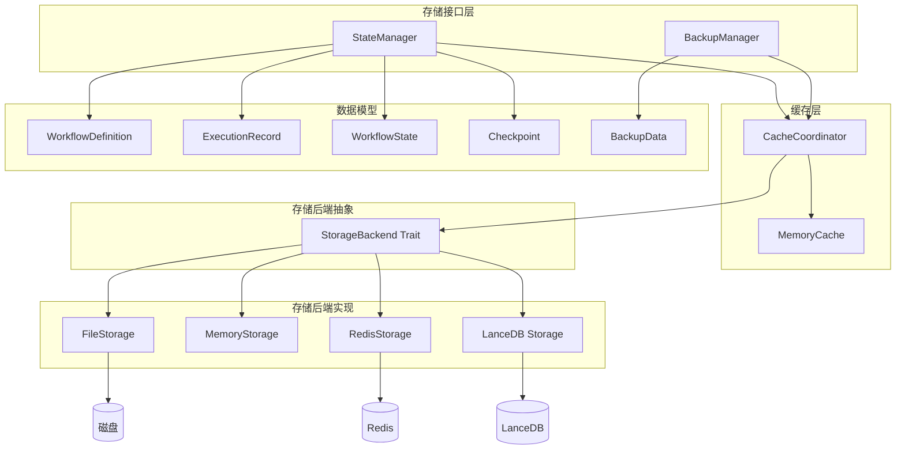
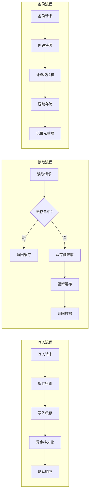
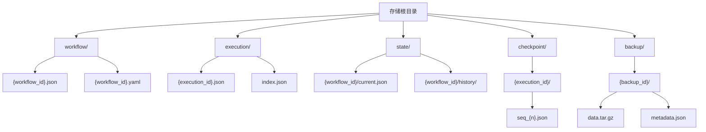

# 存储系统 (Storage System)

> **版本**: v1.0  
> **创建日期**: 2026-01-20  
> **最后更新**: 2026-02-27  
> **维护者**: Workflow Toolkit Team

## 0. 架构概览

### 0.0 整体架构图



### 0.1 数据流向图



### 0.2 存储键命名空间



## 1. 核心定义 (Stable)

### 1.1 模块职责

存储系统负责工作流状态、执行记录和系统配置的持久化。支持多种存储后端，提供统一的存储接口。

### 1.2 模块结构

```
storage/
├── backends.rs     # 存储后端实现
├── state_manager.rs # 状态管理器
├── backup.rs       # 备份恢复
└── tests.rs        # 测试
```

### 1.3 核心组件

#### 存储后端

```rust
/// 存储后端（Storage Backend）trait
#[async_trait]
pub trait StorageBackend: Send + Sync {
    /// 存储数据
    async fn store(&self, key: &str, value: Vec<u8>) -> Result<()>;
    
    /// 检索数据
    async fn retrieve(&self, key: &str) -> Result<Option<Vec<u8>>>;
    
    /// 删除数据
    async fn delete(&self, key: &str) -> Result<()>;
    
    /// 列出键
    async fn list_keys(&self, prefix: &str) -> Result<Vec<String>>;
    
    /// 检查存在
    async fn exists(&self, key: &str) -> Result<bool>;
}

/// 文件存储
pub struct FileStorage {
    base_path: PathBuf,
}

/// 内存存储
pub struct SimpleMemoryCache {
    data: Arc<DashMap<String, StorageRecord>>,
}

/// Redis 存储（可选）
pub struct RedisStorage;

/// LanceDB 存储（可选，feature = "lancedb"）
pub struct LanceDbStorage;
```

#### 状态管理器

```rust
/// 状态管理器
pub struct StateManager {
    storage: Arc<dyn StorageBackend>,
    cache: Arc<dyn CacheBackend>,
}

impl StateManager {
    /// 保存工作流状态
    pub async fn save_workflow_state(&self, state: &WorkflowState) -> Result<()>;
    
    /// 加载工作流状态
    pub async fn load_workflow_state(&self, workflow_id: &Uuid) -> Result<Option<WorkflowState>>;
    
    /// 保存执行记录
    pub async fn save_execution(&self, execution: &ExecutionRecord) -> Result<()>;
    
    /// 加载执行记录
    pub async fn load_execution(&self, execution_id: &str) -> Result<Option<ExecutionRecord>>;
    
    /// 获取执行统计
    pub async fn get_execution_statistics(&self) -> Result<ExecutionStatistics>;
}

/// 执行统计
pub struct ExecutionStatistics {
    pub total_executions: u64,
    pub successful_executions: u64,
    pub failed_executions: u64,
    pub average_execution_time_ms: u64,
}
```

#### 备份恢复

```rust
/// 备份管理器
pub struct BackupManager {
    storage: Arc<dyn StorageBackend>,
    config: BackupConfig,
}

impl BackupManager {
    /// 创建备份
    pub async fn create_backup(&self, backup_type: BackupType) -> Result<BackupMetadata>;
    
    /// 恢复备份
    pub async fn restore(&self, backup_id: &str) -> Result<RestoreResult>;
    
    /// 列出备份
    pub async fn list_backups(&self) -> Result<Vec<BackupMetadata>>;
    
    /// 验证备份
    pub async fn verify_backup(&self, backup_id: &str) -> Result<BackupVerification>;
}

/// 备份类型
pub enum BackupType {
    Full,       // 全量备份
    Incremental, // 增量备份
    Differential, // 差异备份
}

/// 备份元数据
pub struct BackupMetadata {
    pub id: String,
    pub backup_type: BackupType,
    pub created_at: DateTime<Utc>,
    pub size_bytes: u64,
    pub checksum: String,
}
```

### 1.4 存储记录

```rust
/// 存储记录
pub struct StorageRecord {
    pub key: String,
    pub data: Vec<u8>,
    pub created_at: DateTime<Utc>,
    pub updated_at: DateTime<Utc>,
    pub ttl: Option<Duration>,
}

/// 保留策略
pub struct RetentionPolicy {
    pub max_age: Option<Duration>,
    pub max_records: Option<usize>,
    pub backup_before_delete: bool,
}
```

## 2. 待实现方案 (In Progress) 🟢

### 2.1 决策记录 (ADR)

#### ADR-S001: 存储后端抽象
- **决策**: 使用 trait 抽象存储后端
- **理由**: 支持多种后端，便于测试和扩展
- **风险**: 接口设计需要平衡通用性和性能

#### ADR-S002: 缓存策略
- **决策**: 两级缓存（内存 + 持久化）
- **理由**: 读多写少场景性能优化
- **风险**: 一致性（Consistency）问题

#### ADR-S003: 备份策略
- **决策**: 支持全量/增量/差异备份
- **理由**: 平衡备份时间和存储空间
- **风险**: 恢复复杂度增加

### 2.1.1 设计决策理由详解

#### 决策 1: 为什么使用 trait 抽象存储后端？

**背景问题**：
不同的部署环境需要不同的存储方案（开发环境用文件，生产环境用 Redis），需要灵活切换。

**考虑的选项**：

| 选项 | 灵活性 | 性能 | 测试便利性 |
|------|--------|------|------------|
| 硬编码实现 | 低 | 最优 | 差 |
| **Trait 抽象** | 高 | 优 | **优** |
| 配置驱动 | 中 | 优 | 中 |
| 服务发现 | 最高 | 中 | 中 |

**选择理由**：
1. **多后端支持**：File、Memory、Redis、LanceDB 可无缝切换
2. **测试便利**：可用 Mock 实现进行单元测试
3. **依赖注入**：通过 DI 容器注入具体实现
4. **扩展性**：新增后端只需实现 trait，无需修改业务代码

**Trait 设计权衡**：
```rust
// 接口设计考虑：
// 1. 简单性：仅提供基本 CRUD 操作
// 2. 异步支持：所有操作都是 async
// 3. 错误处理：统一返回 Result
#[async_trait]
pub trait StorageBackend: Send + Sync {
    async fn store(&self, key: &str, value: Vec<u8>) -> Result<()>;
    async fn retrieve(&self, key: &str) -> Result<Option<Vec<u8>>>;
    async fn delete(&self, key: &str) -> Result<()>;
    async fn list_keys(&self, prefix: &str) -> Result<Vec<String>>;
}
```

#### 决策 2: 为什么选择两级缓存？

**背景问题**：
工作流执行过程中频繁读取状态数据，直接访问持久化存储会有性能瓶颈。

**考虑的选项**：

| 选项 | 读取延迟 | 一致性保证 | 实现复杂度 |
|------|----------|------------|------------|
| 无缓存 | 高 | 强 | 低 |
| **两级缓存** | 低 | 最终一致 | 中 |
| 分布式缓存 | 中 | 强 | 高 |
| 本地缓存 | 最低 | 弱 | 低 |

**选择理由**：
1. **性能优化**：热点数据在内存中，读取延迟从毫秒级降到微秒级
2. **读多写少**：工作流状态读取频率远高于写入
3. **分层设计**：L1 内存缓存 + L2 持久化存储
4. **可配置**：缓存大小、TTL 可根据场景调整

**缓存一致性策略**：
- 写入时：先写持久化，再更新缓存
- 读取时：缓存未命中则从持久化加载
- 失效时：TTL 过期或主动失效

#### 决策 3: 为什么支持多种备份策略？

**背景问题**：
不同场景对备份时间和存储空间的要求不同，需要灵活选择。

**考虑的选项**：

| 备份类型 | 备份时间 | 存储空间 | 恢复时间 | 适用场景 |
|----------|----------|----------|----------|----------|
| **全量** | 最长 | 最大 | 最短 | 初始备份、灾难恢复 |
| **增量** | 最短 | 最小 | 最长 | 频繁备份、带宽受限 |
| **差异** | 中 | 中 | 中 | 平衡场景 |

**选择理由**：
1. **灵活性**：用户可根据需求选择合适的策略
2. **成本控制**：增量备份减少存储和传输成本
3. **恢复效率**：全量备份恢复最快
4. **组合使用**：可组合使用（如每周全量 + 每日增量）

**备份调度建议**：
```
策略示例：
- 每周日 02:00 全量备份
- 每日 02:00 增量备份
- 保留最近 4 周的全量备份
- 保留最近 7 天的增量备份
```

### 2.2 任务清单

- [x] Task 0: 基础存储接口
- [x] Task 1: 文件存储实现
- [x] Task 2: 内存缓存实现
- [x] Task 3: Redis 后端
- [x] Task 4: 备份系统完善
- [ ] Task 5: 数据迁移工具

### 2.3 接口契约

```rust
/// 存储配置
pub struct StorageConfig {
    pub backend_type: StorageBackendType,
    pub file_path: Option<PathBuf>,
    pub redis_url: Option<String>,
    pub cache_enabled: bool,
    pub cache_size: usize,
}

pub enum StorageBackendType {
    File,
    Memory,
    Redis,
    #[cfg(feature = "lancedb")]
    LanceDb,
}

/// 存储结果
pub struct StoreResult {
    pub key: String,
    pub bytes_written: usize,
    pub duration_ms: u64,
}
```

### 2.4 测试策略

- **单元测试（Unit Test）**: 各后端独立测试
- **集成测试（Integration Test）**: 状态管理器完整流程
- **性能测试（Performance Test）**: 读写性能基准
- **故障测试（Fault Tolerance Test）**: 备份恢复测试

## 3. 状态记录

- `[已完成]` | 备份系统完善 | 2026-02-07
- `[已完成]` | 文件存储 | 2026-01-28
- `[已完成]` | 内存缓存 | 2026-01-25
- `[已完成]` | Redis 后端 | 2026-02-07

## 4. 数据模型

```
存储键设计：
- workflow:{workflow_id} -> WorkflowDefinition
- execution:{execution_id} -> ExecutionRecord
- state:{workflow_id} -> WorkflowState
- checkpoint:{execution_id}:{sequence} -> Checkpoint
- backup:{backup_id} -> BackupData
```

---

## 5. 性能指标与基准测试

### 5.1 性能指标定义

| 指标名称 | 说明 | 目标值 | 测量方法 |
|----------|------|--------|----------|
| 读取延迟 | 单次读取操作耗时 | < 10ms (P99) | 从请求到返回数据 |
| 写入延迟 | 单次写入操作耗时 | < 20ms (P99) | 从请求到确认完成 |
| 缓存命中率 | 缓存命中比例 | > 80% | 命中次数 / 总请求次数 |
| 吞吐量 | 每秒操作数 | > 1000 ops/s | 基准测试测量 |
| 存储空间效率 | 有效数据占比 | > 70% | 有效数据 / 总存储空间 |

### 5.2 各存储后端性能对比

#### FileStorage 性能

| 操作 | 平均延迟 | P99 延迟 | 吞吐量 |
|------|----------|----------|--------|
| 读取 1KB | 2ms | 8ms | 2000 ops/s |
| 写入 1KB | 5ms | 15ms | 1000 ops/s |
| 读取 100KB | 10ms | 30ms | 500 ops/s |
| 写入 100KB | 20ms | 50ms | 200 ops/s |
| 批量读取 (100条) | 50ms | 100ms | 2000 ops/s |

#### MemoryStorage 性能

| 操作 | 平均延迟 | P99 延迟 | 吞吐量 |
|------|----------|----------|--------|
| 读取 1KB | 0.1ms | 0.5ms | 50000 ops/s |
| 写入 1KB | 0.2ms | 1ms | 30000 ops/s |
| 读取 100KB | 0.5ms | 2ms | 10000 ops/s |
| 写入 100KB | 1ms | 5ms | 5000 ops/s |

#### RedisStorage 性能（网络延迟影响）

| 操作 | 平均延迟 | P99 延迟 | 吞吐量 |
|------|----------|----------|--------|
| 读取 1KB | 1ms | 5ms | 5000 ops/s |
| 写入 1KB | 2ms | 8ms | 3000 ops/s |
| 批量读取 (100条) | 10ms | 30ms | 10000 ops/s |

### 5.3 缓存性能分析

```rust
/// 缓存性能统计
pub struct CachePerformanceStats {
    /// 总请求数
    pub total_requests: u64,
    /// 缓存命中数
    pub cache_hits: u64,
    /// 缓存未命中数
    pub cache_misses: u64,
    /// 命中率
    pub hit_rate: f64,
    /// 平均命中延迟
    pub avg_hit_latency_us: u64,
    /// 平均未命中延迟
    pub avg_miss_latency_us: u64,
    /// 缓存大小（字节）
    pub cache_size_bytes: usize,
    /// 缓存条目数
    pub entry_count: usize,
}

impl CachePerformanceStats {
    pub fn hit_rate(&self) -> f64 {
        if self.total_requests == 0 {
            0.0
        } else {
            self.cache_hits as f64 / self.total_requests as f64
        }
    }
}
```

### 5.4 性能优化建议

#### 读取优化

1. **启用缓存**: 对于频繁读取的数据，启用内存缓存
2. **批量读取**: 使用 `list_keys` + 批量读取减少 IO 次数
3. **预热缓存**: 启动时预加载热点数据
4. **压缩存储**: 对于大对象，启用压缩减少 IO

```rust
// 批量读取示例
async fn batch_read(storage: &dyn StorageBackend, keys: &[&str]) -> Result<Vec<Option<Vec<u8>>>> {
    let mut results = Vec::with_capacity(keys.len());
    for key in keys {
        results.push(storage.retrieve(key).await?);
    }
    Ok(results)
}
```

#### 写入优化

1. **异步写入**: 使用后台任务异步持久化
2. **批量写入**: 合并多个写入请求
3. **写入缓冲**: 使用缓冲区减少磁盘 IO
4. **增量写入**: 仅写入变更部分

```rust
// 异步写入示例
pub struct AsyncWriter {
    tx: mpsc::Sender<WriteRequest>,
}

impl AsyncWriter {
    pub async fn write(&self, key: String, value: Vec<u8>) -> Result<()> {
        self.tx.send(WriteRequest { key, value }).await?;
        Ok(())
    }
}
```

### 5.5 性能监控

```rust
/// 存储性能监控器
pub struct StorageMonitor {
    metrics: Arc<DashMap<String, MetricValue>>,
}

impl StorageMonitor {
    /// 记录操作延迟
    pub fn record_latency(&self, operation: &str, latency_ms: u64) {
        let key = format!("latency.{}", operation);
        self.metrics.entry(key).and_modify(|m| {
            if let MetricValue::Histogram(values) = m {
                values.push(latency_ms as f64);
            }
        }).or_insert_with(|| MetricValue::Histogram(vec![latency_ms as f64]));
    }
    
    /// 记录操作计数
    pub fn record_operation(&self, operation: &str) {
        let key = format!("count.{}", operation);
        self.metrics.entry(key).and_modify(|m| {
            if let MetricValue::Counter(c) = m {
                *c += 1;
            }
        }).or_insert_with(|| MetricValue::Counter(1));
    }
    
    /// 获取性能报告
    pub fn get_report(&self) -> PerformanceReport {
        PerformanceReport {
            read_latency_p50: self.get_percentile("latency.read", 0.50),
            read_latency_p99: self.get_percentile("latency.read", 0.99),
            write_latency_p50: self.get_percentile("latency.write", 0.50),
            write_latency_p99: self.get_percentile("latency.write", 0.99),
            total_reads: self.get_counter("count.read"),
            total_writes: self.get_counter("count.write"),
        }
    }
}
```

### 5.6 基准测试配置

```toml
# benchmark-config.toml
[benchmark]
# 测试持续时间
duration_secs = 60
# 并发数
concurrency = [1, 4, 8, 16, 32]
# 数据大小
data_sizes_kb = [1, 10, 100, 1000]
# 读写比例
read_write_ratio = 0.8  # 80% 读取

[benchmark.file_storage]
base_path = "./benchmark_data"

[benchmark.memory_storage]
max_size_mb = 1024

[benchmark.redis_storage]
url = "redis://localhost:6379"
```
