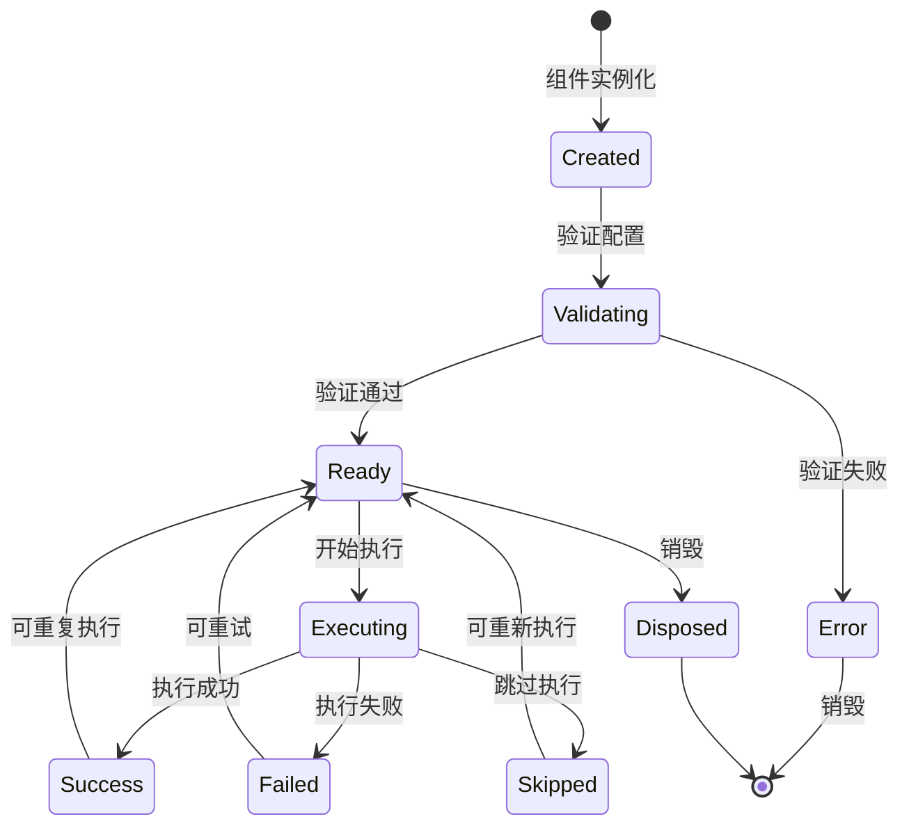

# Component 模块设计文档

> 模块路径: `src/workflow/component`
> 设计原则: LiteFlow "一切皆组件" - 所有逻辑都是组件

---

## 1. 核心定义 (Stable)

### 1.1 模块职责

Component 模块是工作流系统的核心抽象层，负责：

- 定义统一的组件接口 (`Component` trait)
- 提供组件类型枚举 (`ComponentType`)
- 管理组件执行状态 (`ComponentStatus`)
- 封装组件执行输出 (`ComponentOutput`)
- 实现组件注册与发现 (`ComponentRegistry`)

### 1.2 模块结构

```
src/workflow/component/
├── mod.rs          # 核心定义与 trait
├── tool.rs         # Tool 组件实现
├── parallel.rs     # Parallel 组件实现
└── registry.rs     # 组件注册中心
```

### 1.3 核心类型

#### ComponentType 枚举

| 变体 | 用途 | 说明 |
|------|------|------|
| `Tool` | 工具执行 | 执行已注册的工具 |
| `Condition` | 条件判断 | 表达式求值，用于分支 |
| `Loop` | 循环迭代 | 集合遍历或条件循环 |
| `Parallel` | 并行执行 | 多节点并发执行 |
| `Switch` | 多路分支 | 基于表达式值的多分支选择 |
| `Checkpoint` | 检查点 | 保存执行状态用于恢复 |

#### ComponentStatus 枚举

| 变体 | 含义 |
|------|------|
| `Success` | 执行成功 |
| `Failure(String)` | 执行失败，包含错误信息 |
| `Skip` | 跳过执行（如条件为 false） |
| `Break` | 跳出循环 |
| `Continue` | 继续下一次循环迭代 |

#### ComponentOutput 结构

```rust
pub struct ComponentOutput {
    pub status: ComponentStatus,      // 执行状态
    pub next_nodes: Vec<String>,      // 动态确定的下一节点
    pub result: Option<Value>,        // 执行结果值
    pub metadata: HashMap<String, Value>,  // 附加元数据
}
```

**便捷构造方法**:
- `success()` - 成功输出
- `success_with_result(Value)` - 带结果的成功输出
- `success_with_next(Vec<String>)` - 指定下一节点的成功输出
- `failure(impl Into<String>)` - 失败输出
- `skip()` - 跳过输出

#### Component Trait

```rust
#[async_trait]
pub trait Component: Send + Sync {
    fn id(&self) -> &str;                                    // 唯一标识
    fn component_type(&self) -> ComponentType;               // 组件类型
    async fn execute(&self, context: &mut DataContext, 
                     execution_ctx: &ExecutionContext) -> Result<ComponentOutput>;  // 执行逻辑
    fn validate(&self) -> Result<()>;                        // 配置验证
    fn cacheable(&self) -> bool;                             // 是否可缓存
    fn description(&self) -> Option<&str>;                   // 描述信息
}
```

### 1.4 设计原则

1. **单一职责**: 每个组件只处理自己的执行逻辑
2. **开闭原则**: 通过 trait 扩展新组件类型，无需修改核心代码
3. **依赖倒置**: 工作流引擎依赖抽象 trait，而非具体实现
4. **线程安全**: `Component: Send + Sync` 确保异步安全

---

## 2. 待实现方案 (In Progress)

### 2.1 决策记录

| 日期 | 决策 | 理由 | 状态 |
|------|------|------|------|
| - | 使用 async_trait 支持异步执行 | 工作流需要 I/O 操作 | 已采纳 |
| - | ComponentOutput 包含动态 next_nodes | 支持运行时决定分支 | 已采纳 |
| - | 默认 cacheable 返回 false | 安全优先，避免缓存问题 | 已采纳 |

### 2.2 任务清单

#### 待实现组件

- [ ] `ConditionComponent` - 条件判断组件
- [ ] `LoopComponent` - 循环组件
- [ ] `SwitchComponent` - 多路分支组件
- [ ] `CheckpointComponent` - 检查点组件

#### 功能增强

- [ ] 组件执行超时控制
- [ ] 组件执行重试机制
- [ ] 组件执行指标收集 (metrics)
- [ ] 组件缓存策略实现

#### 测试覆盖

- [ ] ComponentOutput 单元测试
- [ ] ComponentStatus 状态转换测试
- [ ] 各组件类型的集成测试

---

## 3. 状态记录

### 3.1 变更历史

| 日期 | 版本 | 变更内容 |
|------|------|----------|
| 2026-02-26 | v1.0 | 初始设计文档，基于 mod.rs 实际代码 |

### 3.2 当前状态

- **稳定性**: Stable (核心定义)
- **完成度**: 
  - 核心类型: 100%
  - Tool 组件: 已实现
  - Parallel 组件: 已实现
  - Registry: 已实现
  - 其他组件: 待实现

### 3.3 依赖关系

```
Component trait
    ├── crate::core::ExecutionContext (执行上下文)
    ├── crate::error::Result (错误处理)
    ├── crate::workflow::context::DataContext (数据上下文)
    └── serde_json::Value (JSON 值类型)
```

---

## 4. 参考资料

- LiteFlow 设计理念: "一切皆组件"
- 项目 SOP: [AGENT_SOP.md](../../../sop/AGENT_SOP.md)

---

## 5. 组件生命周期

### 5.1 生命周期状态图



### 5.2 生命周期阶段

| 阶段 | 触发条件 | 可执行操作 | 说明 |
|------|----------|------------|------|
| Created | 组件实例化 | - | 组件对象已创建，未初始化 |
| Validating | 调用 `validate()` | 配置检查 | 验证组件配置是否有效 |
| Ready | 验证通过 | `execute()` | 组件就绪，可执行 |
| Executing | 调用 `execute()` | 执行逻辑 | 组件正在执行 |
| Success | 执行成功 | - | 执行成功完成 |
| Failed | 执行失败 | - | 执行过程中出错 |
| Skipped | 条件不满足 | - | 跳过执行（如条件为 false） |
| Disposed | 显式销毁 | - | 组件已销毁，不可再使用 |

### 5.3 生命周期钩子

```rust
/// 组件生命周期钩子
#[async_trait]
pub trait ComponentLifecycle: Send + Sync {
    /// 创建后调用
    async fn on_created(&self, _component: &dyn Component) -> Result<()> {
        Ok(())
    }
    
    /// 验证前调用
    async fn on_validating(&self, _component: &dyn Component) -> Result<()> {
        Ok(())
    }
    
    /// 验证后调用
    async fn on_validated(&self, _component: &dyn Component, _result: &Result<()>) -> Result<()> {
        Ok(())
    }
    
    /// 执行前调用
    async fn on_executing(&self, _component: &dyn Component, _context: &DataContext) -> Result<()> {
        Ok(())
    }
    
    /// 执行后调用
    async fn on_executed(
        &self,
        _component: &dyn Component,
        _result: &Result<ComponentOutput>,
    ) -> Result<()> {
        Ok(())
    }
    
    /// 销毁前调用
    async fn on_disposing(&self, _component: &dyn Component) -> Result<()> {
        Ok(())
    }
}
```

### 5.4 组件生命周期管理器

```rust
/// 组件生命周期管理器
pub struct ComponentLifecycleManager {
    hooks: Vec<Box<dyn ComponentLifecycle>>,
    states: DashMap<String, ComponentLifecycleState>,
}

/// 组件生命周期状态
#[derive(Debug, Clone)]
pub enum ComponentLifecycleState {
    Created,
    Validating,
    Ready,
    Executing { started_at: DateTime<Utc> },
    Success { completed_at: DateTime<Utc> },
    Failed { error: String, failed_at: DateTime<Utc> },
    Skipped { reason: String },
    Disposed,
}

impl ComponentLifecycleManager {
    /// 注册生命周期钩子
    pub fn register_hook(&mut self, hook: Box<dyn ComponentLifecycle>) {
        self.hooks.push(hook);
    }
    
    /// 触发创建事件
    pub async fn trigger_created(&self, component: &dyn Component) -> Result<()> {
        self.states.insert(component.id().to_string(), ComponentLifecycleState::Created);
        for hook in &self.hooks {
            hook.on_created(component).await?;
        }
        Ok(())
    }
    
    /// 触发验证事件
    pub async fn trigger_validating(&self, component: &dyn Component) -> Result<()> {
        self.states.insert(component.id().to_string(), ComponentLifecycleState::Validating);
        for hook in &self.hooks {
            hook.on_validating(component).await?;
        }
        Ok(())
    }
    
    /// 触发执行事件
    pub async fn trigger_executing(&self, component: &dyn Component, context: &DataContext) -> Result<()> {
        self.states.insert(
            component.id().to_string(),
            ComponentLifecycleState::Executing { started_at: Utc::now() },
        );
        for hook in &self.hooks {
            hook.on_executing(component, context).await?;
        }
        Ok(())
    }
    
    /// 触发执行完成事件
    pub async fn trigger_executed(
        &self,
        component: &dyn Component,
        result: &Result<ComponentOutput>,
    ) -> Result<()> {
        let state = match result {
            Ok(output) => match output.status {
                ComponentStatus::Success => ComponentLifecycleState::Success {
                    completed_at: Utc::now(),
                },
                ComponentStatus::Skip => ComponentLifecycleState::Skipped {
                    reason: "条件不满足".to_string(),
                },
                ComponentStatus::Failure(ref err) => ComponentLifecycleState::Failed {
                    error: err.clone(),
                    failed_at: Utc::now(),
                },
                _ => ComponentLifecycleState::Success { completed_at: Utc::now() },
            },
            Err(e) => ComponentLifecycleState::Failed {
                error: e.to_string(),
                failed_at: Utc::now(),
            },
        };
        
        self.states.insert(component.id().to_string(), state);
        
        for hook in &self.hooks {
            hook.on_executed(component, result).await?;
        }
        Ok(())
    }
    
    /// 获取组件状态
    pub fn get_state(&self, component_id: &str) -> Option<ComponentLifecycleState> {
        self.states.get(component_id).map(|s| s.clone())
    }
}
```

### 5.5 内置生命周期钩子

#### 日志钩子

```rust
/// 日志记录钩子
pub struct LoggingLifecycleHook {
    logger: Logger,
}

#[async_trait]
impl ComponentLifecycle for LoggingLifecycleHook {
    async fn on_executing(&self, component: &dyn Component, _context: &DataContext) -> Result<()> {
        self.logger.info(&format!(
            "[{}] 开始执行组件: {}",
            chrono::Utc::now().format("%H:%M:%S%.3f"),
            component.id()
        ));
        Ok(())
    }
    
    async fn on_executed(&self, component: &dyn Component, result: &Result<ComponentOutput>) -> Result<()> {
        match result {
            Ok(output) => {
                self.logger.info(&format!(
                    "[{}] 组件执行完成: {} -> {:?}",
                    chrono::Utc::now().format("%H:%M:%S%.3f"),
                    component.id(),
                    output.status
                ));
            }
            Err(e) => {
                self.logger.error(&format!(
                    "[{}] 组件执行失败: {} -> {}",
                    chrono::Utc::now().format("%H:%M:%S%.3f"),
                    component.id(),
                    e
                ));
            }
        }
        Ok(())
    }
}
```

#### 指标收集钩子

```rust
/// 指标收集钩子
pub struct MetricsLifecycleHook {
    metrics: Arc<MetricsCollector>,
}

#[async_trait]
impl ComponentLifecycle for MetricsLifecycleHook {
    async fn on_executing(&self, component: &dyn Component, _context: &DataContext) -> Result<()> {
        self.metrics.counter("component.executing", 1);
        self.metrics.gauge("component.current", component.id().to_string());
        Ok(())
    }
    
    async fn on_executed(&self, component: &dyn Component, result: &Result<ComponentOutput>) -> Result<()> {
        match result {
            Ok(_) => self.metrics.counter("component.success", 1),
            Err(_) => self.metrics.counter("component.failure", 1),
        }
        Ok(())
    }
}
```

### 5.6 生命周期最佳实践

1. **验证阶段**: 在 `validate()` 中检查所有配置，避免运行时错误
2. **执行阶段**: 使用 `ComponentOutput` 正确报告执行状态
3. **错误处理**: 失败时提供有意义的错误信息
4. **资源清理**: 在销毁钩子中释放所有资源
5. **幂等性**: 设计组件支持重复执行
