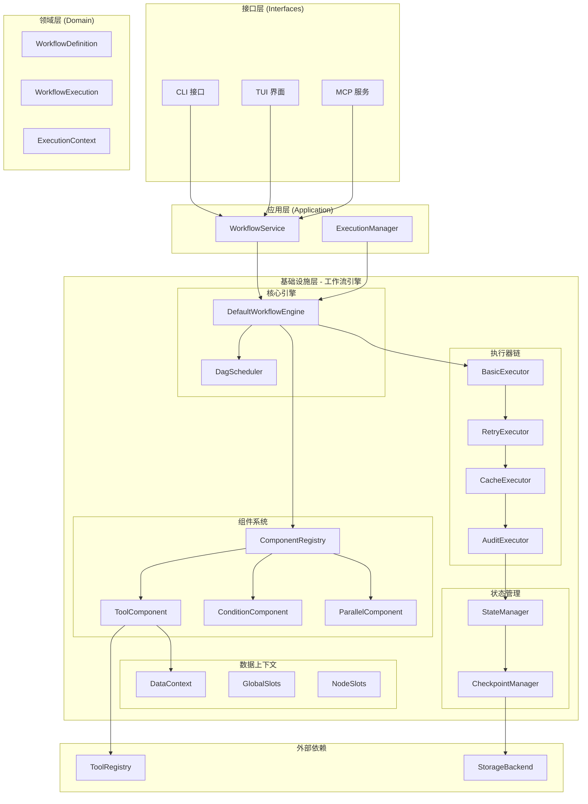
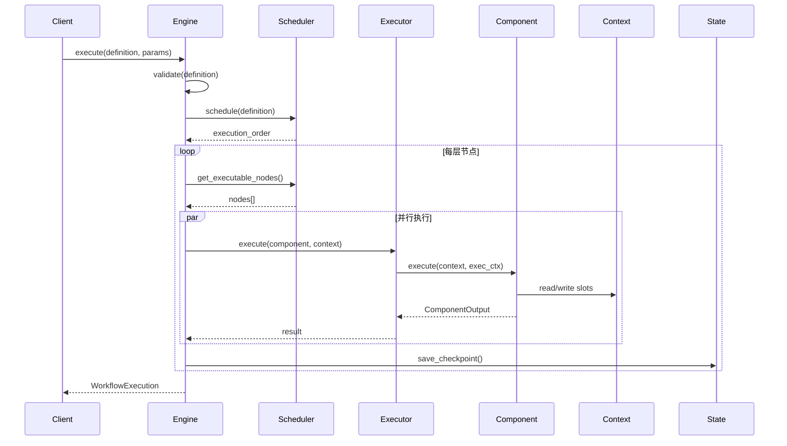

# 工作流引擎 (Workflow Engine)

## 0. 架构概览

### 0.0 整体架构图



### 0.1 执行流程图



## 0.2 分层定位

本模块属于**基础设施层**实现，提供工作流引擎的具体技术实现。

### 0.1 与 DDD 分层的关系

```
┌─────────────────────────────────────────┐
│  接口层 (Interfaces)                     │
│  └── 调用 WorkflowEngine trait          │
├─────────────────────────────────────────┤
│  应用层 (Application)                    │
│  ├── WorkflowEngine trait (端口定义)    │
│  └── WorkflowService (编排逻辑)         │
├─────────────────────────────────────────┤
│  领域层 (Domain)                         │
│  ├── WorkflowExecution (聚合根)         │
│  ├── WorkflowDefinition (聚合根)        │
│  └── ExecutionContext (值对象)          │
├─────────────────────────────────────────┤
│  基础设施层 (Infrastructure)             │
│  └── src/workflow/ (本模块)             │
│      ├── 实现 WorkflowEngine trait      │
│      ├── Component 适配领域层 Tool      │
│      ├── DataContext 适配 ExecutionContext│
│      └── 具体技术实现 (调度、执行、检查点)│
└─────────────────────────────────────────┘
```

### 0.2 职责边界

| 层级 | 职责 | 本模块角色 |
|------|------|-----------|
| 领域层 | 定义工作流模型、执行状态 | 消费领域模型 |
| 应用层 | 定义 WorkflowEngine 接口、编排逻辑 | 实现接口 |
| 基础设施层 | 技术实现：调度、执行、持久化 | **本模块** |

### 0.3 依赖关系

```
src/workflow/
├── 依赖: domain (领域层)
│   ├── WorkflowDefinition
│   ├── WorkflowExecution
│   ├── ExecutionContext
│   └── ToolInfo
├── 依赖: application (应用层)
│   └── port::WorkflowEngine (实现此接口)
└── 被依赖: interfaces (接口层)
    └── 通过应用层间接使用
```

---

## 1. 核心定义 (Stable)

### 1.1 模块职责

工作流引擎负责工作流的定义、验证、调度和执行。采用 LiteFlow 架构风格，包含组件系统、执行器链、数据上下文等核心概念。

### 1.2 模块结构

```
workflow/
├── definition.rs       # 工作流定义
├── engine.rs           # 引擎实现
├── execution.rs        # 执行状态管理
├── execution_manager.rs # 执行管理器
├── scheduler.rs        # DAG 调度器
├── validator.rs        # 验证器
├── audit.rs            # 审计日志
├── result_cache.rs     # 结果缓存
├── component/          # 组件系统
│   ├── mod.rs
│   ├── tool.rs         # 工具组件
│   └── parallel.rs     # 并行组件
├── context/            # 数据上下文
│   ├── mod.rs
│   └── slot.rs         # 数据槽
├── executor/           # 执行器链
│   ├── mod.rs
│   ├── basic.rs        # 基础执行器
│   ├── retry.rs        # 重试执行器
│   ├── cache.rs        # 缓存执行器
│   └── audit.rs        # 审计执行器
└── state/              # 状态管理
    ├── mod.rs
    └── checkpoint.rs   # 检查点
```

### 1.3 核心组件

#### 工作流定义

```rust
/// 工作流定义
/// 
/// 版本: v1.0 | 最后更新: 2026-02-26
pub struct WorkflowDefinition {
    pub name: String,                           // 工作流名称
    pub version: String,                        // 版本号
    pub description: Option<String>,            // 描述
    pub metadata: HashMap<String, Value>,       // 元数据
    pub nodes: Vec<WorkflowNode>,               // 节点列表
    pub edges: Vec<WorkflowEdge>,               // 边列表
    pub global_config: WorkflowConfig,          // 全局配置
}

/// 工作流节点
/// 
/// 版本: v1.0 | 最后更新: 2026-02-26
pub struct WorkflowNode {
    pub id: String,                             // 节点唯一标识
    pub node_type: NodeType,                    // 节点类型
    pub tool_name: Option<String>,              // 工具名称（Tool 类型时必需）
    pub parameters: Value,                      // 执行参数
    pub retry_policy: Option<RetryPolicy>,      // 重试策略
    pub timeout: Option<Duration>,              // 超时时间
    pub metadata: HashMap<String, Value>,       // 节点元数据
    pub depends_on: Vec<String>,                // 显式依赖（除边之外的依赖）
}

/// 节点类型枚举
/// 
/// 版本: v1.0 | 最后更新: 2026-02-26
pub enum NodeType {
    Tool,       // 工具执行节点
    Condition,  // 条件分支节点
    Loop,       // 循环节点
    Parallel,   // 并行执行节点
    Checkpoint, // 检查点节点（用于状态保存和恢复）
}

/// 工作流边
pub struct WorkflowEdge {
    pub from: String,                           // 源节点 ID
    pub to: String,                             // 目标节点 ID
    pub condition: Option<String>,              // 条件表达式
    pub weight: Option<f64>,                    // 边权重
    pub metadata: HashMap<String, Value>,       // 边元数据
}
```

#### 工作流引擎

```rust
/// 工作流引擎 trait
/// 
/// 版本: v1.0 | 最后更新: 2026-02-26
/// 
/// 职责：定义工作流执行的统一接口
#[async_trait]
pub trait WorkflowEngine: Send + Sync {
    /// 执行工作流定义
    /// 
    /// # 参数
    /// - `definition`: 工作流定义（包含节点、边、配置等）
    /// - `initial_params`: 初始参数（键值对形式）
    /// 
    /// # 返回
    /// - `Ok(WorkflowExecution)`: 执行结果
    /// - `Err(WorkflowError)`: 执行错误
    async fn execute(
        &self,
        definition: WorkflowDefinition,
        initial_params: HashMap<String, Value>,
    ) -> Result<WorkflowExecution>;
}

/// 默认引擎实现
pub struct DefaultWorkflowEngine {
    scheduler: Arc<DagScheduler>,
    component_registry: Arc<ComponentRegistry>,
    executor_chain: BoxedExecutor,
}

/// 重构版引擎（LiteFlow 风格）
/// 
/// 版本: v1.0 | 最后更新: 2026-02-26
pub struct RefactoredWorkflowEngine {
    state_manager: Arc<StateManager>,           // 状态管理器
    tool_registry: Arc<ToolRegistry>,           // 工具注册表
    executor: BoxedExecutor,                    // 执行器链
    audit_logger: Arc<AuditLogger>,             // 审计日志
    result_cache: Option<Arc<ResultCache>>,     // 结果缓存（可选）
    workflow_semaphore: Arc<Semaphore>,         // 并发控制信号量
    default_max_concurrency: usize,             // 默认最大并发数
    checkpoint_interval: Duration,              // 检查点间隔
}
```

#### DAG 调度器

```rust
/// DAG 调度器
pub struct DagScheduler {
    max_concurrent: usize,
}

impl DagScheduler {
    /// 拓扑排序
    pub fn schedule(&self, definition: &WorkflowDefinition) -> Result<SchedulingResult>;
    
    /// 获取可执行节点
    pub fn get_executable_nodes(&self, execution: &WorkflowExecution) -> Vec<String>;
}

/// 调度结果
pub struct SchedulingResult {
    pub execution_order: Vec<Vec<String>>, // 分层执行顺序
    pub stats: ExecutionStats,
}
```

### 1.4 组件系统

```rust
/// 组件 trait
/// 
/// 版本: v1.0 | 最后更新: 2026-02-26
/// 
/// 所有工作流节点类型必须实现此 trait。
/// 遵循单一职责原则，每个组件只处理自己的执行逻辑。
#[async_trait]
pub trait Component: Send + Sync {
    /// 返回组件唯一标识
    fn id(&self) -> &str;
    
    /// 返回组件类型
    fn component_type(&self) -> ComponentType;
    
    /// 执行组件逻辑
    /// 
    /// # 参数
    /// - `context`: 可变数据上下文，用于读写槽位值
    /// - `execution_ctx`: 执行上下文，包含工作流元数据
    /// 
    /// # 返回
    /// ComponentOutput 包含执行状态和动态下一节点
    async fn execute(
        &self,
        context: &mut DataContext,
        execution_ctx: &ExecutionContext,
    ) -> Result<ComponentOutput>;
    
    /// 验证组件配置（可选，默认返回 Ok(())）
    fn validate(&self) -> Result<()> { Ok(()) }
    
    /// 检查组件结果是否可缓存（默认返回 false）
    fn cacheable(&self) -> bool { false }
    
    /// 获取组件描述（用于文档/调试）
    fn description(&self) -> Option<&str> { None }
}

/// 组件类型枚举
/// 
/// 版本: v1.0 | 最后更新: 2026-02-26
pub enum ComponentType {
    Tool,       // 工具执行组件 - 执行已注册的工具
    Condition,  // 条件组件 - 表达式求值用于分支
    Loop,       // 循环组件 - 集合遍历或条件循环
    Parallel,   // 并行组件 - 多节点并发执行
    Switch,     // 多路分支组件 - 基于表达式值的多分支选择
    Checkpoint, // 检查点组件 - 保存执行状态用于恢复
}

/// 组件执行状态
pub enum ComponentStatus {
    Success,            // 执行成功
    Failure(String),    // 执行失败，包含错误信息
    Skip,               // 跳过执行（如条件为 false）
    Break,              // 跳出循环
    Continue,           // 继续下一次循环迭代
}

/// 组件输出
pub struct ComponentOutput {
    pub status: ComponentStatus,              // 执行状态
    pub next_nodes: Vec<String>,              // 动态确定的下一节点
    pub result: Option<Value>,                // 执行结果值
    pub metadata: HashMap<String, Value>,     // 附加元数据
}

/// 组件注册表
pub struct ComponentRegistry {
    components: DashMap<String, Box<dyn Component>>,
}
```

#### Component 与领域层 Tool 的映射

```rust
/// Component 是对领域层 Tool 的包装和适配
/// 
/// 关系映射：
/// - Component::execute() → Tool 的业务逻辑执行
/// - Component::component_type() → ToolInfo::category
/// - DataContext → ExecutionContext 的包装
/// 
/// 架构位置：
/// - ToolInfo (领域层) → ToolComponentAdapter (基础设施层) → Component trait
pub trait Component: Send + Sync {
    /// 返回组件唯一标识
    fn id(&self) -> &str;
    
    /// 返回组件类型
    fn component_type(&self) -> ComponentType;
    
    /// 执行组件逻辑
    async fn execute(
        &self,
        context: &mut DataContext,
        execution_ctx: &ExecutionContext,
    ) -> Result<ComponentOutput>;
}

/// Component 到 Tool 的适配器
/// 
/// 将领域层的 Tool 包装为工作流引擎的 Component
pub struct ToolComponentAdapter {
    tool_info: ToolInfo,                       // 来自领域层
    tool_executor: Box<dyn ToolExecutor>,      // 工具执行器
}

impl Component for ToolComponentAdapter {
    fn id(&self) -> &str {
        &self.tool_info.name
    }
    
    fn component_type(&self) -> ComponentType {
        ComponentType::Tool
    }
    
    async fn execute(
        &self,
        context: &mut DataContext,
        execution_ctx: &ExecutionContext,
    ) -> Result<ComponentOutput> {
        // 1. 从 DataContext 提取 ExecutionContext
        let execution_context = context.to_execution_context();
        
        // 2. 调用工具执行
        let result = self.tool_executor.execute(
            &self.tool_info,
            context.get_input(),
            &execution_context
        ).await?;
        
        // 3. 将结果写回 DataContext
        context.set_output(result.clone());
        
        Ok(ComponentOutput {
            status: ComponentStatus::Success,
            next_nodes: vec![], // 由调度器决定
            result: Some(result),
            metadata: HashMap::new(),
        })
    }
}

/// DataContext 与 ExecutionContext 的映射
/// 
/// DataContext 是 ExecutionContext 的技术包装，添加工作流引擎特定的功能
pub struct DataContext {
    execution_context: ExecutionContext,       // 领域层上下文
    node_inputs: HashMap<String, Value>,       // 当前节点输入
    node_outputs: HashMap<String, Value>,      // 当前节点输出
    global_variables: HashMap<String, Value>,  // 全局变量
}

impl DataContext {
    /// 转换为领域层 ExecutionContext
    pub fn to_execution_context(&self) -> ExecutionContext {
        ExecutionContext {
            execution_id: self.execution_context.execution_id.clone(),
            workflow_id: self.execution_context.workflow_id,
            user_id: self.execution_context.user_id.clone(),
            session_id: self.execution_context.session_id.clone(),
            global_variables: self.global_variables.clone(),
            step_results: self.node_outputs.clone(),
            started_at: self.execution_context.started_at,
        }
    }
    
    /// 从 ExecutionContext 创建
    pub fn from_execution_context(ctx: ExecutionContext) -> Self {
        Self {
            execution_context: ctx,
            node_inputs: HashMap::new(),
            node_outputs: HashMap::new(),
            global_variables: HashMap::new(),
        }
    }
}
```

### 1.5 执行器链

```rust
/// 执行器 trait
/// 
/// 版本: v1.0 | 最后更新: 2026-02-26
/// 
/// 执行器包装组件执行，允许以可组合的方式应用横切关注点。
/// 采用责任链模式，每个执行器可以：
/// 1. 执行前置逻辑（如记录开始时间）
/// 2. 委托给下一个执行器
/// 3. 执行后置逻辑（如缓存结果、记录日志）
#[async_trait]
pub trait Executor: Send + Sync {
    /// 执行组件
    /// 
    /// # 参数
    /// - `component`: 要执行的组件
    /// - `context`: 可变数据上下文
    /// - `execution_ctx`: 执行上下文
    /// 
    /// # 返回
    /// 组件的输出结果
    async fn execute(
        &self,
        component: &dyn Component,
        context: &mut DataContext,
        execution_ctx: &ExecutionContext,
    ) -> Result<ComponentOutput>;
    
    /// 获取执行器名称（用于日志/调试）
    fn name(&self) -> &str { "Executor" }
}

/// 基础执行器 - 直接调用组件的 execute 方法
pub struct BasicExecutor;

/// 重试执行器 - 支持 Fixed/Linear/Exponential 退避策略
pub struct RetryExecutor {
    inner: BoxedExecutor,
    max_retries: u32,
    base_delay: Duration,
}

/// 缓存执行器 - 基于 moka::future::Cache 缓存结果
pub struct CacheExecutor {
    inner: BoxedExecutor,
    cache: Arc<moka::future::Cache<String, ComponentOutput>>,
}

/// 审计执行器 - 记录执行开始/完成/错误事件
pub struct AuditExecutor {
    inner: BoxedExecutor,
    logger: Arc<AuditLogger>,
}

/// 执行器链构建器
/// 
/// 示例：
/// ```ignore
/// let executor = ExecutorChainBuilder::new()
///     .with_retry(3, Duration::from_secs(1))
///     .with_cache(cache)
///     .with_audit(audit_logger)
///     .build();
/// ```
pub struct ExecutorChainBuilder {
    executor: BoxedExecutor,
}
```

### 1.6 并发控制

```rust
/// 并发控制器
/// 
/// 使用信号量控制并行执行的最大数量
pub struct ConcurrencyController {
    semaphore: Arc<Semaphore>,
    max_concurrent: usize,
}

impl ConcurrencyController {
    pub fn new(max_concurrent: usize) -> Self {
        Self {
            semaphore: Arc::new(Semaphore::new(max_concurrent)),
            max_concurrent,
        }
    }
    
    /// 获取执行许可
    pub async fn acquire_permit(&self) -> Result<ExecutionPermit> {
        let permit = self.semaphore.acquire().await?;
        Ok(ExecutionPermit { _permit: permit })
    }
    
    /// 获取当前可用许可数
    pub fn available_permits(&self) -> usize {
        self.semaphore.available_permits()
    }
}

/// 执行许可（RAII 模式）
pub struct ExecutionPermit {
    _permit: SemaphorePermit<'static>,
}

/// 并行执行管理器
/// 
/// 管理同一层节点的并行执行
pub struct ParallelExecutionManager {
    concurrency_controller: ConcurrencyController,
}

impl ParallelExecutionManager {
    pub fn new(max_concurrent: usize) -> Self {
        Self {
            concurrency_controller: ConcurrencyController::new(max_concurrent),
        }
    }
    
    /// 并行执行多个节点
    pub async fn execute_parallel(
        &self,
        nodes: Vec<WorkflowNode>,
        ctx: &ExecutionContext,
        executor_chain: &BoxedExecutor,
    ) -> Result<Vec<NodeResult>> {
        let mut task_set = JoinSet::new();
        
        for node in nodes {
            // 获取并发许可
            let permit = self.concurrency_controller.acquire_permit().await?;
            let ctx = ctx.clone();
            let executor = executor_chain.clone();
            
            // 提交并行任务
            task_set.spawn(async move {
                let _permit = permit; // 保持许可生命周期
                execute_node_with_chain(node, ctx, executor).await
            });
        }
        
        // 收集结果
        let mut results = Vec::new();
        while let Some(result) = task_set.join_next().await {
            results.push(result??);
        }
        
        Ok(results)
    }
}

/// 资源限制配置
pub struct ResourceLimits {
    pub max_concurrent_nodes: usize,
    pub max_memory_mb: Option<usize>,
    pub max_execution_time: Option<Duration>,
}
```

## 2. 待实现方案 (In Progress) 🟢

### 2.1 决策记录 (ADR)

#### ADR-W001: 引擎架构选择
- **决策**: 采用 LiteFlow 风格的组件 + 执行器链架构
- **理由**: 更好的扩展性，支持 AOP 风格的横切关注点
- **风险**: 学习成本，需要理解组件和执行器链的概念

#### ADR-W002: 调度算法
- **决策**: 使用拓扑排序（Topological Sort） + 分层执行
- **理由**: 支持复杂 DAG（有向无环图），最大化并行度
- **风险**: 内存占用，需要维护依赖图

#### ADR-W003: 状态持久化
- **决策**: 检查点机制（Checkpoint） + 增量保存
- **理由**: 支持暂停/恢复，容错能力强
- **风险**: 性能开销，需要优化保存频率

### 2.1.1 设计决策理由详解

#### 决策 1: 为什么选择 LiteFlow 架构风格？

**背景问题**：
传统的工作流引擎通常将执行逻辑、调度逻辑和状态管理耦合在一起，导致：
- 代码难以测试和维护
- 无法灵活添加横切关注点（如日志、缓存、重试）
- 扩展新功能需要修改核心代码

**考虑的选项**：

| 选项 | 优点 | 缺点 |
|------|------|------|
| 单体引擎 | 简单直接 | 难以扩展，耦合度高 |
| 责任链模式 | 灵活扩展 | 链条管理复杂 |
| **LiteFlow 组件+执行器链** | 高扩展性，关注点分离 | 学习成本较高 |
| Actor 模型 | 高并发 | 过于复杂，不适合此场景 |

**选择理由**：
1. **关注点分离**：组件专注于业务逻辑，执行器处理横切关注点
2. **开闭原则**：新增功能只需添加执行器，无需修改现有代码
3. **可测试性**：组件和执行器可独立测试
4. **复用性**：执行器可跨组件复用（如 RetryExecutor 适用于所有组件）

**影响与后果**：
- 团队需要理解组件和执行器链的概念
- 调试时需要追踪执行器链的调用过程
- 性能开销可控（执行器链为内存操作）

#### 决策 2: 为什么使用拓扑排序 + 分层执行？

**背景问题**：
工作流节点之间存在依赖关系，需要确定执行顺序，同时最大化并行度。

**考虑的选项**：

| 选项 | 并行度 | 复杂度 | 适用场景 |
|------|--------|--------|----------|
| 线性执行 | 无并行 | 低 | 简单流程 |
| **拓扑排序 + 分层** | 高 | 中 | **DAG 工作流** |
| 优先级队列 | 中 | 高 | 动态优先级 |
| 数据驱动调度 | 最高 | 最高 | 复杂依赖 |

**选择理由**：
1. **最大化并行度**：同一层的节点无依赖，可并行执行
2. **正确性保证**：拓扑排序确保依赖顺序正确
3. **可预测性**：执行顺序确定，便于调试和测试
4. **资源控制**：通过 `max_concurrent` 限制并发数

**实现细节**：
```
分层执行示例：
Layer 0: [A]           ← 入口节点
Layer 1: [B, C]        ← A 完成后并行执行
Layer 2: [D]           ← B、C 都完成后执行
Layer 3: [E]           ← D 完成后执行
```

#### 决策 3: 为什么选择检查点 + 增量保存？

**背景问题**：
长时间运行的工作流需要支持暂停/恢复，系统故障时需要能够恢复执行。

**考虑的选项**：

| 选项 | 恢复粒度 | 性能开销 | 实现复杂度 |
|------|----------|----------|------------|
| 全量快照 | 整体 | 高 | 低 |
| **检查点 + 增量** | 节点级 | 中 | 中 |
| 事件溯源 | 操作级 | 低 | 高 |
| 无持久化 | - | 无 | - |

**选择理由**：
1. **平衡性能与可靠性**：增量保存减少 IO 开销
2. **精确恢复**：可从任意检查点恢复执行
3. **支持暂停/恢复**：用户可主动暂停工作流
4. **故障恢复**：系统崩溃后可恢复执行

**增量保存策略**：
- 每完成一个节点保存一次状态
- 仅保存变更部分（节点结果、上下文更新）
- 定期压缩历史检查点

### 2.2 任务清单

- [x] Task 0: 基础引擎框架
- [x] Task 1: DAG 调度器
- [x] Task 2: 组件系统
- [x] Task 3: 执行器链
- [x] Task 4: 检查点机制完善
- [ ] Task 5: 性能优化

### 2.3 接口契约

#### 执行配置与结果

```rust
/// 执行状态枚举
/// 
/// 版本: v1.0 | 最后更新: 2026-02-26
/// 
/// 定义工作流和节点的执行状态。
#[derive(Debug, Clone, Copy, PartialEq, Eq, Serialize, Deserialize)]
pub enum ExecutionStatus {
    Pending,    // 等待执行
    Running,    // 执行中
    Paused,     // 已暂停
    Completed,  // 已完成
    Failed,     // 执行失败
    Cancelled,  // 已取消
    Timeout,    // 执行超时
}

impl ExecutionStatus {
    /// 检查是否为终态
    pub fn is_terminal(&self) -> bool {
        matches!(self, Self::Completed | Self::Failed | Self::Cancelled | Self::Timeout)
    }
    
    /// 检查是否为成功状态
    pub fn is_success(&self) -> bool {
        matches!(self, Self::Completed)
    }
    
    /// 检查是否为失败状态
    pub fn is_failure(&self) -> bool {
        matches!(self, Self::Failed | Self::Timeout)
    }
}

/// 执行配置
pub struct ExecutionConfig {
    pub max_concurrent: usize,
    pub timeout: Option<Duration>,
    pub retry_policy: Option<RetryPolicy>,
    pub enable_checkpoint: bool,
    pub checkpoint_interval: Duration,
}

/// 执行结果
pub struct ExecutionResult {
    pub execution_id: WorkflowId,
    pub status: ExecutionStatus,
    pub output: Option<Value>,
    pub started_at: DateTime<Utc>,
    pub completed_at: Option<DateTime<Utc>>,
    pub node_results: HashMap<String, NodeResult>,
}

/// 节点结果
pub struct NodeResult {
    pub status: ExecutionStatus,
    pub output: Option<Value>,
    pub started_at: DateTime<Utc>,
    pub completed_at: Option<DateTime<Utc>>,
    pub attempts: u32,
}
```

#### 检查点与恢复机制

```rust
/// 检查点管理器
/// 
/// 负责检查点的保存和恢复
pub struct CheckpointManager {
    storage: Arc<dyn CheckpointStorage>,
    checkpoint_interval: Duration,
}

impl CheckpointManager {
    /// 保存检查点
    pub async fn save_checkpoint(
        &self,
        execution: &WorkflowExecution,
        context: &ExecutionContext,
    ) -> Result<Checkpoint> {
        let checkpoint = Checkpoint {
            id: Uuid::new_v4(),
            execution_id: execution.id.clone(),
            execution_state: execution.clone(),
            context_state: context.clone(),
            completed_nodes: self.extract_completed_nodes(execution),
            in_progress_nodes: self.extract_in_progress_nodes(execution),
            created_at: Utc::now(),
        };
        
        self.storage.save(&checkpoint).await?;
        
        Ok(checkpoint)
    }
    
    /// 从检查点恢复执行
    /// 
    /// 恢复流程：
    /// 1. 加载最新检查点
    /// 2. 验证检查点完整性
    /// 3. 重建执行上下文
    /// 4. 确定恢复点
    /// 5. 继续执行
    pub async fn restore_execution(
        &self,
        execution_id: WorkflowId,
    ) -> Result<RestoredExecution> {
        // 1. 加载最新检查点
        let checkpoint = self.storage
            .load_latest(execution_id)
            .await?
            .ok_or(Error::CheckpointNotFound)?;
        
        // 2. 验证检查点完整性
        self.validate_checkpoint(&checkpoint)?;
        
        // 3. 重建执行上下文
        let execution = checkpoint.execution_state;
        let context = checkpoint.context_state;
        
        // 4. 确定恢复点
        let resume_point = self.calculate_resume_point(&checkpoint);
        
        Ok(RestoredExecution {
            execution,
            context,
            resume_point,
            checkpoint,
        })
    }
    
    /// 验证检查点完整性
    fn validate_checkpoint(&self, checkpoint: &Checkpoint) -> Result<()> {
        // 验证执行状态一致性
        if checkpoint.execution_state.status != ExecutionStatus::Paused {
            return Err(Error::InvalidCheckpointStatus);
        }
        
        // 验证时间戳合理性
        if checkpoint.created_at > Utc::now() {
            return Err(Error::InvalidCheckpointTimestamp);
        }
        
        Ok(())
    }
    
    /// 计算恢复点
    /// 
    /// 确定从哪个节点开始恢复执行
    fn calculate_resume_point(&self, checkpoint: &Checkpoint) -> ResumePoint {
        // 找到最后一个未完成的节点
        let last_completed = checkpoint.completed_nodes.last();
        
        ResumePoint {
            node_id: last_completed.map(|n| n.next_node()),
            retry_count: checkpoint.in_progress_nodes.iter()
                .map(|n| n.retry_count)
                .max()
                .unwrap_or(0),
            resume_from: self.determine_resume_strategy(checkpoint),
        }
    }
    
    /// 确定恢复策略
    fn determine_resume_strategy(&self, checkpoint: &Checkpoint) -> RecoveryStrategy {
        if checkpoint.in_progress_nodes.is_empty() {
            // 没有进行中的节点，从下一层开始
            RecoveryStrategy::NextLayer
        } else {
            // 有进行中的节点，需要重试
            RecoveryStrategy::RetryInProgress
        }
    }
}

/// 检查点存储接口
#[async_trait]
pub trait CheckpointStorage: Send + Sync {
    async fn save(&self, checkpoint: &Checkpoint) -> Result<()>;
    async fn load(&self, checkpoint_id: Uuid) -> Result<Option<Checkpoint>>;
    async fn load_latest(&self, execution_id: WorkflowId) -> Result<Option<Checkpoint>>;
    async fn list(&self, execution_id: WorkflowId) -> Result<Vec<Checkpoint>>;
    async fn delete(&self, checkpoint_id: Uuid) -> Result<()>;
}

/// 检查点数据结构
pub struct Checkpoint {
    pub id: Uuid,
    pub execution_id: WorkflowId,
    pub execution_state: WorkflowExecution,
    pub context_state: ExecutionContext,
    pub completed_nodes: Vec<CompletedNode>,
    pub in_progress_nodes: Vec<InProgressNode>,
    pub created_at: DateTime<Utc>,
}

/// 已完成的节点记录
pub struct CompletedNode {
    pub node_id: String,
    pub output: Value,
    pub completed_at: DateTime<Utc>,
}

/// 进行中的节点记录
pub struct InProgressNode {
    pub node_id: String,
    pub retry_count: u32,
    pub started_at: DateTime<Utc>,
}

/// 恢复后的执行状态
pub struct RestoredExecution {
    pub execution: WorkflowExecution,
    pub context: ExecutionContext,
    pub resume_point: ResumePoint,
    pub checkpoint: Checkpoint,
}

/// 恢复点
pub struct ResumePoint {
    pub node_id: Option<String>,
    pub retry_count: u32,
    pub resume_from: RecoveryStrategy,
}

/// 恢复策略
/// 
/// 版本: v1.0 | 最后更新: 2026-02-26
pub enum RecoveryStrategy {
    /// 从下一层开始
    NextLayer,
    /// 重试进行中的节点
    RetryInProgress,
    /// 从特定节点开始
    FromNode(String),
    /// 从失败节点重新执行
    FromFailedNode,
    /// 从上一个成功检查点重新执行
    FromLastCheckpoint,
    /// 完全重新开始
    Restart,
}
```

### 2.4 测试策略

- **单元测试（Unit Test）**: 调度器、组件、执行器独立测试
- **集成测试（Integration Test）**: 完整工作流执行测试
- **性能测试（Performance Test）**: 大规模 DAG 执行性能
- **容错测试（Fault Tolerance Test）**: 检查点恢复、失败重试

### 2.4.1 测试策略详解

#### 测试金字塔

```
        /\
       /E2E\         端到端测试 (10%)
      /------\
     /  集成  \       集成测试 (30%)
    /----------\
   /    单元    \     单元测试 (60%)
  /______________\
```

#### 单元测试策略

**覆盖目标**：
- 代码覆盖率 > 85%
- 分支覆盖率 > 80%
- 关键路径覆盖率 100%

**测试范围**：

| 模块 | 测试重点 | 覆盖率要求 |
|------|----------|------------|
| DagScheduler | 拓扑排序、依赖解析 | 90% |
| Component | execute 方法、参数验证 | 85% |
| Executor | 执行器链逻辑、错误处理 | 85% |
| CheckpointManager | 检查点保存/恢复 | 90% |
| StateManager | 状态转换、一致性 | 85% |

**测试示例**：

```rust
#[cfg(test)]
mod tests {
    use super::*;
    
    #[tokio::test]
    async fn test_dag_scheduler_simple() {
        let scheduler = DagScheduler::new(4);
        let mut definition = WorkflowDefinition::new("test".to_string(), "1.0.0");
        
        // 创建简单 DAG: A -> B -> C
        definition.add_node(WorkflowNode::new("A", NodeType::Tool));
        definition.add_node(WorkflowNode::new("B", NodeType::Tool));
        definition.add_node(WorkflowNode::new("C", NodeType::Tool));
        definition.add_edge(WorkflowEdge::new("A", "B"));
        definition.add_edge(WorkflowEdge::new("B", "C"));
        
        let result = scheduler.schedule(&definition).unwrap();
        
        assert_eq!(result.execution_order, vec![
            vec!["A".to_string()],
            vec!["B".to_string()],
            vec!["C".to_string()],
        ]);
    }
    
    #[tokio::test]
    async fn test_dag_scheduler_parallel() {
        let scheduler = DagScheduler::new(4);
        let mut definition = WorkflowDefinition::new("test".to_string(), "1.0.0");
        
        // 创建并行 DAG: A -> [B, C] -> D
        definition.add_node(WorkflowNode::new("A", NodeType::Tool));
        definition.add_node(WorkflowNode::new("B", NodeType::Tool));
        definition.add_node(WorkflowNode::new("C", NodeType::Tool));
        definition.add_node(WorkflowNode::new("D", NodeType::Tool));
        definition.add_edge(WorkflowEdge::new("A", "B"));
        definition.add_edge(WorkflowEdge::new("A", "C"));
        definition.add_edge(WorkflowEdge::new("B", "D"));
        definition.add_edge(WorkflowEdge::new("C", "D"));
        
        let result = scheduler.schedule(&definition).unwrap();
        
        assert_eq!(result.execution_order, vec![
            vec!["A".to_string()],
            vec!["B".to_string(), "C".to_string()],
            vec!["D".to_string()],
        ]);
    }
    
    #[tokio::test]
    async fn test_dag_scheduler_cyclic() {
        let scheduler = DagScheduler::new(4);
        let mut definition = WorkflowDefinition::new("test".to_string(), "1.0.0");
        
        // 创建循环: A -> B -> C -> A
        definition.add_node(WorkflowNode::new("A", NodeType::Tool));
        definition.add_node(WorkflowNode::new("B", NodeType::Tool));
        definition.add_node(WorkflowNode::new("C", NodeType::Tool));
        definition.add_edge(WorkflowEdge::new("A", "B"));
        definition.add_edge(WorkflowEdge::new("B", "C"));
        definition.add_edge(WorkflowEdge::new("C", "A"));
        
        let result = scheduler.schedule(&definition);
        assert!(result.is_err());
    }
    
    #[tokio::test]
    async fn test_executor_chain() {
        let component = MockComponent::new();
        let executor = ExecutorChainBuilder::new()
            .with_retry(3, Duration::from_millis(10))
            .with_cache(Arc::new(MemoryCache::new()))
            .build();
        
        let mut context = DataContext::new();
        let execution_ctx = ExecutionContext::new("test-exec".to_string());
        
        let result = executor.execute(&component, &mut context, &execution_ctx).await;
        assert!(result.is_ok());
    }
}
```

#### 集成测试策略

**测试场景**：

| 场景 | 描述 | 验证点 |
|------|------|--------|
| 简单工作流 | 线性执行 5 个节点 | 顺序正确、结果正确 |
| 并行工作流 | 并行执行 10 个节点 | 并发控制、无竞态 |
| 条件分支 | 根据条件选择路径 | 分支逻辑正确 |
| 循环执行 | 循环 100 次 | 循环终止、资源释放 |
| 暂停恢复 | 中途暂停后恢复 | 状态一致性 |
| 错误重试 | 失败后重试 3 次 | 重试逻辑生效 |
| 超时处理 | 节点执行超时 | 超时机制生效 |

**测试示例**：

```rust
#[tokio::test]
async fn test_workflow_execution_simple() {
    let engine = DefaultWorkflowEngine::new();
    let mut definition = WorkflowDefinition::new("test".to_string(), "1.0.0");
    
    // 创建简单工作流
    definition.add_node(WorkflowNode::new("A", NodeType::Tool));
    definition.add_node(WorkflowNode::new("B", NodeType::Tool));
    definition.add_edge(WorkflowEdge::new("A", "B"));
    
    let result = engine.execute(definition, HashMap::new()).await.unwrap();
    
    assert_eq!(result.status, ExecutionStatus::Completed);
    assert!(result.completed_at.is_some());
}

#[tokio::test]
async fn test_workflow_pause_resume() {
    let engine = DefaultWorkflowEngine::new();
    let mut definition = WorkflowDefinition::new("test".to_string(), "1.0.0");
    
    // 创建长时间工作流
    for i in 0..10 {
        definition.add_node(WorkflowNode::new(&format!("node_{}", i), NodeType::Tool));
    }
    
    let execution = engine.execute(definition, HashMap::new()).await.unwrap();
    
    // 暂停执行
    engine.pause(&execution.id).await.unwrap();
    assert_eq!(execution.status, ExecutionStatus::Paused);
    
    // 恢复执行
    let resumed = engine.resume(&execution.id).await.unwrap();
    assert_eq!(resumed.status, ExecutionStatus::Running);
}
```

#### 性能测试策略

**基准测试**：

| 指标 | 目标值 | 测试方法 |
|------|--------|----------|
| 单节点执行延迟 | < 10ms (P99) | Criterion 基准测试 |
| 100 节点工作流 | < 1s | 集成测试 |
| 1000 节点工作流 | < 10s | 集成测试 |
| 内存占用 | < 100MB | 性能分析 |
| 并发执行 | 支持 100 并发 | 压力测试 |

**测试工具**：
- `criterion` - Rust 基准测试框架
- `flamegraph` - 火焰图生成
- `heaptrack` - 内存分析

#### 容错测试策略

**测试场景**：

| 场景 | 模拟方式 | 预期行为 |
|------|----------|----------|
| 节点失败 | Mock 返回错误 | 重试或失败 |
| 网络超时 | 延迟响应 | 超时机制生效 |
| 进程崩溃 | Kill 进程 | 检查点恢复 |
| 磁盘满 | 模拟 IO 错误 | 优雅降级 |
| 内存不足 | 限制内存 | OOM 处理 |

#### 测试覆盖率要求

**CI/CD 集成**：

```yaml
# .github/workflows/test.yml
name: Tests
on: [push, pull_request]
jobs:
  test:
    runs-on: ubuntu-latest
    steps:
      - uses: actions/checkout@v2
      - uses: actions-rs/toolchain@v1
        with:
          toolchain: stable
      - name: Run tests
        run: |
          cargo test --all-features
          cargo test --all-features --release
      - name: Coverage
        run: |
          cargo install cargo-tarpaulin
          cargo tarpaulin --out Xml
      - name: Upload coverage
        uses: codecov/codecov-action@v2
```

**覆盖率阈值**：
- 总体覆盖率 > 80%
- 核心模块覆盖率 > 85%
- 关键路径覆盖率 > 95%

### 2.5 架构完善任务

#### ADR-W004: 与 DDD 分层关系
- **决策**: 明确本模块属于基础设施层实现
- **理由**: 符合 DDD 分层架构，应用层定义接口，基础设施层实现
- **风险**: 需要梳理现有代码，确保依赖方向正确

#### ADR-W005: 事务补偿机制
- **决策**: 实现 Saga 模式的补偿事务
- **理由**: 工作流可能涉及多个外部系统，需要最终一致性
- **风险**: 补偿逻辑复杂，需要完善的日志和监控

- [x] Task 6: 添加 DDD 分层定位说明（第 0 节）
- [x] Task 7: 设计补偿事务机制
- [x] Task 8: 添加 Component-Tool 映射说明（第 1.4 节）
- [x] Task 9: 设计并发控制机制（第 1.6 节）
- [x] Task 10: 完善检查点恢复流程（第 2.3 节扩展）

---

## 3. 状态记录

- `[已完成]` | 检查点机制完善 | 2026-02-07
- `[已完成]` | 组件系统重构 | 2026-02-01
- `[已完成]` | 执行器链实现 | 2026-01-28
- `[已完成]` | DAG 调度器 | 2026-01-25

## 4. 执行流程

```
1. 接收 WorkflowDefinition（工作流定义）
2. 验证定义（validator）
3. DAG 调度（scheduler）
4. 初始化执行上下文
5. 按层执行节点：
   a. 获取可执行节点
   b. 并行执行（max_concurrent 限制）
   c. 执行器链处理（retry/cache/audit）
   d. 更新执行状态
   e. 保存检查点（如启用）
6. 返回执行结果
```

## 5. 生产就绪改进 (Production Readiness)

### 5.1 错误处理与容错机制

#### 错误分类

```rust
/// 错误分类
/// 
/// 根据错误性质分类，指导错误处理策略
pub enum ErrorClassification {
    /// 业务错误（可预期，可处理）
    /// 例如：参数验证失败、业务规则违反
    BusinessError { 
        code: String, 
        message: String,
        recoverable: bool, // 是否可恢复
    },
    /// 系统错误（需要重试或降级）
    /// 例如：内存不足、线程池耗尽
    SystemError { 
        retryable: bool,
        severity: ErrorSeverity,
    },
    /// 网络错误（通常可重试）
    /// 例如：连接超时、DNS 解析失败
    NetworkError { 
        timeout: bool,
        retry_after: Option<Duration>,
    },
    /// 资源错误（资源不足）
    /// 例如：磁盘空间不足、配额超限
    ResourceError { 
        resource_type: String,
        current_usage: u64,
        limit: u64,
    },
}

/// 错误严重程度
pub enum ErrorSeverity {
    Warning,    // 警告，可继续
    Error,      // 错误，需要处理
    Critical,   // 严重，需要熔断
    Fatal,      // 致命，终止执行
}
```

#### 错误处理策略

```rust
/// 错误处理策略
/// 
/// 定义遇到错误时的处理方式
pub enum ErrorHandlingStrategy {
    /// 立即重试
    ImmediateRetry { 
        max_attempts: u32,
        delay: Duration,
    },
    /// 指数退避重试
    ExponentialBackoff { 
        max_attempts: u32, 
        base_delay: Duration,
        max_delay: Duration,
        multiplier: f64,
    },
    /// 熔断（暂停服务）
    CircuitBreaker { 
        failure_threshold: u32,
        success_threshold: u32,
        timeout: Duration,
    },
    /// 降级（使用备用方案）
    Fallback { 
        fallback_node: Option<String>,
        default_value: Option<Value>,
    },
    /// 快速失败
    FailFast,
    /// 忽略错误继续
    Ignore,
}

/// 错误处理器
pub struct ErrorHandler {
    strategy: ErrorHandlingStrategy,
    classifier: Box<dyn ErrorClassifier>,
}

impl ErrorHandler {
    /// 处理错误
    pub async fn handle(
        &self,
        error: &Error,
        context: &ExecutionContext,
    ) -> ErrorAction {
        let classification = self.classifier.classify(error);
        
        match (&self.strategy, classification) {
            (ErrorHandlingStrategy::CircuitBreaker { .. }, 
             ErrorClassification::SystemError { .. }) => {
                ErrorAction::TriggerCircuitBreaker
            }
            (ErrorHandlingStrategy::Fallback { fallback_node, .. }, _) => {
                ErrorAction::ExecuteFallback(fallback_node.clone())
            }
            _ => ErrorAction::Retry,
        }
    }
}
```

#### 熔断器实现

```rust
/// 熔断器
/// 
/// 防止级联故障，保护系统稳定性
pub struct CircuitBreaker {
    config: CircuitBreakerConfig,
    state: Arc<RwLock<CircuitState>>,
    metrics: Arc<CircuitBreakerMetrics>,
}

pub struct CircuitBreakerConfig {
    /// 失败阈值（触发熔断的失败次数）
    pub failure_threshold: u32,
    /// 成功阈值（恢复关闭状态的成功次数）
    pub success_threshold: u32,
    /// 熔断超时时间
    pub timeout: Duration,
    /// 半开状态测试请求数
    pub half_open_max_calls: u32,
}

#[derive(Clone, Copy, PartialEq)]
pub enum CircuitState {
    /// 关闭状态 - 正常处理请求
    Closed,
    /// 打开状态 - 拒绝请求，直接失败
    Open { opened_at: DateTime<Utc> },
    /// 半开状态 - 允许部分请求测试恢复
    HalfOpen { test_calls: u32 },
}

impl CircuitBreaker {
    /// 执行受保护的操作
    pub async fn call<F, T>(&self, operation: F) -> Result<T>
    where
        F: Future<Output = Result<T>>,
    {
        // 检查当前状态
        match *self.state.read().await {
            CircuitState::Open { opened_at } => {
                // 检查是否到达恢复时间
                if Utc::now() - opened_at > self.config.timeout {
                    // 切换到半开状态
                    *self.state.write().await = CircuitState::HalfOpen { test_calls: 0 };
                } else {
                    return Err(Error::CircuitBreakerOpen);
                }
            }
            CircuitState::HalfOpen { test_calls } => {
                if test_calls >= self.config.half_open_max_calls {
                    return Err(Error::CircuitBreakerOpen);
                }
            }
            CircuitState::Closed => {}
        }
        
        // 执行操作
        match operation.await {
            Ok(result) => {
                self.on_success().await;
                Ok(result)
            }
            Err(error) => {
                self.on_failure().await;
                Err(error)
            }
        }
    }
    
    /// 成功回调
    async fn on_success(&self) {
        let mut state = self.state.write().await;
        match *state {
            CircuitState::HalfOpen { test_calls } => {
                if test_calls + 1 >= self.config.success_threshold {
                    *state = CircuitState::Closed;
                    self.metrics.record_state_change("half_open", "closed");
                } else {
                    *state = CircuitState::HalfOpen { test_calls: test_calls + 1 };
                }
            }
            _ => {}
        }
        self.metrics.record_success();
    }
    
    /// 失败回调
    async fn on_failure(&self) {
        let mut state = self.state.write().await;
        match *state {
            CircuitState::Closed => {
                let failures = self.metrics.increment_failure();
                if failures >= self.config.failure_threshold {
                    *state = CircuitState::Open { opened_at: Utc::now() };
                    self.metrics.record_state_change("closed", "open");
                }
            }
            CircuitState::HalfOpen { .. } => {
                *state = CircuitState::Open { opened_at: Utc::now() };
                self.metrics.record_state_change("half_open", "open");
            }
            _ => {}
        }
    }
}

/// 熔断器指标
pub struct CircuitBreakerMetrics {
    success_count: AtomicU32,
    failure_count: AtomicU32,
    state_changes: Vec<StateChangeEvent>,
}
```

### 5.2 可观测性设计

#### 指标收集

```rust
/// 指标收集器接口
#[async_trait]
pub trait MetricsCollector: Send + Sync {
    /// 记录工作流执行时间
    fn record_workflow_duration(
        &self, 
        workflow_id: &str, 
        duration: Duration
    );
    
    /// 记录工作流执行结果
    fn record_workflow_result(
        &self, 
        workflow_id: &str, 
        success: bool
    );
    
    /// 记录节点执行时间
    fn record_node_duration(
        &self, 
        node_type: &str, 
        duration: Duration
    );
    
    /// 记录队列深度
    fn record_queue_depth(&self, depth: usize);
    
    /// 记录并发执行数
    fn record_concurrent_executions(&self, count: usize);
    
    /// 记录熔断器状态变化
    fn record_circuit_breaker_state(
        &self, 
        name: &str, 
        from: &str, 
        to: &str
    );
}

/// Prometheus 指标收集器实现
pub struct PrometheusMetricsCollector {
    workflow_duration: HistogramVec,
    workflow_results: CounterVec,
    node_duration: HistogramVec,
    queue_depth: Gauge,
    concurrent_executions: Gauge,
}
```

#### 分布式追踪

```rust
/// 追踪上下文
/// 
/// 在节点间传递追踪信息
#[derive(Clone)]
pub struct TracingContext {
    pub trace_id: String,
    pub span_id: String,
    pub parent_span_id: Option<String>,
    pub sampled: bool,
}

impl TracingContext {
    /// 创建根上下文
    pub fn new_root() -> Self {
        Self {
            trace_id: generate_trace_id(),
            span_id: generate_span_id(),
            parent_span_id: None,
            sampled: true,
        }
    }
    
    /// 创建子上下文
    pub fn child(&self) -> Self {
        Self {
            trace_id: self.trace_id.clone(),
            span_id: generate_span_id(),
            parent_span_id: Some(self.span_id.clone()),
            sampled: self.sampled,
        }
    }
}

/// 追踪 Span
pub struct TracingSpan {
    context: TracingContext,
    name: String,
    start_time: DateTime<Utc>,
    attributes: HashMap<String, Value>,
}

impl TracingSpan {
    pub fn new(name: &str, context: TracingContext) -> Self {
        Self {
            context,
            name: name.to_string(),
            start_time: Utc::now(),
            attributes: HashMap::new(),
        }
    }
    
    /// 添加属性
    pub fn set_attribute(&mut self, key: &str, value: Value) {
        self.attributes.insert(key.to_string(), value);
    }
    
    /// 结束 Span
    pub fn end(self) -> SpanRecord {
        SpanRecord {
            trace_id: self.context.trace_id,
            span_id: self.context.span_id,
            parent_span_id: self.context.parent_span_id,
            name: self.name,
            start_time: self.start_time,
            end_time: Utc::now(),
            attributes: self.attributes,
        }
    }
}
```

#### 结构化日志

```rust
/// 工作流日志
#[derive(Serialize)]
pub struct WorkflowLog {
    /// 时间戳
    pub timestamp: DateTime<Utc>,
    /// 日志级别
    pub level: LogLevel,
    /// 追踪 ID
    pub trace_id: String,
    /// 执行 ID
    pub execution_id: String,
    /// 节点 ID
    pub node_id: Option<String>,
    /// 消息
    pub message: String,
    /// 上下文
    pub context: HashMap<String, Value>,
}

#[derive(Serialize)]
pub enum LogLevel {
    Debug,
    Info,
    Warn,
    Error,
}

/// 日志记录器
pub struct WorkflowLogger {
    collector: Arc<dyn LogCollector>,
}

impl WorkflowLogger {
    pub fn log(&self, log: WorkflowLog) {
        self.collector.collect(log);
    }
    
    /// 记录节点开始
    pub fn node_started(&self, execution_id: &str, node_id: &str) {
        self.log(WorkflowLog {
            timestamp: Utc::now(),
            level: LogLevel::Info,
            trace_id: generate_trace_id(),
            execution_id: execution_id.to_string(),
            node_id: Some(node_id.to_string()),
            message: "Node execution started".to_string(),
            context: HashMap::new(),
        });
    }
}
```

### 5.3 限流与熔断

#### 限流器

```rust
/// 限流器
/// 
/// 使用令牌桶算法控制请求速率
pub struct RateLimiter {
    /// 令牌桶
    tokens: Arc<Mutex<f64>>,
    /// 令牌生成速率（每秒）
    rate: f64,
    /// 桶容量
    capacity: f64,
    /// 上次更新时间
    last_update: Arc<Mutex<Instant>>,
}

impl RateLimiter {
    pub fn new(rate: f64, capacity: f64) -> Self {
        Self {
            tokens: Arc::new(Mutex::new(capacity)),
            rate,
            capacity,
            last_update: Arc::new(Mutex::new(Instant::now())),
        }
    }
    
    /// 更新令牌数量
    fn update_tokens(&self) {
        let mut last_update = self.last_update.lock().unwrap();
        let now = Instant::now();
        let elapsed = now.duration_since(*last_update).as_secs_f64();
        
        let mut tokens = self.tokens.lock().unwrap();
        *tokens = (*tokens + elapsed * self.rate).min(self.capacity);
        *last_update = now;
    }
    
    /// 尝试获取许可
    pub async fn acquire(&self, tokens: f64) -> Result<()> {
        self.update_tokens();
        
        let mut current = self.tokens.lock().unwrap();
        if *current >= tokens {
            *current -= tokens;
            Ok(())
        } else {
            Err(Error::RateLimitExceeded)
        }
    }
    
    /// 等待获取许可
    pub async fn acquire_with_wait(&self, tokens: f64) -> Result<()> {
        loop {
            match self.acquire(tokens).await {
                Ok(()) => return Ok(()),
                Err(Error::RateLimitExceeded) => {
                    sleep(Duration::from_millis(100)).await;
                }
                Err(e) => return Err(e),
            }
        }
    }
}

/// 工作流限流配置
pub struct WorkflowRateLimitConfig {
    /// 每秒最大执行数
    pub max_executions_per_second: u32,
    /// 并发执行限制
    pub max_concurrent: usize,
    /// 是否启用熔断
    pub enable_circuit_breaker: bool,
    /// 熔断配置
    pub circuit_breaker: CircuitBreakerConfig,
}
```

### 5.4 配置管理增强

```rust
/// 配置加载器
#[async_trait]
pub trait ConfigLoader: Send + Sync {
    /// 加载配置
    async fn load(&self) -> Result<WorkflowConfig>;
    /// 重新加载配置
    async fn reload(&self) -> Result<WorkflowConfig>;
    /// 监听配置变化
    async fn watch(&self) -> Result<mpsc::Receiver<ConfigChange>>;
}

/// 文件配置加载器
pub struct FileConfigLoader {
    path: PathBuf,
}

#[async_trait]
impl ConfigLoader for FileConfigLoader {
    async fn load(&self) -> Result<WorkflowConfig> {
        let content = fs::read_to_string(&self.path).await?;
        let config: WorkflowConfig = serde_yaml::from_str(&content)?;
        ConfigValidator::validate(&config)?;
        Ok(config)
    }
    
    async fn reload(&self) -> Result<WorkflowConfig> {
        self.load().await
    }
    
    async fn watch(&self) -> Result<mpsc::Receiver<ConfigChange>> {
        // 实现文件监听
        todo!()
    }
}

/// 配置验证器
pub struct ConfigValidator;

impl ConfigValidator {
    /// 验证配置
    pub fn validate(config: &WorkflowConfig) -> Result<ValidationReport> {
        let mut report = ValidationReport::new();
        
        // 验证超时设置
        if let Some(timeout) = config.default_timeout {
            if timeout == 0 {
                report.add_error("timeout", "超时时间不能为0");
            }
        }
        
        // 验证并发设置
        if config.max_concurrent_steps == 0 {
            report.add_error("max_concurrent", "并发数必须大于0");
        }
        
        // 验证重试策略
        if let Some(ref retry) = config.retry_policy {
            if retry.max_attempts == 0 {
                report.add_warning("retry", "重试次数为0，相当于禁用重试");
            }
        }
        
        Ok(report)
    }
}

/// 验证报告
pub struct ValidationReport {
    errors: Vec<ValidationError>,
    warnings: Vec<ValidationWarning>,
}

/// 热更新管理器
pub struct ConfigHotReloader {
    loader: Box<dyn ConfigLoader>,
    current_config: Arc<RwLock<WorkflowConfig>>,
    change_handlers: Vec<Box<dyn Fn(&ConfigChange)>>,
}

impl ConfigHotReloader {
    pub async fn start(&self) -> Result<()> {
        let mut receiver = self.loader.watch().await?;
        
        while let Some(change) = receiver.recv().await {
            match self.loader.reload().await {
                Ok(new_config) => {
                    *self.current_config.write().await = new_config;
                    for handler in &self.change_handlers {
                        handler(&change);
                    }
                }
                Err(e) => {
                    error!("Failed to reload config: {}", e);
                }
            }
        }
        
        Ok(())
    }
}
```

### 5.5 版本兼容性

```rust
/// 工作流版本
#[derive(Clone, PartialEq)]
pub struct WorkflowVersion {
    pub major: u32,
    pub minor: u32,
    pub patch: u32,
}

impl WorkflowVersion {
    pub fn new(major: u32, minor: u32, patch: u32) -> Self {
        Self { major, minor, patch }
    }
    
    pub fn to_string(&self) -> String {
        format!("{}.{}.{}", self.major, self.minor, self.patch)
    }
}

/// 版本兼容性检查器
pub struct VersionCompatibilityChecker;

impl VersionCompatibilityChecker {
    /// 检查版本兼容性
    pub fn check_compatibility(
        &self,
        current: &WorkflowVersion,
        target: &WorkflowVersion,
    ) -> CompatibilityResult {
        if current.major != target.major {
            CompatibilityResult::Incompatible(
                format!("主版本不兼容: {} vs {}", current.major, target.major)
            )
        } else if current.minor < target.minor {
            CompatibilityResult::UpgradeRequired
        } else {
            CompatibilityResult::Compatible
        }
    }
}

pub enum CompatibilityResult {
    Compatible,
    UpgradeRequired,
    Incompatible(String),
}

/// 迁移策略
#[async_trait]
pub trait MigrationStrategy: Send + Sync {
    /// 迁移工作流定义
    async fn migrate(&self, definition: &mut WorkflowDefinition) -> Result<()>;
    /// 检查是否支持迁移
    fn can_migrate(&self, from: &WorkflowVersion, to: &WorkflowVersion) -> bool;
}

/// 版本迁移管理器
pub struct MigrationManager {
    strategies: Vec<Box<dyn MigrationStrategy>>,
}

impl MigrationManager {
    /// 迁移工作流
    pub async fn migrate(
        &self,
        definition: &mut WorkflowDefinition,
        target_version: &WorkflowVersion,
    ) -> Result<()> {
        let current_version = definition.version.clone();
        
        // 检查兼容性
        let checker = VersionCompatibilityChecker;
        match checker.check_compatibility(&current_version, target_version) {
            CompatibilityResult::Compatible => return Ok(()),
            CompatibilityResult::Incompatible(reason) => {
                return Err(Error::IncompatibleVersion(reason));
            }
            CompatibilityResult::UpgradeRequired => {}
        }
        
        // 查找并执行迁移策略
        for strategy in &self.strategies {
            if strategy.can_migrate(&current_version, target_version) {
                strategy.migrate(definition).await?;
                definition.version = target_version.clone();
                return Ok(());
            }
        }
        
        Err(Error::NoMigrationPath)
    }
}
```

### 5.6 安全设计

```rust
/// 权限检查器
#[async_trait]
pub trait PermissionChecker: Send + Sync {
    /// 检查执行权限
    async fn can_execute(&self, user_id: &str, workflow_id: &str) -> bool;
    /// 检查管理权限
    async fn can_manage(&self, user_id: &str, workflow_id: &str) -> bool;
    /// 检查查看权限
    async fn can_view(&self, user_id: &str, workflow_id: &str) -> bool;
}

/// 基于角色的权限检查器
pub struct RBACPermissionChecker {
    role_store: Arc<dyn RoleStore>,
}

#[async_trait]
impl PermissionChecker for RBACPermissionChecker {
    async fn can_execute(&self, user_id: &str, workflow_id: &str) -> bool {
        let roles = self.role_store.get_user_roles(user_id).await;
        roles.iter().any(|r| r.has_permission("workflow:execute"))
    }
    
    async fn can_manage(&self, user_id: &str, workflow_id: &str) -> bool {
        let roles = self.role_store.get_user_roles(user_id).await;
        roles.iter().any(|r| r.has_permission("workflow:manage"))
    }
    
    async fn can_view(&self, user_id: &str, workflow_id: &str) -> bool {
        let roles = self.role_store.get_user_roles(user_id).await;
        roles.iter().any(|r| r.has_permission("workflow:view"))
    }
}

/// 数据加密
pub struct DataEncryption {
    cipher: Box<dyn Cipher>,
}

impl DataEncryption {
    pub fn new(cipher: Box<dyn Cipher>) -> Self {
        Self { cipher }
    }
    
    /// 加密敏感数据
    pub fn encrypt(&self, data: &str) -> Result<String> {
        self.cipher.encrypt(data)
    }
    
    /// 解密数据
    pub fn decrypt(&self, encrypted: &str) -> Result<String> {
        self.cipher.decrypt(encrypted)
    }
    
    /// 加密工作流上下文中的敏感数据
    pub fn encrypt_context(&self, context: &mut ExecutionContext) -> Result<()> {
        for (key, value) in &mut context.global_variables {
            if is_sensitive_key(key) {
                *value = Value::String(self.encrypt(&value.to_string())?);
            }
        }
        Ok(())
    }
}

fn is_sensitive_key(key: &str) -> bool {
    let sensitive_patterns = ["password", "secret", "token", "key", "credential"];
    sensitive_patterns.iter().any(|p| key.to_lowercase().contains(p))
}
```

### 5.7 测试策略细化

```markdown
#### 测试场景矩阵

| 场景 | 类型 | 覆盖率要求 | 关键验证点 |
|------|------|-----------|-----------|
| 简单线性工作流 | 单元测试 | 100% | 节点顺序执行 |
| 复杂 DAG 工作流 | 集成测试 | 90% | 依赖解析正确 |
| 并行节点执行 | 并发测试 | 85% | 无竞态条件 |
| 检查点保存/恢复 | 容错测试 | 90% | 状态一致性 |
| 熔断器触发 | 容错测试 | 80% | 状态转换正确 |
| 限流器生效 | 性能测试 | 75% | 速率控制准确 |
| 1000+ 节点工作流 | 压力测试 | 70% | 内存/性能稳定 |
| 内存限制场景 | 资源测试 | 80% | 优雅降级 |
| 网络超时恢复 | 容错测试 | 85% | 重试机制有效 |
| 配置热更新 | 集成测试 | 75% | 配置生效及时 |

#### 测试工具

- **单元测试**: `cargo test` + `mockall` 模拟依赖
- **集成测试**: `cargo test --test integration`
- **性能测试**: `criterion` 基准测试
- **压力测试**: `k6` 或自定义负载生成器
- **混沌测试**: 随机注入故障验证容错能力
```

## 6. 子模块

- [组件系统](./component/design.md) - 组件详细设计
- [执行器链](./executor/design.md) - 执行器链详细设计
- [数据上下文](./context/design.md) - 数据传递机制
- [状态管理](./state/design.md) - 检查点和恢复机制
