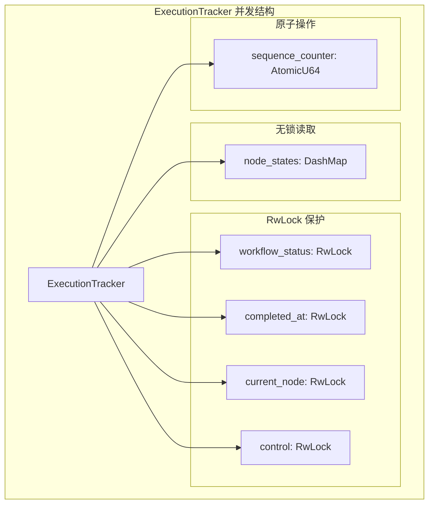

# State 模块设计文档

## 1. 核心定义 (Stable)

### 1.1 模块职责

`state` 模块是工作流执行的**单一状态源**，负责：

- 统一管理工作流执行状态，消除 DagScheduler 和 WorkflowExecution 之间的状态同步问题
- 提供检查点机制，支持故障恢复和状态持久化
- 提供控制信号（暂停/停止）的统一管理
- 提供执行统计信息的实时查询

### 1.2 模块结构

```
src/workflow/state/
├── mod.rs              # ExecutionTracker 核心实现
├── checkpoint.rs       # 检查点管理器
└── checkpoint_recovery.rs  # 增强检查点与恢复机制
```

### 1.3 核心类型

#### ExecutionTracker

执行状态追踪器，作为工作流执行的单一状态源。

| 字段 | 类型 | 说明 |
|------|------|------|
| `workflow_id` | `Uuid` | 工作流执行 ID |
| `workflow_name` | `String` | 工作流名称 |
| `node_states` | `Arc<DashMap<String, NodeExecutionState>>` | 节点执行状态（并发安全） |
| `workflow_status` | `Arc<RwLock<ExecutionStatus>>` | 工作流级别状态 |
| `started_at` | `DateTime<Utc>` | 执行开始时间 |
| `completed_at` | `Arc<RwLock<Option<DateTime<Utc>>>>` | 执行结束时间 |
| `current_node` | `Arc<RwLock<Option<String>>>` | 当前执行节点 |
| `control` | `Arc<RwLock<ControlSignals>>` | 控制信号 |

**核心方法分组：**

- **状态管理**: `status()`, `set_status()`, `mark_running()`, `mark_completed()`, `mark_failed()`, `mark_paused()`
- **节点状态**: `initialize_nodes()`, `mark_node_started()`, `mark_node_completed()`, `mark_node_failed()`, `mark_node_skipped()`, `increment_retry()`
- **状态查询**: `get_node_state()`, `get_all_node_states()`, `is_node_completed()`, `is_node_succeeded()`, `get_completed_nodes()`, `get_pending_nodes()`
- **控制信号**: `request_pause()`, `request_stop()`, `resume()`, `should_pause()`, `should_stop()`
- **统计信息**: `get_stats()`

#### ControlSignals

工作流执行控制信号。

| 字段 | 类型 | 说明 |
|------|------|------|
| `should_pause` | `bool` | 是否应暂停 |
| `should_stop` | `bool` | 是否应停止 |
| `pause_requested_at` | `Option<DateTime<Utc>>` | 暂停请求时间 |
| `stop_requested_at` | `Option<DateTime<Utc>>` | 停止请求时间 |

#### ExecutionStats

执行统计信息。

| 字段 | 类型 | 说明 |
|------|------|------|
| `total_nodes` | `usize` | 总节点数 |
| `completed_nodes` | `usize` | 已完成节点数 |
| `failed_nodes` | `usize` | 失败节点数 |
| `pending_nodes` | `usize` | 待执行节点数 |
| `running_nodes` | `usize` | 运行中节点数 |

**方法**: `completion_percentage()`, `is_complete()`, `has_failures()`

#### CheckpointManager (checkpoint.rs)

检查点管理器，负责创建和恢复执行检查点。

| 字段 | 类型 | 说明 |
|------|------|------|
| `state_manager` | `Arc<StateManager>` | 状态管理器 |
| `checkpoint_interval` | `Duration` | 检查点间隔 |
| `last_checkpoint` | `RwLock<Option<DateTime<Utc>>>` | 上次检查点时间 |
| `sequence_counter` | `AtomicU64` | 序列号计数器 |

#### EnhancedCheckpoint (checkpoint_recovery.rs)

增强的执行检查点，包含更多元数据用于恢复验证。

| 字段 | 类型 | 说明 |
|------|------|------|
| `id` | `String` | 检查点 ID |
| `workflow_id` | `Uuid` | 工作流执行 ID |
| `workflow_name` | `String` | 工作流名称 |
| `definition_hash` | `String` | 工作流定义哈希 |
| `created_at` | `DateTime<Utc>` | 创建时间 |
| `node_states` | `HashMap<String, NodeExecutionState>` | 节点状态 |
| `global_slots` | `HashMap<String, Value>` | 全局上下文槽 |
| `input_params` | `HashMap<String, Value>` | 输入参数 |
| `sequence` | `u64` | 序列号 |
| `checkpoint_type` | `CheckpointType` | 检查点类型 |
| `status` | `CheckpointStatus` | 检查点状态 |

#### CheckpointRecovery (checkpoint_recovery.rs)

检查点恢复器，提供验证和恢复功能。

| 字段 | 类型 | 说明 |
|------|------|------|
| `state_manager` | `Arc<StateManager>` | 状态管理器 |
| `config` | `RecoveryConfig` | 恢复配置 |
| `checkpoints` | `RwLock<HashMap<String, EnhancedCheckpoint>>` | 检查点缓存 |

#### RecoveryStrategy

恢复策略枚举：

```rust
/// 恢复策略
/// 
/// 版本: v1.0 | 最后更新: 2026-02-26
pub enum RecoveryStrategy {
    /// 从失败节点重新执行
    FromFailedNode,
    /// 从上一个成功检查点重新执行
    FromLastCheckpoint,
    /// 从指定节点重新执行
    FromSpecificNode(String),
    /// 完全重新开始
    Restart,
}
```

#### CheckpointType

检查点类型：

- `Scheduled` - 定时检查点
- `AfterNode` - 节点完成后检查点
- `OnError` - 错误时检查点
- `Manual` - 手动检查点
- `OnPause` - 暂停时检查点

#### CheckpointValidation

检查点验证结果：

- `Valid` - 验证通过
- `ValidWithWarnings(Vec<String>)` - 验证通过但有警告
- `Invalid(Vec<String>)` - 验证失败

### 1.4 依赖关系

```
state 模块依赖:
├── crate::core::ExecutionStatus
├── crate::error::{Result, WorkflowError}
├── crate::storage::StateManager
├── crate::workflow::context::DataContext
├── crate::workflow::execution::NodeExecutionState
├── crate::workflow::WorkflowDefinition
├── dashmap (并发 HashMap)
├── chrono (时间处理)
├── serde/serde_json (序列化)
└── uuid (ID 生成)
```

---

## 2. 待实现方案 (In Progress)

### 2.1 决策记录

| 决策 | 选择 | 原因 | 状态 |
|------|------|------|------|
| 状态存储 | `DashMap` | 高并发读写，无需全局锁 | 已实现 |
| 检查点存储 | StateManager Cache | 复用现有存储基础设施 | 已实现 |
| 恢复策略 | 可配置策略 | 支持多种恢复场景 | 已实现 |
| 定义一致性验证 | 哈希比对 | 确保检查点与当前定义匹配 | 已实现 |

### 2.2 任务清单

#### 高优先级

- [ ] 实现检查点持久化到数据库（当前仅内存缓存）
- [ ] 添加检查点压缩功能（大型工作流状态可能很大）
- [ ] 实现增量检查点（仅保存变更部分）

#### 中优先级

- [ ] 添加检查点版本迁移机制（工作流定义升级时）
- [ ] 实现分布式检查点存储（多实例场景）
- [ ] 添加检查点加密（敏感数据保护）

#### 低优先级

- [ ] 优化序列化性能（考虑 bincode 替代 JSON）
- [ ] 添加检查点导出/导入功能（跨环境迁移）
- [ ] 实现检查点自动清理策略（基于时间/数量）

### 2.3 已知问题

1. **检查点存储**: `save_checkpoint` 方法当前仅记录日志，未实际持久化
2. **序列化开销**: 大型工作流的检查点序列化可能成为性能瓶颈
3. **并发恢复**: 多实例同时恢复同一检查点可能导致状态冲突

---

## 3. 状态记录

### 3.1 变更历史

| 日期 | 变更内容 | 影响范围 |
|------|----------|----------|
| - | 初始实现：ExecutionTracker 核心功能 | mod.rs |
| - | 添加 CheckpointManager | checkpoint.rs |
| - | 添加 CheckpointRecovery 增强恢复机制 | checkpoint_recovery.rs |

### 3.2 测试覆盖

| 模块 | 测试状态 | 备注 |
|------|----------|------|
| ExecutionTracker | 基础测试 | 状态转换、节点管理 |
| CheckpointManager | 基础测试 | 检查点创建 |
| CheckpointRecovery | 完整测试 | 验证、恢复策略 |

### 3.3 性能指标

| 操作 | 预期性能 | 实测性能 |
|------|----------|----------|
| 节点状态更新 | < 1μs | 待测试 |
| 检查点创建 | < 10ms | 待测试 |
| 检查点恢复 | < 100ms | 待测试 |
| 状态查询 | < 1μs | 待测试 |

---

## 4. 扩展点

### 4.1 自定义恢复策略

可通过扩展 `RecoveryStrategy` 枚举添加新的恢复策略：

```rust
pub enum RecoveryStrategy {
    // 现有策略...
    FromFailedNode,
    FromLastCheckpoint,
    FromSpecificNode(String),
    Restart,
    
    // 自定义策略（扩展点）
    Custom(String),  // 自定义恢复逻辑标识
}
```

### 4.2 检查点钩子

可在检查点生命周期中添加钩子：

```rust
pub trait CheckpointHook {
    fn before_checkpoint(&self, checkpoint: &mut EnhancedCheckpoint);
    fn after_checkpoint(&self, checkpoint: &EnhancedCheckpoint);
    fn before_restore(&self, checkpoint: &EnhancedCheckpoint);
    fn after_restore(&self, context: &RecoveryContext);
}
```

### 4.3 状态观察者

支持外部监听状态变化：

```rust
pub trait StateObserver: Send + Sync {
    fn on_status_changed(&self, old: ExecutionStatus, new: ExecutionStatus);
    fn on_node_completed(&self, node_id: &str, state: &NodeExecutionState);
    fn on_checkpoint_created(&self, checkpoint: &EnhancedCheckpoint);
}
```

---

## 5. 并发模型

### 5.1 并发设计原则

状态管理模块采用以下并发设计原则：

1. **无锁读取**: 使用 `DashMap` 实现高并发读取
2. **细粒度锁**: 不同数据使用独立的锁，减少竞争
3. **原子操作**: 状态转换使用原子操作保证一致性
4. **读写分离**: 读操作不阻塞写操作

### 5.2 数据结构并发特性



### 5.3 并发访问模式

| 操作类型 | 数据结构 | 锁类型 | 说明 |
|----------|----------|--------|------|
| 节点状态读取 | `DashMap` | 无锁 | 支持高并发读取 |
| 节点状态写入 | `DashMap` | 分段锁 | 仅锁定相关分片 |
| 工作流状态读取 | `RwLock` | 读锁 | 多读者并发 |
| 工作流状态写入 | `RwLock` | 写锁 | 独占写入 |
| 序列号递增 | `AtomicU64` | 原子 | 无锁 CAS 操作 |
| 控制信号读取 | `RwLock` | 读锁 | 高频读取 |
| 控制信号写入 | `RwLock` | 写锁 | 低频写入 |

### 5.4 线程安全保证

```rust
impl ExecutionTracker {
    /// 线程安全的状态转换
    pub fn transition_status(&self, new_status: ExecutionStatus) -> Result<()> {
        let mut status = self.workflow_status.write().unwrap();
        
        // 验证状态转换合法性
        match (&*status, &new_status) {
            (ExecutionStatus::Pending, ExecutionStatus::Running) => {}
            (ExecutionStatus::Running, ExecutionStatus::Paused) => {}
            (ExecutionStatus::Running, ExecutionStatus::Completed) => {}
            (ExecutionStatus::Running, ExecutionStatus::Failed) => {}
            (ExecutionStatus::Paused, ExecutionStatus::Running) => {}
            _ => return Err(WorkflowError::invalid_status_transition(
                format!("{:?} -> {:?}", *status, new_status)
            )),
        }
        
        *status = new_status;
        Ok(())
    }
    
    /// 并发安全的节点状态更新
    pub fn mark_node_completed(&self, node_id: &str, output: Value) -> Result<()> {
        // DashMap 自动处理并发
        self.node_states.entry(node_id.to_string()).and_modify(|state| {
            state.status = NodeExecutionStatus::Completed;
            state.output = Some(output.clone());
            state.completed_at = Some(Utc::now());
        });
        Ok(())
    }
}
```

### 5.5 死锁预防

#### 锁获取顺序

为避免死锁，所有代码必须按以下顺序获取锁：

1. `workflow_status` (RwLock)
2. `node_states` (DashMap)
3. `control` (RwLock)
4. `completed_at` (RwLock)
5. `current_node` (RwLock)

```rust
// ✅ 正确：按顺序获取锁
fn correct_lock_order(&self) {
    let status = self.workflow_status.read().unwrap();
    let node = self.node_states.get("node1");
    let control = self.control.read().unwrap();
    // ...
}

// ❌ 错误：反向获取锁可能导致死锁
fn incorrect_lock_order(&self) {
    let control = self.control.read().unwrap();
    let status = self.workflow_status.read().unwrap(); // 危险！
    // ...
}
```

#### 超时机制

```rust
use std::sync::RwLock;
use std::time::Duration;

impl ExecutionTracker {
    /// 带超时的状态读取
    pub fn try_get_status(&self, timeout: Duration) -> Option<ExecutionStatus> {
        // 使用 try_read 避免无限等待
        match self.workflow_status.try_read() {
            Ok(guard) => Some(*guard),
            Err(std::sync::TryLockError::WouldBlock) => {
                // 等待一段时间后重试
                std::thread::sleep(Duration::from_millis(10));
                self.workflow_status.try_read().ok().map(|g| *g)
            }
            Err(_) => None,
        }
    }
}
```

### 5.6 并发性能特性

| 场景 | 预期性能 | 说明 |
|------|----------|------|
| 单线程读取 | < 1μs | 无锁 DashMap 读取 |
| 并发读取 (16线程) | < 2μs | DashMap 分片并行 |
| 单线程写入 | < 5μs | DashMap 分段锁 |
| 并发写入 (16线程) | < 20μs | 分片减少竞争 |
| 状态转换 | < 10μs | RwLock 写锁 |

### 5.7 并发测试策略

```rust
#[cfg(test)]
mod concurrency_tests {
    use super::*;
    use std::sync::Arc;
    use std::thread;
    
    #[test]
    fn test_concurrent_node_updates() {
        let tracker = Arc::new(ExecutionTracker::new(
            Uuid::new_v4(),
            "test-workflow".to_string(),
        ));
        
        tracker.initialize_nodes(&["node1", "node2", "node3"]);
        
        let mut handles = vec![];
        
        // 并发更新不同节点
        for node_id in ["node1", "node2", "node3"] {
            let tracker_clone = tracker.clone();
            let node = node_id.to_string();
            handles.push(thread::spawn(move || {
                tracker_clone.mark_node_started(&node).unwrap();
                tracker_clone.mark_node_completed(&node, json!({"result": "ok"})).unwrap();
            }));
        }
        
        for handle in handles {
            handle.join().unwrap();
        }
        
        // 验证所有节点都正确更新
        assert!(tracker.is_node_completed("node1"));
        assert!(tracker.is_node_completed("node2"));
        assert!(tracker.is_node_completed("node3"));
    }
    
    #[test]
    fn test_concurrent_status_transitions() {
        let tracker = Arc::new(ExecutionTracker::new(
            Uuid::new_v4(),
            "test-workflow".to_string(),
        ));
        
        let tracker_clone = tracker.clone();
        
        // 线程1：尝试暂停
        let h1 = thread::spawn(move || {
            tracker_clone.request_pause();
        });
        
        // 线程2：检查状态
        let tracker_clone2 = tracker.clone();
        let h2 = thread::spawn(move || {
            let should_pause = tracker_clone2.should_pause();
            should_pause
        });
        
        h1.join().unwrap();
        let result = h2.join().unwrap();
        
        assert!(tracker.should_pause());
    }
}
```
