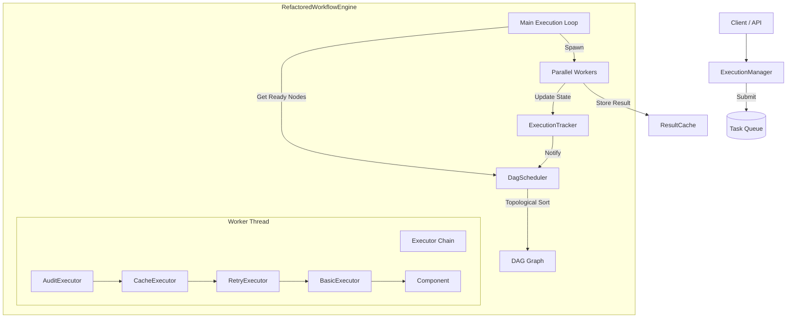

# Workflow Engine Design (v2)

## 版本变更记录

| 版本 | 日期 | 作者 | 变更内容 |
|------|------|------|----------|
| v2.0 | 2026-01-16 | Trae AI | 重构为LiteFlow架构，引入并行执行、责任链模式和细粒度状态管理 |

## 1. 架构概览

新版工作流引擎（`RefactoredWorkflowEngine`）采用了 **LiteFlow** 设计原则，旨在提供一个模块化、高性能且真正的并行执行环境。

### 1.1 核心设计理念

*   **真正的并行 (True Parallelism)**: 利用 Rust 的异步运行时 (`tokio`) 和多线程能力，同时执行无依赖的节点，而非简单的并发调度。
*   **责任链模式 (Chain of Responsibility)**: 将核心业务逻辑与横切关注点（如重试、缓存、审计）分离，通过 Executor Chain 组合。
*   **单一事实来源 (Single Source of Truth)**: 使用统一的 `ExecutionTracker` 管理所有状态，确保线程安全和数据一致性。
*   **组件化 (Component-based)**: 所有执行单元封装为 `Component`，便于扩展和测试。

### 1.2 系统架构图



## 2. 核心模块详解

### 2.1 RefactoredWorkflowEngine (`src/workflow/engine_v2.rs`)

引擎的核心是一个基于事件循环的调度器。

*   **职责**: 
    *   初始化工作流上下文。
    *   驱动主循环：`check_ready` -> `execute_parallel` -> `update_state`。
    *   管理生命周期（Start, Pause, Resume, Stop）。
*   **并行机制**: 使用 `futures::future::join_all` 并发等待多个 `tokio::spawn` 任务的完成。

### 2.2 DagScheduler (`src/workflow/scheduler.rs`)

基于 `petgraph` 的 DAG 调度器。

*   **职责**:
    *   **构建图**: 将 `WorkflowDefinition` 转换为内存中的有向图。
    *   **拓扑排序**: 检测循环依赖并确定静态执行顺序。
    *   **动态就绪检测**: 维护 `ready_nodes` 队列。当节点完成时，检查其后继节点的依赖是否全部满足。
    *   **关键路径计算**: 识别影响总执行时间的关键路径（Critical Path）。

### 2.3 ExecutionManager (`src/workflow/execution_manager.rs`)

面向外部的高层管理器。

*   **职责**:
    *   **任务队列**: 管理异步执行请求。
    *   **资源控制**: 使用 `Semaphore` 限制全局并发工作流数量。
    *   **同步/异步桥接**: 提供 `execute_async` 和 `execute_sync` 接口。

### 2.4 Executor Chain (`src/workflow/executor/`)

执行逻辑被拆分为多个中间件式的执行器：

1.  **AuditExecutor**: 记录节点开始和结束的审计日志。
2.  **CacheExecutor**: 
    *   计算 `CacheKey` (WorkflowID + NodeID + InputHash)。
    *   查询缓存，命中则跳过后续执行。
    *   执行后将结果写入缓存。
3.  **RetryExecutor**: 
    *   捕获执行错误。
    *   根据 `RetryPolicy` (次数, 间隔, 策略) 进行重试。
4.  **BasicExecutor**: 最终调用具体的 `Component`。

### 2.5 ExecutionTracker (`src/workflow/state/mod.rs`)

状态管理中心。

*   **数据结构**: 使用 `DashMap` 存储节点状态 (`NodeState`)，支持高并发读写。
*   **状态流转**: `Pending` -> `Running` -> `Completed` / `Failed` / `Skipped`。
*   **通知机制**: 状态变更通过 `tokio::sync::notify` 通知调度器。

## 3. 关键算法与逻辑

### 3.1 依赖解析与阻塞传播

当一个节点执行失败且耗尽重试次数时：
1.  该节点标记为 `Failed`。
2.  调度器遍历该节点的所有后继节点。
3.  后继节点被标记为 `Blocked`（而非 Failed）。
4.  阻塞状态级联传播至整个下游分支。

这种机制防止了无效的执行，同时保留了错误上下文。

### 3.2 缓存键生成算法

```rust
CacheKey = Hash(
    WorkflowName,
    WorkflowVersion,
    NodeID,
    InputParams,  // JSON value
    ContextVariables // 相关的全局变量
)
```
通过包含上下文变量，确保了在不同环境下执行的一致性。

### 3.3 并行执行控制

```rust
// 伪代码逻辑
while let nodes = scheduler.get_ready_nodes().await {
    if nodes.is_empty() {
        if scheduler.all_done() { break; }
        wait_for_change().await;
        continue;
    }
    
    let futures = nodes.map(|node| {
        tokio::spawn(async move {
            executor_chain.execute(node).await
        })
    });
    
    join_all(futures).await;
}
```

## 4. 配置参数说明

配置主要通过 `WorkflowConfig` 和节点级配置定义。

### 4.1 全局配置 (`config.toml`)

```toml
[workflow]
# 最大并发执行的工作流数量
max_concurrent_workflows = 10

# 异步任务队列大小
task_queue_size = 100

# 默认节点执行超时 (秒)
default_timeout = 3600

[workflow.cache]
# 是否启用结果缓存
enabled = true
# 默认TTL (秒)
default_ttl = 86400
```

### 4.2 节点配置 (YAML)

```yaml
nodes:
  - id: step1
    tool: my_tool
    # 重试策略
    retry:
      max_attempts: 3
      delay_ms: 1000
      strategy: "exponential" # exponential | linear | fixed
    # 超时设置
    timeout: 30s
    # 缓存控制
    cache:
      enabled: true
      ttl: 1h
```

## 5. 接口定义

### 5.1 Component Trait

所有执行单元必须实现的接口：

```rust
#[async_trait]
pub trait Component: Send + Sync {
    /// 执行组件逻辑
    async fn execute(
        &self, 
        ctx: &mut DataContext, 
    ) -> Result<ComponentOutput>;
}
```

### 5.2 Executor Trait

执行链节点的接口：

```rust
#[async_trait]
pub trait Executor: Send + Sync {
    /// Execute a component through this executor.
    async fn execute(
        &self,
        component: &dyn Component,
        context: &mut DataContext,
        execution_ctx: &ExecutionContext,
    ) -> Result<ComponentOutput>;
}
```

## 6. 适用场景与限制

### 适用场景
*   **ETL 数据管道**: 复杂的依赖关系和数据转换。
*   **AI Agent 编排**: 多步骤的 LLM 调用、工具使用和决策流程。
*   **自动化运维**: 并行执行多个服务器的任务。

### 限制条件
*   **单机并发**: 目前设计为单机多线程执行，不支持跨节点分布式调度（需配合 Kubernetes 等外部调度器）。
*   **状态持久化**: 虽然支持 Checkpoint，但严重崩溃（如断电）后的恢复依赖于持久化存储后端的可靠性。
