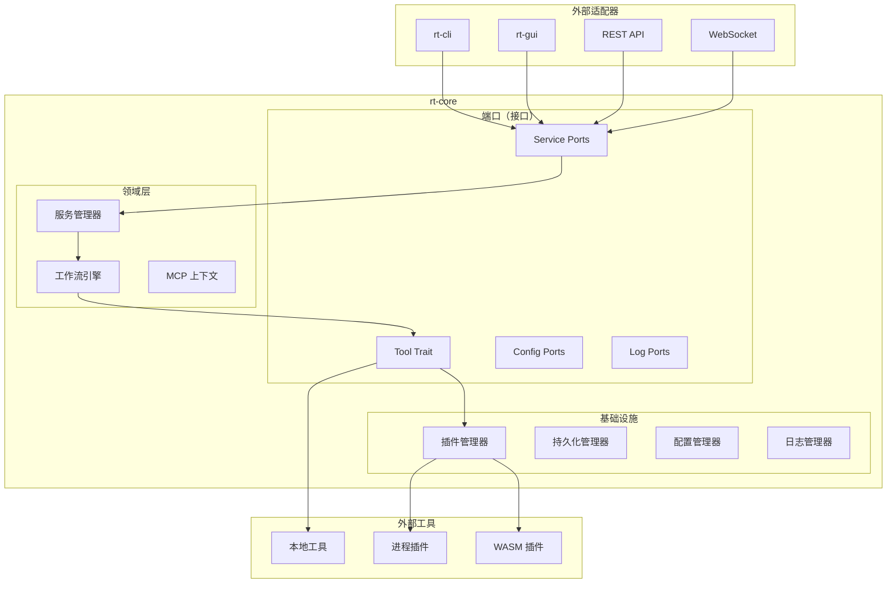

# rt-core 核心库

## 1. 目标 (Goal)
- **核心功能**：rt-core 是 Rust Toolbox 的基础库，定义了所有工具和工作流必须遵循的核心接口（Traits）和通用数据结构。它提供了架构"骨架"和核心功能支持，但不包含具体的业务逻辑工具（这些位于 `rt-tools` 中）。
- **非目标**：不包含具体的业务逻辑工具，不处理命令行或 GUI 实现。

## 2. 核心定义 (Definitions)
- **Tool**：工具的核心抽象，定义了工具的基本行为和接口。
- **Locale**：语言环境枚举，支持多语言设置。
- **WorkflowDefinition**：工作流定义，包含节点、边和执行规则。
- **McpContext**：MCP 上下文，包含执行状态和历史记录。
- **McpRequest**：MCP 请求，定义标准化的工具调用格式。
- **McpResponse**：MCP 响应，定义标准化的执行结果格式。
- **CoreError**：统一的错误类型，用于系统间一致的错误处理。
- **ServiceRequest**：服务请求，包含服务名称、方法和参数。
- **ServiceResponse**：服务响应，包含执行结果和状态。
- **PluginMetadata**：插件元数据，包含插件的基本信息和多语言支持。

## 3. 算法与逻辑设计 (Algorithm & Logic)

### 核心架构

rt-core 模块遵循六边形架构模式，关注点清晰分离：



### 核心流程

#### 工具执行流程
1. **工具发现**：通过插件管理器加载所有可用工具。
2. **请求处理**：接收工具调用请求，验证参数和权限。
3. **上下文管理**：创建或更新 MCP 上下文。
4. **工具执行**：调用工具的 `run` 或 `run_with_context` 方法。
5. **结果处理**：处理工具执行结果，更新上下文。
6. **响应返回**：返回标准化的响应格式。

#### 插件加载流程
1. **插件发现**：扫描指定目录中以 `rt-plugin-` 为前缀的文件。
2. **插件加载**：加载插件并解析其元数据。
3. **工具注册**：将插件提供的工具注册到工具注册表中。
4. **MCP 支持检查**：检查工具是否支持 MCP 协议。
5. **服务注册**：将工具注册为服务，支持通过服务层调用。

## 4. 接口与边界 (Interface & Boundary)

### 4.1 Tool 特性
```rust
#[async_trait]
pub trait Tool: Send + Sync {
    /// 工具名称 (唯一标识符)
    fn name(&self) -> &str;

    /// 显示名称 (多语言支持)
    fn display_name(&self, _locale: Locale) -> String {
        self.name().to_string()
    }
    
    /// 工具描述 (用于 UI 展示)
    fn description(&self, locale: Locale) -> String;
    
    /// 用户指南 (Markdown 格式)
    fn user_guide(&self, locale: Locale) -> String;

    /// 输入参数 schema (JSON Schema)
    fn input_schema(&self, locale: Locale) -> Value;

    /// 输出结果 schema (JSON Schema)
    fn output_schema(&self, _locale: Locale) -> Value {
        serde_json::json!({ "type": "object" })
    }

    /// 执行逻辑
    async fn run(&self, input: Value) -> Result<Value>;
    
    /// 是否支持 MCP
    fn mcp_supported(&self) -> bool {
        false
    }
    
    /// 使用 MCP 上下文执行工具
    async fn run_with_context(&self, request: McpRequest) -> Result<McpResponse>;
}
```

### 4.2 ServiceManager 接口
```rust
impl ServiceManager {
    /// 注册服务实例
    pub async fn register_service(&self, service: Arc<dyn ServicePort>);
    
    /// 调用服务方法，带权限检查
    pub async fn call_service(&self, request: ServiceRequest) -> Result<ServiceResponse>;
    
    /// 列出所有注册的服务
    pub async fn list_services(&self) -> Vec<String>;
}
```

### 4.3 PluginManager 接口
```rust
impl PluginManager {
    pub async fn load_all(&self) -> Result<()>;
    pub async fn get_tool(&self, name: &str) -> Option<Arc<dyn Tool>>;
    pub async fn list_tools(&self) -> Vec<Arc<dyn Tool>>;
    pub async fn list_mcp_tools(&self) -> Vec<Arc<dyn Tool>>;
    pub async fn get_mcp_tool(&self, name: &str) -> Option<Arc<dyn Tool>>;
}
```

## 5. 变更记录 (Status)
- `[已完成]`：更新文档结构，统一命名规范，添加变更记录 | 2025-12-21
- `[已完成]`：初始设计文档创建 | 2025-12-20

## 附加信息

### 核心职责
- **工具接口定义**：定义所有具体工具必须实现的 `Tool` trait，支持同步和 MCP 上下文执行
- **多语言支持**：定义用于多语言区域设置的 `Locale` 枚举
- **工作流管理**：定义工作流相关结构，用于管理工具执行顺序和上下文传递
- **模型上下文协议 (MCP) 支持**：提供上下文管理、请求/响应处理和标准化工具调用协议
- **错误处理**：定义统一的 `CoreError` 类型，用于系统间一致的错误处理
- **插件系统**：实现外部插件加载和管理，支持基于进程和 WebAssembly 的插件
- **服务层**：提供统一的服务管理层，带有权限控制和标准化服务接口
- **配置管理**：实现基于六边形架构的配置系统，带有多个适配器
- **日志系统**：提供结构化日志，带有可配置的格式化程序和输出目标
- **持久化层**：统一的数据存储、缓存和文件操作（详细见 `PERSISTENCE_DESIGN.md`）
- **工作流引擎**：工作流编排和执行引擎（详细见 `WORKFLOW_DESIGN.md`）
- **MCP 服务器**：提供 REST API 和 WebSocket 端点，用于外部工具调用

### 依赖关系

#### 核心依赖
- `async-trait`：支持异步 trait 方法
- `serde`：带有 derive 宏的序列化/反序列化
- `serde_json`：JSON 数据交换
- `serde_yaml`：YAML 配置文件解析
- `thiserror`：结构化错误定义
- `anyhow`：通用错误处理
- `tokio`：异步运行时，带有特性：`process`, `io-util`, `fs`, `sync`, `time`, `net`

#### 日志和监控
- `tracing`：结构化日志和仪表化
- `chrono`：带有 serde 支持的日期/时间处理
- `uuid`：唯一标识符生成

#### Web 和网络
- `warp`：用于 MCP 服务器的 Web 服务器框架
- `futures-util`：异步流处理
- `tokio-tungstenite`：WebSocket 支持

#### 存储和缓存
- `moka`：带有异步支持的内存缓存
- `sled`：用于持久化的嵌入式键值数据库
- `bincode`：用于存储的二进制序列化
- `zstd + async-compression`：数据压缩

#### 插件系统
- `wasmtime`：用于 WASM 插件的 WebAssembly 运行时
- `wasmtime-wasi`：WASM 插件的 WASI 支持

#### 工具库
- `regex`：模式匹配
- `sha2 + hex`：密码哈希
- `tempfile`：临时文件/目录管理

### 接口稳定性
该模块的接口变更将影响所有下游 crate（`rt-tools`、`rt-cli`、`rt-gui`），需要小心修改。所有公共接口遵循语义版本控制原则。

### 扩展指南

#### 添加新工具
1. 实现 `Tool` trait
2. 可选地实现 `McpTool` trait 以支持 MCP
3. 在工具库中注册工具

#### 创建插件
1. 实现 `Tool` trait
2. 使用 `PluginMetadata` 定义插件元数据
3. 构建遵循 `rt-plugin-*` 命名模式的可执行文件
4. 将插件放置在指定目录中

#### 添加新服务
1. 实现 `ServicePort` trait
2. 使用 `ServiceManager` 注册服务
3. 定义适当的权限要求

#### 扩展 MCP 功能
1. 修改 `McpContext` 添加新的上下文字段
2. 更新 `McpRequest` 和 `McpResponse` 以支持新字段
3. 扩展 `ContextManager` 以支持新的上下文操作

### 性能和安全考虑

#### 性能
- 使用异步编程模型提高并发处理能力
- 使用 Arc 共享上下文以减少复制
- 使用异步 IO 加载插件，提高启动速度
- 工作流执行支持并行处理
- 服务层使用高效路由和缓存

#### 安全
- 插件执行使用沙盒机制（WASM 插件）
- 外部命令执行使用安全参数传递
- 输入/输出 schema 验证防止恶意输入
- MCP 上下文隔离防止上下文泄漏
- 服务层实现基于权限的访问控制

### 测试策略

#### 单元测试
- 核心组件单元测试
- 各种 Tool 接口实现测试
- MCP 上下文管理测试
- 插件加载和管理测试
- 服务层功能测试

#### 集成测试
- 完整工作流引擎执行测试
- MCP 服务器 API 端点测试
- 插件与核心系统集成测试
- 服务集成测试

#### 性能测试
- 大规模工具和插件加载性能测试
- 工作流执行性能测试
- MCP 服务器并发处理能力测试

### 版本控制和发布

- 遵循语义版本控制（SemVer）
- 每个版本包含详细的 CHANGELOG
- 发布前运行完整测试套件
- 向后兼容原则，主要版本变更除外

### 未来路线图

- 支持更多 MCP 标准功能
- 增强的工作流可视化支持
- 更多插件类型支持
- 增强的安全性和沙盒机制
- 分布式工作流执行支持
- 额外的监控和日志功能
- 性能优化和可扩展性改进
- 增强的错误处理和恢复机制

### 贡献指南

#### 代码风格
- 遵循官方 Rust 代码风格
- 使用 `cargo fmt` 进行代码格式化
- 使用 `cargo clippy` 进行代码质量检查

#### 文档要求
- 所有公共接口必须有文档注释
- 添加适当的示例代码
- 更新相关设计文档

#### 测试要求
- 新功能必须添加单元测试
- Bug 修复必须添加回归测试
- 测试覆盖率目标：80%+

### 许可证

本项目采用 GNU AGPL v3 许可证。