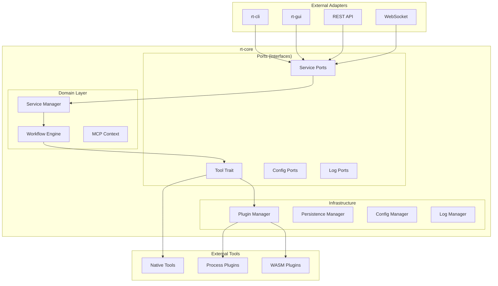

# rt-core Design Document

## 1. Module Overview
`rt-core` is the foundational library of the Rust Toolbox, defining the core interfaces (Traits) and common data structures that all tools and workflows must follow. It provides the architectural "skeleton" and core functionality support without containing specific business logic tools (which are in `rt-tools`).

## 2. Core Responsibilities
- **Tool Interface Definition**: Define the `Tool` trait that all concrete tools must implement, supporting both synchronous and MCP context execution
- **Locale Support**: Define the `Locale` enum for multi-language region settings
- **Workflow Management**: Define workflow-related structures for managing tool execution order and context passing
- **Model Context Protocol (MCP) Support**: Provide context management, request/response handling, and standardized tool calling protocol
- **Error Handling**: Define unified `CoreError` type for consistent error handling across the system
- **Plugin System**: Implement external plugin loading and management with support for both process-based and WebAssembly plugins
- **Service Layer**: Provide a unified service management layer with permission control and standardized service interfaces
- **Configuration Management**: Implement hexagonal architecture-based configuration system with multiple adapters
- **Logging System**: Provide structured logging with configurable formatters and sinks
- **Persistence Layer**: Unified data storage, caching, and file operations (detailed in `PERSISTENCE_DESIGN.md`)
- **Workflow Engine**: Workflow orchestration and execution engine (detailed in `WORKFLOW_DESIGN.md`)
- **MCP Server**: Provide REST API and WebSocket endpoints for external tool invocation

## 3. Architecture Overview

The rt-core module follows a hexagonal architecture pattern with clear separation of concerns:



## 4. Core Components

### 4.1 Locale Support (`locale.rs`)
Defines supported language regions with serialization support:

```rust
use serde::{Deserialize, Serialize};
use std::fmt;

#[derive(Debug, Clone, Copy, PartialEq, Eq, Hash, Serialize, Deserialize)]
pub enum Locale {
    #[serde(rename = "en")]
    En,
    #[serde(rename = "zh-CN")]
    Zh,
}

impl fmt::Display for Locale {
    fn fmt(&self, f: &mut fmt::Formatter<'_>) -> fmt::Result {
        match self {
            Locale::En => write!(f, "en"),
            Locale::Zh => write!(f, "zh-CN"),
        }
    }
}

impl Default for Locale {
    fn default() -> Self {
        Locale::En
    }
}
```

### 4.2 Tool Interface (`tool.rs`)
The core interface that all tools must implement, with MCP context support:

```rust
use async_trait::async_trait;
use serde_json::Value;
use crate::error::Result;
use crate::locale::Locale;
use crate::mcp::{McpRequest, McpResponse};

#[async_trait]
pub trait Tool: Send + Sync {
    /// Tool name (unique identifier)
    fn name(&self) -> &str;

    /// Display name (multi-language support)
    fn display_name(&self, _locale: Locale) -> String {
        self.name().to_string()
    }
    
    /// Tool description (for UI display)
    fn description(&self, locale: Locale) -> String;
    
    /// User guide (Markdown format)
    fn user_guide(&self, locale: Locale) -> String;

    /// Input parameter schema (JSON Schema)
    fn input_schema(&self, locale: Locale) -> Value;

    /// Output result schema (JSON Schema)
    fn output_schema(&self, _locale: Locale) -> Value {
        serde_json::json!({ "type": "object" })
    }

    /// Execution logic
    async fn run(&self, input: Value) -> Result<Value>;
    
    /// Whether MCP is supported
    fn mcp_supported(&self) -> bool {
        false
    }
    
    /// Execute tool with MCP context
    async fn run_with_context(&self, request: McpRequest) -> Result<McpResponse>;
}

/// MCP Tool trait, extends Tool trait with MCP-specific functionality
#[async_trait]
pub trait McpTool: Tool {
    /// Get MCP capability description
    fn get_mcp_capabilities(&self) -> Value;
    
    /// Get MCP context validation rules
    fn get_context_validation_rules(&self) -> Value;
    
    /// Whether full context is required
    fn requires_full_context(&self) -> bool;
    
    /// Execute with MCP context
    async fn run_with_context(&self, request: McpRequest) -> Result<McpResponse>;
}
```

### 4.3 Service Layer Architecture

#### 4.3.1 Service Manager (`service/manager.rs`)
The service manager provides a unified entry point for all service calls with permission control:

```rust
pub struct ServiceManager {
    /// Service registry storing all registered service instances
    services: RwLock<HashMap<String, Arc<dyn ServicePort>>>,
    
    /// Default permission policy
    default_permission_policy: PermissionPolicy,
}

impl ServiceManager {
    /// Register service instance
    pub async fn register_service(&self, service: Arc<dyn ServicePort>);
    
    /// Call service method with permission checking
    pub async fn call_service(&self, request: ServiceRequest) -> Result<ServiceResponse>;
    
    /// List all registered services
    pub async fn list_services(&self) -> Vec<String>;
}
```

#### 4.3.2 Service Ports (`service/port.rs`)
Standardized service interfaces with context and permission support:

```rust
/// Service calling context with caller information and permission levels
#[derive(Debug, Serialize, Deserialize)]
pub struct ServiceContext {
    pub caller_id: String,
    pub caller_type: CallerType,
    pub permission_level: PermissionLevel,
    pub extra: Value,
}

/// Caller types
#[derive(Debug, Serialize, Deserialize, Clone, Copy, PartialEq, Eq, Hash)]
pub enum CallerType {
    System,     // System components
    CoreTool,   // Core tools
    Plugin,     // External plugins
    User,       // Direct user calls
}

/// Permission levels
#[derive(Debug, Serialize, Deserialize, Clone, Copy, PartialEq, Eq, PartialOrd, Ord, Hash)]
pub enum PermissionLevel {
    ReadOnly,   // Read-only access
    Standard,   // Standard permissions
    Admin,      // Administrator permissions
}

/// Service port trait defining standard service call interface
#[async_trait]
pub trait ServicePort: Send + Sync {
    fn name(&self) -> &str;
    async fn call(&self, method: &str, params: &Value, context: &ServiceContext) -> Result<ServiceResponse>;
}
```

### 4.4 Configuration Management (`config/`)

The configuration system follows hexagonal architecture with multiple adapters:

#### 4.4.1 Domain Layer (`config/domain.rs`)
- `ConfigItem`: Represents configuration items with metadata
- `ConfigSource`: Enumeration of configuration sources (file, environment, cache)

#### 4.4.2 Port Layer (`config/port.rs`)
- `ConfigManagerPort`: Main configuration management interface
- `ConfigSourcePort`: Configuration source interface
- `ConfigCachePort`: Configuration caching interface
- `ConfigRepositoryPort`: Configuration persistence interface

#### 4.4.3 Service Layer (`config/service.rs`)
- `ConfigService`: Business logic for configuration operations
- `ConfigManager`: Orchestrates configuration operations across adapters

#### 4.4.4 Adapter Layer (`config/adapter/`)
- `FileAdapter`: File-based configuration storage
- `EnvAdapter`: Environment variable configuration source
- `CacheAdapter`: In-memory configuration caching

### 4.5 Logging System (`logger/`)

Structured logging system with configurable output:

#### 4.5.1 Domain Layer (`logger/domain.rs`)
- `LogLevel`: Log level enumeration (Debug, Info, Warn, Error)
- `LogRecord`: Individual log record structure
- `LogEntry`: Complete log entry with metadata

#### 4.5.2 Port Layer (`logger/port.rs`)
- `LogManagerPort`: Main logging management interface
- `LogWriterPort`: Log writing interface
- `LogSinkPort`: Log output destination interface
- `LogFormatterPort`: Log formatting interface

#### 4.5.3 Service Layer (`logger/service.rs`)
- `LogService`: Business logic for logging operations
- `LogManager`: Orchestrates logging across components
- `LogWriter`: Handles log writing operations

#### 4.5.4 Adapter Layer (`logger/adapter/`)
- `FormatterAdapter`: Log message formatting
- `SinkAdapter`: Log output destinations (console, file, etc.)

### 4.6 Model Context Protocol (MCP) Support (`mcp/`)

#### 4.6.1 MCP Context (`mcp/context.rs`)
MCP context containing execution state and history:

```rust
#[derive(Debug, Clone, Serialize, Deserialize)]
pub struct McpContext {
    pub id: String,                 // Context unique identifier
    pub parent_id: Option<String>,  // Parent context ID
    pub model_state: ModelState,    // Model state
    pub execution_history: Vec<ExecutionRecord>, // Execution history
    pub environment_info: EnvironmentInfo, // Environment information
    pub metadata: Value,            // Metadata
}
```

#### 4.6.2 MCP Request and Response (`mcp/request.rs`, `mcp/response.rs`)
Standardized MCP request and response formats:

```rust
#[derive(Debug, Clone, Serialize, Deserialize)]
pub struct McpRequest {
    pub id: String,                  // Request unique identifier
    pub component_type: ComponentType, // Component type (Tool/Plugin/Workflow)
    pub component_name: String,      // Component name
    pub method: String,              // Call method
    pub params: Value,               // Parameters
    pub context: McpContext,         // Request context
    pub service_context: McpServiceContext, // Service context
}

#[derive(Debug, Clone, Serialize, Deserialize)]
pub struct McpResponse {
    pub id: String,                  // Response unique identifier
    pub request_id: String,          // Associated request ID
    pub status: ResponseStatus,      // Response status
    pub data: Option<Value>,         // Response data
    pub error: Option<McpError>,     // Error information
    pub context: McpContext,         // Response context
    pub duration_ms: Option<u64>,    // Execution duration
}
```

#### 4.6.3 Context Manager (`mcp/manager.rs`)
Manages MCP context creation, updates, and propagation:

```rust
pub struct ContextManager {
    contexts: RwLock<HashMap<String, McpContext>>, // Context storage
}

impl ContextManager {
    pub async fn create_context(&self) -> McpContext;
    pub async fn create_child_context(&self, parent_id: &str) -> Result<McpContext>;
    pub async fn get_context(&self, context_id: &str) -> Result<McpContext>;
    pub async fn update_context(&self, context: McpContext) -> Result<()>;
    pub async fn delete_context(&self, context_id: &str) -> Result<()>;
}
```

### 4.7 Plugin System (`plugin/`)

#### 4.7.1 Plugin Metadata (`plugin/manifest.rs`)
Plugin metadata with MCP support and multi-tool capabilities:

```rust
#[derive(Debug, Clone, Deserialize, Serialize, Default)]
pub struct PluginMetadata {
    pub name: String,                      // Plugin name
    pub display_name: LocalizedString,     // Display name
    pub description: LocalizedString,      // Description
    pub user_guide: LocalizedString,       // User guide
    pub input_schema: Value,               // Input schema
    pub output_schema: Option<Value>,      // Output schema
    pub input_fields: Option<HashMap<String, LocalizedString>>, // Input fields
    pub output_fields: Option<HashMap<String, LocalizedString>>, // Output fields
    pub version: Option<String>,           // Version
    pub author: Option<String>,            // Author
    pub mcp_supported: bool,               // MCP support
    pub mcp_capabilities: Value,           // MCP capabilities
    pub requires_full_context: bool,       // Full context requirement
    pub context_validation_rules: Value,   // Context validation rules
}

#[derive(Debug, Clone, Deserialize, Serialize, Default)]
pub struct LocalizedString {
    pub en: String,
    #[serde(alias = "zh-CN")]
    pub zh: Option<String>,
}
```

#### 4.7.2 Plugin Manager (`plugin/mod.rs`)
Manages plugin loading and access with multi-tool support:

```rust
pub struct PluginManager {
    plugin_dir: PathBuf,                  // Plugin directory
    plugins: RwLock<HashMap<String, Arc<dyn Tool>>>, // Loaded plugins
}

impl PluginManager {
    pub async fn load_all(&self) -> Result<()>;
    pub async fn get_tool(&self, name: &str) -> Option<Arc<dyn Tool>>;
    pub async fn list_tools(&self) -> Vec<Arc<dyn Tool>>;
    pub async fn list_mcp_tools(&self) -> Vec<Arc<dyn Tool>>;
    pub async fn get_mcp_tool(&self, name: &str) -> Option<Arc<dyn Tool>>;
}
```

#### 4.7.3 Multi-Tool Plugin Support
The plugin system supports single plugins providing multiple tools:

- **Single Tool Plugin**: Returns single JSON object from `spec` command
- **Multi-Tool Plugin**: Returns JSON array of tool metadata objects
- **Tool Discovery**: Plugins are scanned for `rt-plugin-*` prefix
- **Tool Registration**: Each tool from multi-tool plugins is registered separately

### 4.8 Workflow Integration (`workflow.rs`)

#### 4.8.1 Workflow Structures
Core workflow data structures for tool orchestration:

```rust
#[derive(Debug, Clone, Serialize, Deserialize)]
pub struct WorkflowNode {
    pub id: String,                         // Node ID
    pub tool_name: String,                  // Tool name
    pub label: Option<String>,              // Node label
    pub input_mappings: HashMap<String, String>, // Input mappings
    pub static_inputs: Value,               // Static inputs
}

#[derive(Debug, Clone, Serialize, Deserialize)]
pub struct WorkflowDefinition {
    pub id: String,                         // Workflow ID
    pub name: String,                       // Workflow name
    pub description: String,                // Workflow description
    pub nodes: Vec<WorkflowNode>,           // Node list
    pub edges: Vec<WorkflowEdge>,           // Edge list
}
```

#### 4.8.2 MCP Workflow Extensions (`mcp/node.rs`, `mcp/workflow.rs`)
Extended workflow structures with MCP context support:

```rust
#[derive(Debug, Clone, Serialize, Deserialize)]
pub struct McpNode {
    pub base: WorkflowNode,                 // Base node
    pub mcp_config: McpNodeConfig,          // MCP configuration
    pub context_mappings: HashMap<String, String>, // Context mappings
    pub output_context_updates: HashMap<String, String>, // Output context updates
}

#[derive(Debug, Clone, Serialize, Deserialize)]
pub struct McpWorkflow {
    pub base: WorkflowDefinition,           // Base workflow
    pub mcp_config: McpWorkflowConfig,     // MCP configuration
    pub mcp_nodes: Vec<McpNode>,           // MCP node list
}
```

### 4.9 Error Handling (`error.rs`)
Unified error handling with comprehensive error types:

```rust
#[derive(Error, Debug)]
pub enum CoreError {
    #[error("Tool execution failed: {0}")]
    ToolFailure(String),
    
    #[error("Invalid input: {0}")]
    InvalidInput(String),
    
    #[error("Configuration error: {0}")]
    ConfigError(String),
    
    #[error("IO error: {0}")]
    IoError(#[from] std::io::Error),
    
    #[error("JSON serialization error: {0}")]
    JsonError(#[from] serde_json::Error),
    
    #[error("YAML serialization error: {0}")]
    YamlError(#[from] serde_yaml::Error),
    
    #[error(transparent)]
    Unknown(#[from] anyhow::Error),
}

pub type Result<T> = std::result::Result<T, CoreError>;
```

### 4.10 MCP Server (`server/`)

#### 4.10.1 REST API Endpoints (`server/api.rs`)
- `GET /health`: Health check
- `GET /tools`: Get tool list
- `GET /tools/mcp`: Get MCP-supported tool list
- `POST /tools/{name}/call`: Call tool
- `POST /mcp/call`: MCP call endpoint

#### 4.10.2 WebSocket Support (`server/websocket.rs`)
- `ws://{address}/ws/mcp`: WebSocket endpoint for real-time communication

#### 4.10.3 MCP Protocol Handlers (`server/mcp.rs`)
Warp-based MCP server implementation providing REST API and WebSocket endpoints

## 5. Dependencies

### 5.1 Core Dependencies
- `async-trait`: Support for async trait methods
- `serde`: Serialization/deserialization with derive macros
- `serde_json`: JSON data exchange
- `serde_yaml`: YAML configuration file parsing
- `thiserror`: Structured error definitions
- `anyhow`: General error handling
- `tokio`: Async runtime with features: `process`, `io-util`, `fs`, `sync`, `time`, `net`

### 5.2 Logging and Monitoring
- `tracing`: Structured logging and instrumentation
- `chrono`: Date/time handling with serde support
- `uuid`: Unique identifier generation

### 5.3 Web and Network
- `warp`: Web server framework for MCP server
- `futures-util`: Async stream processing
- `tokio-tungstenite`: WebSocket support

### 5.4 Storage and Caching
- `moka`: In-memory caching with async support
- `sled`: Embedded key-value database for persistence
- `bincode`: Binary serialization for storage
- `zstd + async-compression`: Data compression

### 5.5 Plugin System
- `wasmtime`: WebAssembly runtime for WASM plugins
- `wasmtime-wasi`: WASI support for WASM plugins

### 5.6 Utilities
- `regex`: Pattern matching
- `sha2 + hex`: Cryptographic hashing
- `tempfile`: Temporary file/directory management

## 6. Interface Stability
This module's interface changes will affect all downstream crates (`rt-tools`, `rt-cli`, `rt-gui`), requiring careful modification. All public interfaces follow semantic versioning principles.

## 7. Public Tool Capabilities

### 7.1 Tool Interface
The `Tool` interface provided by `rt-core` is the core interface that all tools and plugins must implement:
- Define metadata (name, description, user guide)
- Provide input/output schemas
- Implement execution logic
- Support MCP context execution

### 7.2 Plugin Loading and Management
`PluginManager` provides:
- Automatic plugin scanning and loading from specified directories
- Management of core tools and plugin tools
- Tool retrieval by name
- MCP-supported tool list retrieval
- Multi-tool plugin support

### 7.3 MCP Context Management
`ContextManager` provides:
- Context creation, retrieval, update, and deletion
- Parent-child context relationship management
- Context propagation support

### 7.4 Service Layer
The service layer provides:
- Unified service registration and discovery
- Permission-based access control
- Standardized service call interface
- Service lifecycle management

### 7.5 Configuration Management
The configuration system provides:
- Multi-source configuration loading (file, environment, cache)
- Type-safe configuration access
- Configuration change notification
- Hierarchical configuration support

### 7.6 Logging System
The logging system provides:
- Structured logging with multiple levels
- Configurable log formatting
- Multiple output destinations
- Async logging support

## 8. Usage Examples

### 8.1 Creating and Using a Tool
```rust
use rt_core::{Tool, Locale, Result, CoreError};
use async_trait::async_trait;
use serde_json::Value;

struct MyTool;

#[async_trait]
impl Tool for MyTool {
    fn name(&self) -> &str { "my-tool" }
    
    fn description(&self, _locale: Locale) -> String { "My test tool".to_string() }
    
    fn user_guide(&self, _locale: Locale) -> String { "# My Tool Guide".to_string() }
    
    fn input_schema(&self, _locale: Locale) -> Value { 
        serde_json::json!({ 
            "type": "object", 
            "properties": { 
                "input": { "type": "string" } 
            } 
        })
    }
    
    async fn run(&self, input: Value) -> Result<Value> {
        let input_str = input["input"].as_str()
            .ok_or(CoreError::InvalidInput("Missing input".to_string()))?;
        Ok(Value::String(format!("Hello, {}!", input_str)))
    }
}
```

### 8.2 Using Service Manager
```rust
use rt_core::{ServiceManager, ServiceRequest, ServiceContext, CallerType, PermissionLevel};
use serde_json::json;

#[tokio::main]
async fn main() {
    let manager = ServiceManager::new();
    
    // Register services
    // manager.register_service(config_service).await;
    
    // Call service
    let request = ServiceRequest {
        service_name: "config".to_string(),
        method: "get_config".to_string(),
        params: json!({"key": "app.name"}),
        context: ServiceContext {
            caller_id: "my-tool".to_string(),
            caller_type: CallerType::CoreTool,
            permission_level: PermissionLevel::Standard,
            extra: json!({}),
        },
    };
    
    let response = manager.call_service(request).await.unwrap();
    println!("Response: {:?}", response);
}
```

### 8.3 Using Plugin Manager
```rust
use rt_core::PluginManager;
use std::path::PathBuf;

#[tokio::main]
async fn main() {
    let plugin_dir = PathBuf::from("./plugins");
    let manager = PluginManager::new(plugin_dir);
    
    // Load all plugins
    manager.load_all().await.unwrap();
    
    // Get tool list
    let tools = manager.list_tools().await;
    println!("Loaded {} tools", tools.len());
    
    // Get MCP tool list
    let mcp_tools = manager.list_mcp_tools().await;
    println!("Loaded {} MCP tools", mcp_tools.len());
}
```

## 9. Extension Guide

### 9.1 Adding New Tools
1. Implement the `Tool` trait
2. Optionally implement the `McpTool` trait for MCP support
3. Register the tool in the tool library

### 9.2 Creating Plugins
1. Implement the `Tool` trait
2. Use `PluginMetadata` to define plugin metadata
3. Build executable file following `rt-plugin-*` naming pattern
4. Place plugin in specified directory

### 9.3 Adding New Services
1. Implement the `ServicePort` trait
2. Register service with `ServiceManager`
3. Define appropriate permission requirements

### 9.4 Extending MCP Functionality
1. Modify `McpContext` to add new context fields
2. Update `McpRequest` and `McpResponse` to support new fields
3. Extend `ContextManager` to support new context operations

## 10. Performance and Security Considerations

### 10.1 Performance
- Uses async programming model for improved concurrent processing
- Context sharing using Arc to reduce copying
- Async IO for plugin loading to improve startup speed
- Workflow execution supports parallel processing
- Service layer uses efficient routing and caching

### 10.2 Security
- Plugin execution uses sandboxing mechanisms (WASM plugins)
- External command execution uses secure parameter passing
- Input/output schema validation prevents malicious input
- MCP context isolation prevents context leakage
- Service layer implements permission-based access control

## 11. Testing Strategy

### 11.1 Unit Testing
- Core component unit testing
- Various Tool interface implementations testing
- MCP context management testing
- Plugin loading and management testing
- Service layer functionality testing

### 11.2 Integration Testing
- Complete workflow engine execution testing
- MCP server API endpoint testing
- Plugin integration with core system testing
- Service integration testing

### 11.3 Performance Testing
- Large-scale tool and plugin loading performance testing
- Workflow execution performance testing
- MCP server concurrent processing capability testing

## 12. Version Control and Release

- Follows semantic versioning (SemVer)
- Each version includes detailed CHANGELOG
- Complete test suite run before release
- Backward compatibility principle, except for major version changes

## 13. Future Roadmap

- Support for more MCP standard features
- Enhanced workflow visualization support
- More plugin type support
- Enhanced security and sandboxing mechanisms
- Distributed workflow execution support
- Additional monitoring and logging features
- Performance optimization and scalability improvements
- Enhanced error handling and recovery mechanisms

## 14. Contributing Guidelines

### 14.1 Code Style
- Follow official Rust code style
- Use `cargo fmt` for code formatting
- Use `cargo clippy` for code quality checks

### 14.2 Documentation Requirements
- All public interfaces must have documentation comments
- Add appropriate example code
- Update related design documents

### 14.3 Testing Requirements
- New features must add unit tests
- Bug fixes must add regression tests
- Test coverage target: 80%+

## 15. Contact Information

- Project Repository: [GitHub Repository]
- Issue Tracking: [GitHub Issues]
- Discussion Forum: [GitHub Discussions]
- Contributing Guide: CONTRIBUTING.md

## 16. License

This project is licensed under the GNU AGPL v3 License.