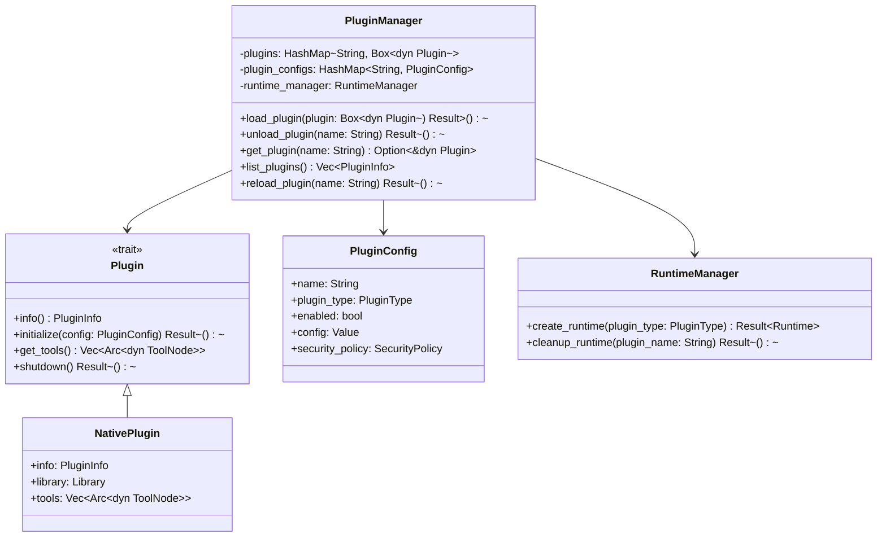

# 插件系统设计文档

## 概述

插件系统为工作流工具包提供了可扩展的架构，支持多种类型的插件，包括原生Rust插件、Python插件、Node.js插件、Docker插件和WebAssembly插件。系统采用统一的插件接口，提供插件生命周期管理、配置管理和安全沙箱机制。

## 架构设计

### 核心组件



### 插件类型

1. **Native插件**: 使用Rust编写的动态库插件
2. **Python插件**: Python脚本和包的封装
3. **Node.js插件**: JavaScript/TypeScript模块的封装
4. **Docker插件**: 容器化工具的封装
5. **WebAssembly插件**: WASM模块的封装

## 数据结构

### PluginConfig

```rust
pub struct PluginConfig {
    pub name: String,
    pub plugin_type: PluginType,
    pub enabled: bool,
    pub config: Value,
    pub security_policy: SecurityPolicy,
    pub resource_limits: ResourceLimits,
    pub dependencies: Vec<String>,
    pub metadata: HashMap<String, Value>,
}
```

### SecurityPolicy

```rust
pub struct SecurityPolicy {
    pub allow_network_access: bool,
    pub allow_file_system_access: bool,
    pub allowed_paths: Vec<PathBuf>,
    pub environment_variables: HashMap<String, String>,
    pub resource_limits: ResourceLimits,
}
```

### ResourceLimits

```rust
pub struct ResourceLimits {
    pub max_memory: Option<u64>,
    pub max_cpu_time: Option<Duration>,
    pub max_execution_time: Option<Duration>,
    pub max_file_size: Option<u64>,
}
```

## 插件生命周期

1. **加载阶段**: 
   - 验证插件配置
   - 创建插件实例
   - 初始化插件环境

2. **运行阶段**:
   - 注册工具节点
   - 处理工具执行请求
   - 监控资源使用

3. **卸载阶段**:
   - 停止所有活动任务
   - 清理资源
   - 销毁插件实例

## Native插件实现

### 动态库加载

使用`libloading` crate进行动态库加载：

```rust
pub struct NativePlugin {
    info: PluginInfo,
    library: Library,
    tools: Vec<Arc<dyn ToolNode>>,
    init_fn: Symbol<'static, unsafe extern "C" fn() -> *mut c_void>,
    shutdown_fn: Symbol<'static, unsafe extern "C" fn(*mut c_void)>,
}
```

### 符号解析

插件动态库必须导出以下符号：
- `plugin_info`: 返回插件信息
- `plugin_init`: 初始化插件
- `plugin_get_tools`: 获取工具列表
- `plugin_shutdown`: 关闭插件

### 安全机制

1. **符号验证**: 验证必需的符号是否存在
2. **版本检查**: 检查插件API版本兼容性
3. **权限控制**: 基于配置限制插件权限
4. **资源监控**: 监控插件资源使用情况

## 错误处理

### 插件加载错误

- 文件不存在或无法访问
- 符号解析失败
- 版本不兼容
- 初始化失败

### 运行时错误

- 工具执行失败
- 资源超限
- 权限违规
- 通信错误

### 恢复策略

- 自动重试机制
- 插件隔离
- 降级执行
- 故障转移

## 配置示例

```yaml
plugins:
  - name: "data-processor"
    type: "native"
    enabled: true
    config:
      library_path: "./plugins/data-processor.so"
      security_policy:
        allow_network_access: false
        allow_file_system_access: true
        allowed_paths: ["/tmp", "/data"]
      resource_limits:
        max_memory: 1073741824  # 1GB
        max_execution_time: 300  # 5 minutes
```

## 测试策略

### 单元测试

- 插件加载和卸载
- 配置验证
- 错误处理

### 集成测试

- 插件与工具注册表集成
- 多插件并发执行
- 资源限制测试

### 属性测试

- 插件加载和卸载一致性
- 配置解析正确性
- 安全策略执行