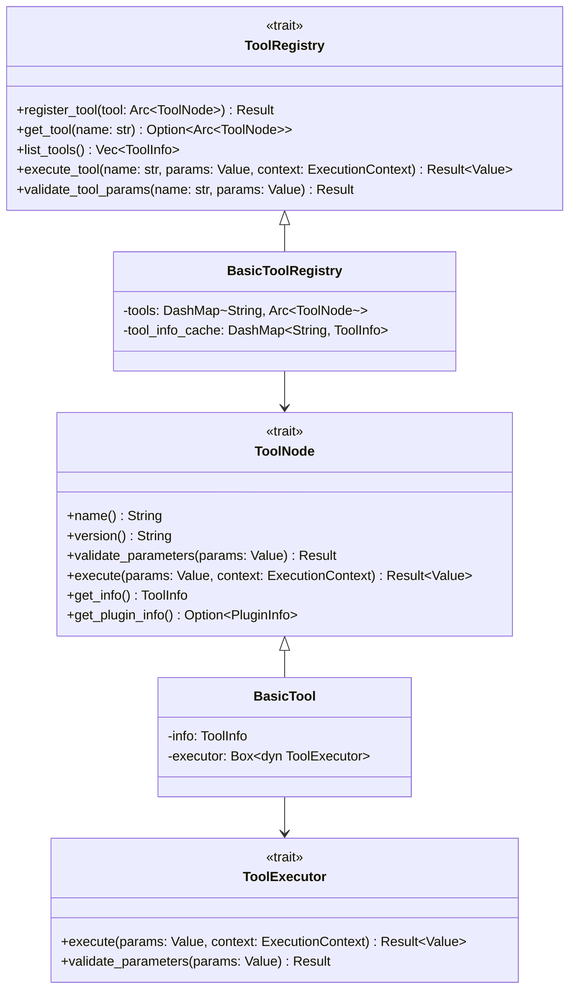

# 工具系统设计文档

## 概述

工具系统是工作流工具包的核心组件之一，负责管理可复用的工具节点。工具节点可以在工作流中使用，也可以独立调用。系统支持多种类型的工具实现，包括原生Rust工具、插件工具等。

## 架构设计

### 核心组件

### 数据结构

#### ToolInfo
工具信息结构，包含工具的元数据：
- `name`: 工具名称（唯一标识符）
- `version`: 工具版本
- `description`: 工具描述
- `category`: 工具分类（可选）
- `tags`: 工具标签列表
- `parameters_schema`: 参数JSON Schema
- `return_schema`: 返回值JSON Schema
- `plugin_name`: 所属插件名称（可选）
- `created_at`: 创建时间
- `updated_at`: 更新时间

#### ExecutionContext
执行上下文，包含工具执行时的环境信息：
- `workflow_id`: 工作流ID（可选）
- `execution_id`: 执行ID
- `user_id`: 用户ID（可选）
- `session_id`: 会话ID（可选）
- `global_variables`: 全局变量
- `started_at`: 开始时间

## 实现细节

### ToolNode Trait
定义了工具节点的基本接口：
- `name()`: 返回工具名称
- `version()`: 返回工具版本
- `validate_parameters()`: 验证输入参数
- `execute()`: 异步执行工具逻辑
- `get_info()`: 获取工具信息
- `get_plugin_info()`: 获取插件信息（如果是插件工具）

### ToolRegistry Trait
定义了工具注册表的接口：
- `register_tool()`: 注册工具
- `get_tool()`: 获取工具实例
- `list_tools()`: 列出所有工具
- `execute_tool()`: 执行指定工具
- `validate_tool_params()`: 验证工具参数

### BasicToolRegistry
基础工具注册表实现：
- 使用 `DashMap` 提供并发安全的工具存储
- 支持工具信息缓存以提高查询性能
- 提供工具生命周期管理

### BasicTool
基础工具实现：
- 封装工具元数据和执行逻辑
- 支持参数验证
- 提供统一的执行接口

## 参数验证

工具系统使用JSON Schema进行参数验证：
- 每个工具定义输入参数的JSON Schema
- 在执行前自动验证参数格式和类型
- 支持复杂的验证规则和约束

## 错误处理

工具执行过程中的错误处理：
- 参数验证错误：返回详细的验证失败信息
- 执行错误：包装底层错误并提供上下文信息
- 超时错误：支持工具执行超时控制
- 资源错误：处理资源不足等系统级错误

## 扩展性

工具系统设计为可扩展的：
- 支持通过插件系统添加新的工具类型
- 工具注册表可以扩展支持不同的存储后端
- 执行上下文可以扩展包含更多环境信息
- 支持工具的热加载和卸载

## 性能考虑

- 使用 `DashMap` 提供高性能的并发访问
- 工具信息缓存减少重复计算
- 异步执行支持高并发场景
- 支持工具执行的资源限制和监控